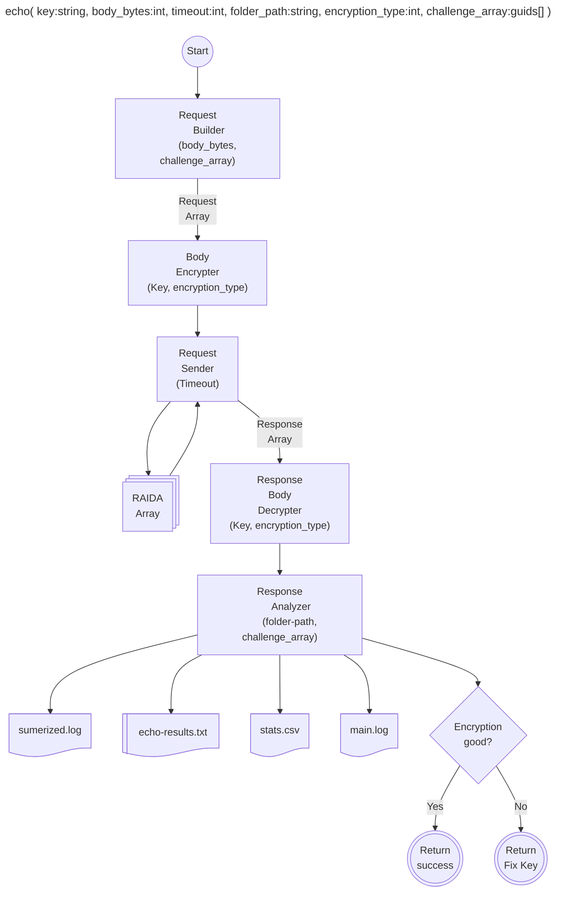

## Echo Method
This method tests the connection to the raida and generates data about:
* Network Latency. How long does it take for a return trip to the Raidas
* Internal Processing. The echo can send lots of bytes to test the speed of the raida's cpu.
* Encryption Coin. Is the encryption coin used to encrypt the traffic good? Or does it need to be fixed.
* Record Statitics. Creates CSV files that can be fed into AI Models to calculate timeouts in the future.
* Down Raidas. Can detect if a raida is unreachable.

* 

# Client Flow Diagram
This shows how data flows in the program. The folders serve as the backbone of the program and never change even with upgrades. 

# Echo Raida

   timeout-calculator -->|Timeout| request-sender
    password --> coin-decrypter
    encryption-coin --> coin-decrypter
    coin-decrypter -->|Key|request-encrypter

password@{ shape: bow-rect, label: "Password
Store" }
    encryptio

## Deposit Coins

```mermaid
---
title: Deposit Cooins
---
flowchart TD
    %% start@{ shape: circle, label: "Start" }
    picker["File Picker"]
    precounter["Precount Coins"]
    timeout-calculator["Timeout Calculator"]
    import-folder@{ shape:  div-rect, label: "Import Folder"}
    work-completer["Work Completer"]
    imported-folder@{ shape:  div-rect, label: "Imported Folder"}
    duplicates-folder@{ shape:  div-rect, label: "Duplicates Folder"}
    incorrect-formatting@{ shape:  div-rect, label: "Incorrect Format Folder"}
    trash-folder@{ shape:  div-rect, label: "Trach Folder"}
    unzipper["Unzipper"]
    png-extracter["PNG Extracter"]
    bin-unpacker["Binary File Parser"]
    password-store@{ shape:  bow-rect, label: "Password Store"}
    log-bufffer@{ shape:  bow-rect, label: "Log Buffer"}
    password-getter["Password Getter"]
    task-monitor["Task Monitor"]
    logger["Logger"]
    raida@{ shape:  processes, label: "RAIDA Array"}
    raida_ips@{ shape:  doc, label: "RAIDA Host File"}
    ai-statistics-logger["response-data.csv"]
    sumerized-log["summarized_lod.csv"]
    sumerized-log["main.log"]
    request-encrypter["Request Encrypter / Decrypter"]
    file-encrypter["File Encrypter / Decrypter"]
    request-builder["Request Builder"]
    request-sender["Request Sender"]
    response-analizeer["Response Analyzer"]
    task-log@{ shape:  doc, label: "task #9889893223.csv"}
    request-statistics[("Detect Foler")]
    coin-reader["Coin Counter"]
    detect-folder@{ shape:  div-rect, label: "Detect Foler"}
    grade-folder@{ shape:  div-rect, label: "Grade Folder"}
    stop@{ shape: dbl-circ, label: "Stop" }

```

```mermaid
---
title: Client Flow
---
flowchart TD
    %% start@{ shape: circle, label: "Start" }
    picker["File Picker"]
    precounter["Precount Coins"]
    timeout-calculator["Timeout Calculator"]
    import-folder@{ shape:  div-rect, label: "Import Folder"}
    work-completer["Work Completer"]
    imported-folder@{ shape:  div-rect, label: "Imported Folder"}
    duplicates-folder@{ shape:  div-rect, label: "Duplicates Folder"}
    incorrect-formatting@{ shape:  div-rect, label: "Incorrect Format Folder"}
    trash-folder@{ shape:  div-rect, label: "Trach Folder"}
    unzipper["Unzipper"]
    png-extracter["PNG Extracter"]
    bin-unpacker["Binary File Parser"]
    loss-fixer["Loss Fixer"]
    frack-fixer["Frack Fixer"]
    grader["Grader"]
    password-store@{ shape:  bow-rect, label: "Password Store"}
    log-bufffer@{ shape:  bow-rect, label: "Log Buffer"}
    password-getter["Password Getter"]
    ticket-getter["Ticket Getter"]
    task-monitor["Task Monitor"]
    logger["Logger"]
    echoer["Echoer"]
    raida@{ shape:  processes, label: "RAIDA Array"}
    ai-statistics-logger["response-data.csv"]
    sumerized-log["summarized_lod.csv"]
    sumerized-log["main.log"]
    minder["Minder"]
    request-encrypter["Request Encrypter / Decrypter"]
    file-encrypter["File Encrypter / Decrypter"]
    exporter["Exporter"]
    sender["sender"]
    emailer["Emailer"]
    request-builder["Request Builder"]
    request-sender["Request Sender"]
    response-analizeer["Response Analyzer"]
    echo-results@{ shape:  doc, label: "echo-results.txt"}
    echo-results@{ shape:  doc, label: "event-log.csv"}
    task-log@{ shape:  doc, label: "task #9889893223.csv"}
    frack-fixer-db[("Detect Foler")]
    request-statistics[("Detect Foler")]
    coin-reader["Coin Counter"]
    transaction-reader["Transaction Reader"]
    transaction-deleter["Transaction Deleter"]
    locker-exporter["Locker Exporter"]
    locker-importer["Locker Importer"]
    locker-peeker["Locker Peeker"]
    note-breaker["Note Breaker"]
    note-joiner["Note Joiner"]
    detect-folder@{ shape:  div-rect, label: "Detect Foler"}
    grade-folder@{ shape:  div-rect, label: "Grade Folder"}
    bank-folder@{ shape:  div-rect, label: "Bank Folder"}
    fracked-folder@{ shape:  div-rect, label: "Fracked Folder"}
    limbo-folder@{ shape:  div-rect, label: "Limbo Folder"}
    error-folder@{ shape:  div-rect, label: "Error Folder"}
    broke-encryption-folder@{ shape: div-rect, label: "Broke Encryption Folder"}
    counterfeit-folder@{ shape:  div-rect, label: "Counterfeit Folder"}
    E@{ shape:  div-rect, label: "My Folder"}
    template-folder@{ shape:  div-rect, label: "Temoplates Folder"}
    stop@{ shape: dbl-circ, label: "Stop" }

```

```mermaid
---
title: Client Flow
---
flowchart TD
    %% start@{ shape: circle, label: "Start" }
    picker["File Picker"]
    precounter["Precount Coins"]
    timeout-calculator["Timeout Calculator"]
    import-folder@{ shape:  div-rect, label: "Import Folder"}
    work-completer["Work Completer"]
    imported-folder@{ shape:  div-rect, label: "Imported Folder"}
    duplicates-folder@{ shape:  div-rect, label: "Duplicates Folder"}
    incorrect-formatting@{ shape:  div-rect, label: "Incorrect Format Folder"}
    trash-folder@{ shape:  div-rect, label: "Trach Folder"}
    unzipper["Unzipper"]
    png-extracter["PNG Extracter"]
    bin-unpacker["Binary File Parser"]
    loss-fixer["Loss Fixer"]
    frack-fixer["Frack Fixer"]
    grader["Grader"]
    password-store@{ shape:  bow-rect, label: "Password Store"}
    log-bufffer@{ shape:  bow-rect, label: "Log Buffer"}
    password-getter["Password Getter"]
    ticket-getter["Ticket Getter"]
    task-monitor["Task Monitor"]
    logger["Logger"]
    echoer["Echoer"]
    raida@{ shape:  processes, label: "RAIDA Array"}
    ai-statistics-logger["response-data.csv"]
    sumerized-log["summarized_lod.csv"]
    sumerized-log["main.log"]
    minder["Minder"]
    request-encrypter["Request Encrypter / Decrypter"]
    file-encrypter["File Encrypter / Decrypter"]
    exporter["Exporter"]
    sender["sender"]
    emailer["Emailer"]
    request-builder["Request Builder"]
    request-sender["Request Sender"]
    response-analizeer["Response Analyzer"]
    echo-results@{ shape:  doc, label: "echo-results.txt"}
    echo-results@{ shape:  doc, label: "event-log.csv"}
    task-log@{ shape:  doc, label: "task #9889893223.csv"}
    frack-fixer-db[("Detect Foler")]
    request-statistics[("Detect Foler")]
    coin-reader["Coin Counter"]
    transaction-reader["Transaction Reader"]
    transaction-deleter["Transaction Deleter"]
    locker-exporter["Locker Exporter"]
    locker-importer["Locker Importer"]
    locker-peeker["Locker Peeker"]
    note-breaker["Note Breaker"]
    note-joiner["Note Joiner"]
    detect-folder@{ shape:  div-rect, label: "Detect Foler"}
    grade-folder@{ shape:  div-rect, label: "Grade Folder"}
    bank-folder@{ shape:  div-rect, label: "Bank Folder"}
    fracked-folder@{ shape:  div-rect, label: "Fracked Folder"}
    limbo-folder@{ shape:  div-rect, label: "Limbo Folder"}
    error-folder@{ shape:  div-rect, label: "Error Folder"}
    broke-encryption-folder@{ shape: div-rect, label: "Broke Encryption Folder"}
    counterfeit-folder@{ shape:  div-rect, label: "Counterfeit Folder"}
    E@{ shape:  div-rect, label: "My Folder"}
    template-folder@{ shape:  div-rect, label: "Temoplates Folder"}
    stop@{ shape: dbl-circ, label: "Stop" }

```

