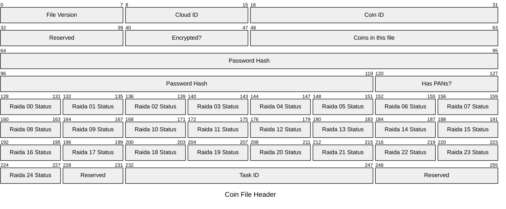

# Coin File Headers
Coin files hold the data about files and coin files will have a coin file header and then many coin chuncks (One chunk per coin). Each coin has a coin header.
So there are Coin files. Coin Files have File Headers and an array of coins. Each coin has a coin header and a coin body. 
Coin files have a naming convention that make it easier for software to use them. 


## File Header For All tokens (32 Bytes Fixed)





## File Header Byte explanation:
index | Code | Bytes |  Name | Possible Values | Description
---|---|---|---|---|---
00|$\color{blue}{\textsf{FT }}$      | 1 | File Version       | 9             | We are on file version 9 now.
01|$\color{yellow}{\textsf{CL }}$    | 1 | Cloud ID           | 1             | If creating a new stand alone cloud, choose an unused number.
02,03|$\color{orange}{\textsf{ID }}$ | 2 | Coin ID            | 0-255         | This is if there are more than one coin on your cloud. Useful for NFTs, Stable Tokens, etc.
04|$\color{cyan}{\textsf{SP }}$      | 1 | Experimental    | Any | App programmer can use this as they like. 
05|$\color{white}{\textsf{EN }}$     | 1 | Encryption Type    | 0, 1          | The type of encryption to be used (See [Encryption Types](encryption-types.md)encryption table)
06,07|$\color{red}{\textsf{CC}}$     | 2 | Token Count        | 0-65535       | How many notes are in the file. Not the total value but total count. 
08-15|$\color{yellow}{\textsf{HS }}$ | 7 | Password Hash      | Any           | First 7 bytes of the encryption key's MD5 Hash  
16| $\color{pink}{\textsf{FL}}$    | 1 | State (Current=0, Pending=1, Confirmed=2)     | 0, 1 or 2 | Optional: Used as a way to track state if needed. See table below for meanings.  Two bits are for pown state. The six other bits are experimental and are free for the programmer to use.

### State Table (Optional and for internal use)
Value Dec | State | Value Binary | Decsription
---|---|---|---
0 | Current | 00000000 | This file contains passwords that are the last known good but not guaranteed. Therefor they are suspect. No Proposed Authenticity Numbers are present. Each coin uses 400 bytes and not 800 bytes. These files are found in the "Suspect" folder.
1 | Pending | 00000001 | Used within a program during the pown process. In addition to the 400 bytes of the current authenticity numbers, each coin holds 400 bytes of pending passwords that are the PANs (Proposed Authenticity Numbers) that will be sent to the raida. 
2 | Confirmed | 00000010 | This coin has gone through pown process and the status of each AN is known (although the status of some maybe "Limbo" that describes that it is known that the state of the authenticty number is unknown). These coins are usually found in the "Grade" folder 
3-255 | Expansion | 00000011-11111111 | These bits are free for experimentation. If 

### Alternative to Track State
```
wallet-name/
├── Suspect/  (This is the current passwords that are thought to be good)
│   └── coinname.bin
└── Pending/ (This is a copy of the coin with just the proposed authenticity numbers) 
    └── coinname.bin
```


## Last 16 bytes of the header if the Coin File has many coins in it:
index | Code | Bytes |  Name | Possible Values | Description
---|---|---|---|---|---
17-31|$\color{violet}{\textsf{PS }}$ | 16| Moto |"4C 69 76 65 20 46 72 65 65 20 4F 72 20 44 69 65"|This transalates to "Live Free or Die" in ASCII. See [POWN String Codes](pown-string-codes.md)

## Last 16 bytes of the header if the Coin File has only one coin in it:
index | Code | Bytes |  Name | Possible Values | Description
---|---|---|---|---|---
17-28.5|$\color{violet}{\textsf{PS }}$ | 12.5| Pown String | 0x0,0xA,0xB,0xC,0xE,0xF | [POWN String Codes](pown-string-codes.md)
29.5-30|$\color{maroone}{\textsf{EX }}$    | .5 | Experimental    | Any | App programmer can use this as they like. 
30-31|$\color{lime}{\textsf{TI }}$ | 2 | Task ID     | Any                     | Allows program to give coin a tracking number for accounting purposes
32|$\color{maroone}{\textsf{EX }}$    | 1 | Experimental    | Any | App programmer can use this as they like. 

## File Encryption Types
Code | Meaning
---|---
0 | No encryption
1 | 128 AES CTR
4 | 256 AES CTR
