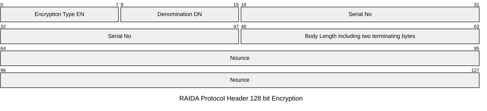

This specification is for when the client is sending unencrypted requests or requests encrypted in 128 bit AES. 

[Request Header for Encryption Type 1](#encryption-type-1)

[Request Header for Encryption Type 2](#encryption-type-2)

[Request Header for Encryption Type 3](#encryption-type-3)

# Encryption Type 1

### Request Header Byte by Byte Code Meanings

Index | Group | Code | Name | Notes
---|---|---|---|---
16 | Encryption | EN  | [Encryption](https://github.com/worthingtonse/client-prompts/blob/main/CONTEXT/encryption-types-used-in-requests.md) Type  |  0x00 means no encryption. See encryption codes table.
17 | Encryption | DE | [Denomination](https://github.com/worthingtonse/client-prompts/blob/main/CONTEXT/denominations.md) | Denomination of the token used to encrypt the request body.
18 | Encryption | SN | Encryption token SN 0| Serial Number of the token used to encrypt the body. HOB
19 | Encryption | SN |  Encryption token SN 1 | 2nd Highest Order Byte
20 | Encryption | SN |  Encryption token SN 2 |  
21 | Encryption | SN |  Encryption token SN 3| Lowest Order Byte
22 | Encryption | BL u16| Body Length | Length in bytes of the entire body including the last 2 terminating bytes. 
23 | Encryption | BL u16| Body Length| LOB. if more than 65,535 bytes are sent, then bytes 22 and 23 will be FF FF and bytes 24, 25, 26 and 27 will be the body length. 
24 | Nonce | NO |  Nonce 0 | The nonce used in the encryption and should never be used twice. 
25 | Nonce | NO |  Nonce 1 | 
26 | Nonce | NO |  Nonce 2 |
27 | Nonce | NO |  Nonce 3 | 
28 | Nonce | NO |  Nonce 4 | 
29 | Nonce | NO |  Nonce 5 | 
30 | Nonce | NO |  Nonce 6 / Echo 0 | Serves two purposes. These bytes are always echoed back to the client.
31 | Nonce | NO |  Nonce 7 / Echo 1 | 

* Nounce can do two jobs. Bytes 30, 31 are used as an Echo also.
* The nounce is also a challenge. The RKE (RAIDA Key Exchange) server must decrypt this and place it in the response if RKE is enabled. 

## # Encryption Type 2

### Request Header Byte by Byte Code Meanings

Index | Group | Code | Name | Notes
---|---|---|---|---
16 | Encryption | EN  | [Encryption](https://github.com/worthingtonse/client-prompts/blob/main/CONTEXT/encryption-types-used-in-requests.md) Type  |  0x00 means no encryption. See encryption codes table.
17 | Encryption | DE | [Denomination](https://github.com/worthingtonse/client-prompts/blob/main/CONTEXT/denominations.md) | Denomination of the token used to encrypt the request body.
18 | Encryption | SN | Encryption token SN 0| Serial Number of the token used to encrypt the body. HOB
19 | Encryption | SN |  Encryption token SN 1 | 2nd Highest Order Byte
20 | Encryption | SN |  Encryption token SN 2 |  
21 | Encryption | SN |  Encryption token SN 3| Lowest Order Byte
22 | Encryption | BL u16| Body Length | Length in bytes of the entire body including the last 2 terminating bytes. 
23 | Encryption | BL u16| Body Length| LOB. if more than 65,535 bytes are sent, then bytes 22 and 23 will be FF FF and bytes 24, 25, 26 and 27 will be the body length. 
24 | Nonce | NO |  Nonce 0 | The nonce used in the encryption and should never be used twice. 
25 | Nonce | NO |  Nonce 1 | 
26 | Nonce | NO |  Nonce 2 |
27 | Nonce | NO |  Nonce 3 | 
28 | Nonce | NO |  Nonce 4 | 
29 | Nonce | NO |  Nonce 5 | 
30 | Nonce | NO |  Nonce 6 / Echo 0 | Serves two purposes. These bytes are always echoed back to the client.
31 | Nonce | NO |  Nonce 7 / Echo 1 | 

* Nounce can do two jobs. Bytes 30, 31 are used as an Echo also.
* If EN (byte 16) is zero (no encryption) then bytes 17-31 may take any values. In 'no encryption' mode, these values will be ignored except for the two echo bytes. 
* The nounce is also a challenge. The RKE (RAIDA Key Exchange) server must decrypt this and place it in the response if RKE is enabled. 

## # Encryption Type 3

### Request Header Byte by Byte Code Meanings

Index | Group | Code | Name | Notes
---|---|---|---|---
16 | Encryption | EN  | [Encryption](https://github.com/worthingtonse/client-prompts/blob/main/CONTEXT/encryption-types-used-in-requests.md) Type  |  0x00 means no encryption. See encryption codes table.
17 | Encryption | DE | [Denomination](https://github.com/worthingtonse/client-prompts/blob/main/CONTEXT/denominations.md) | Denomination of the token used to encrypt the request body.
18 | Encryption | SN | Encryption token SN 0| Serial Number of the token used to encrypt the body. HOB
19 | Encryption | SN |  Encryption token SN 1 | 2nd Highest Order Byte
20 | Encryption | SN |  Encryption token SN 2 |  
21 | Encryption | SN |  Encryption token SN 3| Lowest Order Byte
22 | Encryption | BL u16| Body Length | Length in bytes of the entire body including the last 2 terminating bytes. 
23 | Encryption | BL u16| Body Length| LOB. if more than 65,535 bytes are sent, then bytes 22 and 23 will be FF FF and bytes 24, 25, 26 and 27 will be the body length. 
24 | Nonce | NO |  Nonce 0 | The nonce used in the encryption and should never be used twice. 
25 | Nonce | NO |  Nonce 1 | 
26 | Nonce | NO |  Nonce 2 |
27 | Nonce | NO |  Nonce 3 | 
28 | Nonce | NO |  Nonce 4 | 
29 | Nonce | NO |  Nonce 5 | 
30 | Nonce | NO |  Nonce 6 / Echo 0 | Serves two purposes. These bytes are always echoed back to the client.
31 | Nonce | NO |  Nonce 7 / Echo 1 | 

* Nounce can do two jobs. Bytes 30, 31 are used as an Echo also.
* If EN (byte 16) is zero (no encryption) then bytes 17-31 may take any values. In 'no encryption' mode, these values will be ignored except for the two echo bytes. 
* The nounce is also a challenge. The RKE (RAIDA Key Exchange) server must decrypt this and place it in the response if RKE is enabled. 
