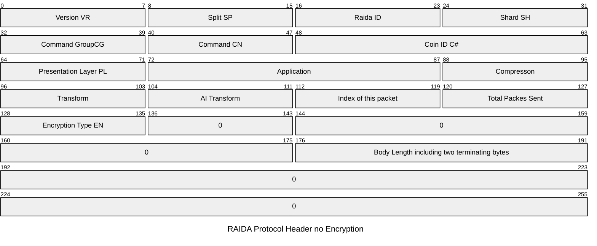
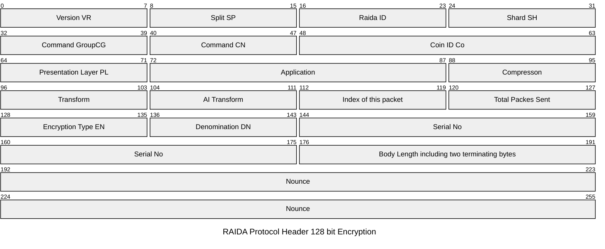

This specification is for when the client is sending unencrypted requests or requests encrypted in 128 bit AES. 

[Request Headers Overview](#overview)

[Request Header for Encryption Type 0](#encryption-type-0)

[Request Header for Encryption Type 1](#encryption-type-1)

[Request Header for Encryption Type 2](#encryption-type-2)

[Request Header for Encryption Type 3](#encryption-type-3)

# Overview
This prodocol allows clients to send requests to the RAIDA. 
All requests made to the RAIDA must have a 32
The header is fixed length and will always be 32
If the header does not contain 32
The Request Header is not encrypted. 

## When using 128 bit encryption ( shown by byte 16 of the header set to 0x00, 0x01, 0x02 or 0x03  )
Headers are made up of four groups of eight bytes. The byte groups are named "Routing", "Presentation", "Encryption" and "Nounce".

All multibyte fields are considered big-endian. For example, the two "ID" byte located at 0x04 and 0x05, 0x04 is MSB and 0x05 is LSB


## WEST RAIDA Protocol Header Byte Group View (32 Bytes Fixed):
```javascript
VR SP RI SH CG CM C# C#  // 8 Routing Bytes
VR AP AP CP TR AI RE RE  // 8 Presentation Bytes
EN DN SN SN SN SN BL BL  // 8 Encryption Bytes
NO NO NO NO NO NO EC EC  // 8 Nounce Bytes
```

# Encryption Type 0


## Offset View:
Offset(h) |`0x00` | `0x01` | `0x02` | `0x03` |`0x04` |`0x05`|`0x06`|`0x07`|`0x08`|`0x09`|`0x0A`|`0x0B`|`0x0C`|`0x0D`|`0x0E`|`0x0F`
-|-|-|-|-|-|-|-|-|-|-|-|-|-|-|-|-
`0x00` | VR |SP |RI |SH| CG | CM |C#| C#| VR | AP| AP |CP | TR| AI| RE| RE 
`0x10` | EN | 0 |0 |0| 0 | 0 |BL| BL| O| O | O| O |O | O| O| O 


### Request Header Byte by Byte Code Meanings

Index | Group | Code | Name | Notes
---|---|---|---|---
00 | Routing | VR | Bitfield  | The request header version. Should be zero. 
01 | Routing | SP | Split ID | For future use in case the token is to be split. Otherwise zero. 
02 | Routing | RI | RAIDA ID  |  Detection Agents called RAIDA Servers. Value must be 0-24. 
03 | Routing | SH | Shard ID  | For future use in case the token is to be sharded. For now, zero. 
04 | Routing | CG | [Command Group](https://github.com/worthingtonse/client-prompts/blob/main/CONTEXT/commands.md#command-groups)| High order byte for command number
05 | Routing | CM | [Command](https://github.com/worthingtonse/client-prompts/blob/main/CONTEXT/commands.md#command-codes)  | Low Number byte for command number
06 | Routing | C#  |  Coin ID | 0 unless there are coins numbered greater than 255.
07 | Routing | C#  |  Coin ID | 6 for CloudCoin
08 | Presentation | RS | Reserved | Reserved for future use. Zero for now
09  | Presentation | AP | Application 0| | For future use. Applications are generally numbered by the port they use. Zero for now.
10 | Presentation | AP  | Application 1 |  For future use. 0 means generic. 80 = HTTP, 25 =SMTP etc. Zero for now. 
11 | Presentation | CP | Compression | Future Use. 0 means none (Future Use)
12 | Presentation | TR | Translation | Future Use. 0 means none. Can be used to encode text-based protocols. 
13 | Presentation | AI  |AI Translation | Future Use. 0 means none. What type of AI should be used to translate.
14 | Presentation | ii |  i | The packet index number in the message array
15 | Presentation | LE |  AR | The length of packets in the message array.
16 | Encryption | EN  | [Encryption](https://github.com/worthingtonse/client-prompts/blob/main/CONTEXT/encryption-types-used-in-requests.md) Type  |  0x00 means no encryption. See encryption codes table.
17 | Encryption | 0 | Not needed | Use zero for encryption type 0.
18 | Encryption | 0 | Not needed| Use zero for encryption type 0.
19 | Encryption | 0 |  Not needed | Use zero for encryption type 0.
20 | Encryption | 0 |  Not needed |  Use zero for encryption type 0.
21 | Encryption | 0 |  Not needed| Use zero for encryption type 0.
22 | Encryption | BL u16| Body Length | Length in bytes of the entire body including the last 2 terminating bytes. 
23 | Encryption | BL u16| Body Length| LOB. if more than 65,535 bytes are sent, then bytes 22 and 23 will be FF FF and bytes 24, 25, 26 and 27 will be the body length. 
24 | Nonce | 0 |  Not needed | Use zero for encryption type 0.
25 | Nonce | 0 |  Not needed | Use zero for encryption type 0.
26 | Nonce | 0 |  Not needed |Use zero for encryption type 0.
27 | Nonce | 0 |  Not needed| Use zero for encryption type 0.
28 | Nonce | 0 |  Not needed | Use zero for encryption type 0.
29 | Nonce | 0 |  Not needed | Use zero for encryption type 0.
30 | Nonce | random |  Echo 0 | Random byte.  These bytes are always echoed back to the client so the client knows what the response if for. 
31 | Nonce | random |   Echo 1 | Random byte.

* Nounce can do two jobs. Bytes 30, 31 are used as an Echo also.
* If EN (byte 16) is zero (no encryption) then bytes 17-31 may take any values. In 'no encryption' mode, these values will be ignored except for the two echo bytes. 


# Encryption Type 1

```javascript
VR SP RI SH CG CM C# C#  // 8 Routing Bytes
VR AP AP CP TR AI RE RE  // 8 Presentation Bytes
EN DN SN SN SN SN BL BL  // 8 Encryption Bytes
NO NO NO NO NO NO EC EC  // 8 Nounce Bytes
```



## RAIDA Protocol Header Offset View:
Offset(h) |`0x00` | `0x01` | `0x02` | `0x03` |`0x04` |`0x05`|`0x06`|`0x07`|`0x08`|`0x09`|`0x0A`|`0x0B`|`0x0C`|`0x0D`|`0x0E`|`0x0F`
-|-|-|-|-|-|-|-|-|-|-|-|-|-|-|-|-
`0x00` | VR |SP |RI |SH| CG | CM |C#| C#| VR | AP| AP |CP | TR| AI| RE| RE 
`0x10` | EN | DN |SN |SN| SN | SN |BL| BL| NO| NO | NO| NO |NO | NO| NO| NO 

### Request Header Byte by Byte Code Meanings

Index | Group | Code | Name | Notes
---|---|---|---|---
00 | Routing | VR | Bitfield  | The request header version. Should be zero. 
01 | Routing | SP | Split ID | For future use in case the token is to be split. Otherwise zero. 
02 | Routing | RI | RAIDA ID  |  Detection Agents called RAIDA Servers. Value must be 0-24. 
03 | Routing | SH | Shard ID  | For future use in case the token is to be sharded. For now, zero. 
04 | Routing | CG | [Command Group](https://github.com/worthingtonse/client-prompts/blob/main/CONTEXT/commands.md#command-groups)| High order byte for command number
05 | Routing | CM | [Command](https://github.com/worthingtonse/client-prompts/blob/main/CONTEXT/commands.md#command-codes)  | Low Number byte for command number
06 | Routing | C#  |  Coin ID | 0 unless there are coins numbered greater than 255.
07 | Routing | C#  |  Coin ID | 6 for CloudCoin
08 | Presentation | RS | Reserved | Reserved for future use. Zero for now
09  | Presentation | AP | Application 0| | For future use. Applications are generally numbered by the port they use. Zero for now.
10 | Presentation | AP  | Application 1 |  For future use. 0 means generic. 80 = HTTP, 25 =SMTP etc. Zero for now. 
11 | Presentation | CP | Compression | Future Use. 0 means none (Future Use)
12 | Presentation | TR | Translation | Future Use. 0 means none. Can be used to encode text-based protocols. 
13 | Presentation | AI  |AI Translation | Future Use. 0 means none. What type of AI should be used to translate.
14 | Presentation | ii |  i | The packet index number in the message array
15 | Presentation | LE |  AR | The length of packets in the message array.
16 | Encryption | EN  | [Encryption](https://github.com/worthingtonse/client-prompts/blob/main/CONTEXT/encryption-types-used-in-requests.md) Type  |  0x00 means no encryption. See encryption codes table.
17 | Encryption | DE | [Denomination](https://github.com/worthingtonse/client-prompts/blob/main/CONTEXT/denominations.md) | Denomination of the token used to encrypt the request body.
18 | Encryption | SN | Encryption token SN 0| Serial Number of the token used to encrypt the body. HOB
19 | Encryption | SN |  Encryption token SN 1 | 2nd Highest Order Byte
20 | Encryption | SN |  Encryption token SN 2 |  
21 | Encryption | SN |  Encryption token SN 3| Lowest Order Byte
22 | Encryption | BL u16| Body Length | Length in bytes of the entire body including the last 2 terminating bytes. 
23 | Encryption | BL u16| Body Length| LOB. if more than 65,535 bytes are sent, then bytes 22 and 23 will be FF FF and bytes 24, 25, 26 and 27 will be the body length. 
24 | Nonce | NO |  Nonce 0 | The nonce used in the encryption and should never be used twice. 
25 | Nonce | NO |  Nonce 1 | 
26 | Nonce | NO |  Nonce 2 |
27 | Nonce | NO |  Nonce 3 | 
28 | Nonce | NO |  Nonce 4 | 
29 | Nonce | NO |  Nonce 5 | 
30 | Nonce | NO |  Nonce 6 / Echo 0 | Serves two purposes. These bytes are always echoed back to the client.
31 | Nonce | NO |  Nonce 7 / Echo 1 | 

* Nounce can do two jobs. Bytes 30, 31 are used as an Echo also.
* If EN (byte 16) is zero (no encryption) then bytes 17-31 may take any values. In 'no encryption' mode, these values will be ignored except for the two echo bytes. 
* The nounce is also a challenge. The RKE (RAIDA Key Exchange) server must decrypt this and place it in the response if RKE is enabled. 


## # Encryption Type 2
```javascript
VR SP RI SH CG CM ID ID  // 8 Routing Bytes
VR AP AP CP TR AI RE RE  // 8 Presentation Bytes
EN DN SN SN SN SN BL BL  // 8 Encryption Bytes
NO NO NO NO NO NO EC EC  // 8 Nounce Bytes
```


## 
Offset(h) |`0x00` | `0x01` | `0x02` | `0x03` |`0x04` |`0x05`|`0x06`|`0x07`|`0x08`|`0x09`|`0x0A`|`0x0B`|`0x0C`|`0x0D`|`0x0E`|`0x0F`
-|-|-|-|-|-|-|-|-|-|-|-|-|-|-|-|-
`0x00` | VR |SP |RI |SH| CG | CM |ID| ID| VR | AP| AP |CP | TR| AI| RE| RE 
`0x10` | EN | DN |SN |SN| SN | SN |BL| BL| NO| NO | NO| NO |NO | NO| NO| NO 


### Request Header Byte by Byte Code Meanings

Index | Group | Code | Name | Notes
---|---|---|---|---
00 | Routing | VR | Bitfield  | The request header version. Should be zero. 
01 | Routing | SP | Split ID | For future use in case the token is to be split. Otherwise zero. 
02 | Routing | RI | RAIDA ID  |  Detection Agents called RAIDA Servers. Value must be 0-24. 
03 | Routing | SH | Shard ID  | For future use in case the token is to be sharded. For now, zero. 
04 | Routing | CG | [Command Group](https://github.com/worthingtonse/client-prompts/blob/main/CONTEXT/commands.md#command-groups)| High order byte for command number
05 | Routing | CM | [Command](https://github.com/worthingtonse/client-prompts/blob/main/CONTEXT/commands.md#command-codes)  | Low Number byte for command number
06 | Routing | C#  |  Coin ID | 0 unless there are coins numbered greater than 255.
07 | Routing | C#  |  Coin ID | 6 for CloudCoin
08 | Presentation | RS | Reserved | Reserved for future use. Zero for now
09  | Presentation | AP | Application 0| | For future use. Applications are generally numbered by the port they use. Zero for now.
10 | Presentation | AP  | Application 1 |  For future use. 0 means generic. 80 = HTTP, 25 =SMTP etc. Zero for now. 
11 | Presentation | CP | Compression | Future Use. 0 means none (Future Use)
12 | Presentation | TR | Translation | Future Use. 0 means none. Can be used to encode text-based protocols. 
13 | Presentation | AI  |AI Translation | Future Use. 0 means none. What type of AI should be used to translate.
14 | Presentation | ii |  i | The packet index number in the message array
15 | Presentation | LE |  AR | The length of packets in the message array.
16 | Encryption | EN  | [Encryption](https://github.com/worthingtonse/client-prompts/blob/main/CONTEXT/encryption-types-used-in-requests.md) Type  |  0x00 means no encryption. See encryption codes table.
17 | Encryption | DE | [Denomination](https://github.com/worthingtonse/client-prompts/blob/main/CONTEXT/denominations.md) | Denomination of the token used to encrypt the request body.
18 | Encryption | SN | Encryption token SN 0| Serial Number of the token used to encrypt the body. HOB
19 | Encryption | SN |  Encryption token SN 1 | 2nd Highest Order Byte
20 | Encryption | SN |  Encryption token SN 2 |  
21 | Encryption | SN |  Encryption token SN 3| Lowest Order Byte
22 | Encryption | BL u16| Body Length | Length in bytes of the entire body including the last 2 terminating bytes. 
23 | Encryption | BL u16| Body Length| LOB. if more than 65,535 bytes are sent, then bytes 22 and 23 will be FF FF and bytes 24, 25, 26 and 27 will be the body length. 
24 | Nonce | NO |  Nonce 0 | The nonce used in the encryption and should never be used twice. 
25 | Nonce | NO |  Nonce 1 | 
26 | Nonce | NO |  Nonce 2 |
27 | Nonce | NO |  Nonce 3 | 
28 | Nonce | NO |  Nonce 4 | 
29 | Nonce | NO |  Nonce 5 | 
30 | Nonce | NO |  Nonce 6 / Echo 0 | Serves two purposes. These bytes are always echoed back to the client.
31 | Nonce | NO |  Nonce 7 / Echo 1 | 

* Nounce can do two jobs. Bytes 30, 31 are used as an Echo also.
* If EN (byte 16) is zero (no encryption) then bytes 17-31 may take any values. In 'no encryption' mode, these values will be ignored except for the two echo bytes. 
* The nounce is also a challenge. The RKE (RAIDA Key Exchange) server must decrypt this and place it in the response if RKE is enabled. 


## # Encryption Type 3
```javascript
VR SP RI SH CG CM ID ID  // 8 Routing Bytes
VR AP AP CP TR AI RE RE  // 8 Presentation Bytes
EN DN SN SN SN SN BL BL  // 8 Encryption Bytes
NO NO NO NO NO NO EC EC  // 8 Nounce Bytes
```


## WEST RAIDA Protocol Header Offset View:
Offset(h) |`0x00` | `0x01` | `0x02` | `0x03` |`0x04` |`0x05`|`0x06`|`0x07`|`0x08`|`0x09`|`0x0A`|`0x0B`|`0x0C`|`0x0D`|`0x0E`|`0x0F`
-|-|-|-|-|-|-|-|-|-|-|-|-|-|-|-|-
`0x00` | VR |SP |RI |SH| CG | CM |ID| ID| VR | AP| AP |CP | TR| AI| RE| RE 
`0x10` | EN | DN |SN |SN| SN | SN |BL| BL| NO| NO | NO| NO |NO | NO| NO| NO 

### Request Header Byte by Byte Code Meanings

Index | Group | Code | Name | Notes
---|---|---|---|---
00 | Routing | VR | Bitfield  | The request header version. Should be zero. 
01 | Routing | SP | Split ID | For future use in case the token is to be split. Otherwise zero. 
02 | Routing | RI | RAIDA ID  |  Detection Agents called RAIDA Servers. Value must be 0-24. 
03 | Routing | SH | Shard ID  | For future use in case the token is to be sharded. For now, zero. 
04 | Routing | CG | [Command Group](https://github.com/worthingtonse/client-prompts/blob/main/CONTEXT/commands.md#command-groups)| High order byte for command number
05 | Routing | CM | [Command](https://github.com/worthingtonse/client-prompts/blob/main/CONTEXT/commands.md#command-codes)  | Low Number byte for command number
06 | Routing | C#  |  Coin ID | 0 unless there are coins numbered greater than 255.
07 | Routing | C#  |  Coin ID | 6 for CloudCoin
08 | Presentation | RS | Reserved | Reserved for future use. Zero for now
09  | Presentation | AP | Application 0| | For future use. Applications are generally numbered by the port they use. Zero for now.
10 | Presentation | AP  | Application 1 |  For future use. 0 means generic. 80 = HTTP, 25 =SMTP etc. Zero for now. 
11 | Presentation | CP | Compression | Future Use. 0 means none (Future Use)
12 | Presentation | TR | Translation | Future Use. 0 means none. Can be used to encode text-based protocols. 
13 | Presentation | AI  |AI Translation | Future Use. 0 means none. What type of AI should be used to translate.
14 | Presentation | ii |  i | The packet index number in the message array
15 | Presentation | LE |  AR | The length of packets in the message array.
16 | Encryption | EN  | [Encryption](https://github.com/worthingtonse/client-prompts/blob/main/CONTEXT/encryption-types-used-in-requests.md) Type  |  0x00 means no encryption. See encryption codes table.
17 | Encryption | DE | [Denomination](https://github.com/worthingtonse/client-prompts/blob/main/CONTEXT/denominations.md) | Denomination of the token used to encrypt the request body.
18 | Encryption | SN | Encryption token SN 0| Serial Number of the token used to encrypt the body. HOB
19 | Encryption | SN |  Encryption token SN 1 | 2nd Highest Order Byte
20 | Encryption | SN |  Encryption token SN 2 |  
21 | Encryption | SN |  Encryption token SN 3| Lowest Order Byte
22 | Encryption | BL u16| Body Length | Length in bytes of the entire body including the last 2 terminating bytes. 
23 | Encryption | BL u16| Body Length| LOB. if more than 65,535 bytes are sent, then bytes 22 and 23 will be FF FF and bytes 24, 25, 26 and 27 will be the body length. 
24 | Nonce | NO |  Nonce 0 | The nonce used in the encryption and should never be used twice. 
25 | Nonce | NO |  Nonce 1 | 
26 | Nonce | NO |  Nonce 2 |
27 | Nonce | NO |  Nonce 3 | 
28 | Nonce | NO |  Nonce 4 | 
29 | Nonce | NO |  Nonce 5 | 
30 | Nonce | NO |  Nonce 6 / Echo 0 | Serves two purposes. These bytes are always echoed back to the client.
31 | Nonce | NO |  Nonce 7 / Echo 1 | 

* Nounce can do two jobs. Bytes 30, 31 are used as an Echo also.
* If EN (byte 16) is zero (no encryption) then bytes 17-31 may take any values. In 'no encryption' mode, these values will be ignored except for the two echo bytes. 
* The nounce is also a challenge. The RKE (RAIDA Key Exchange) server must decrypt this and place it in the response if RKE is enabled. 
