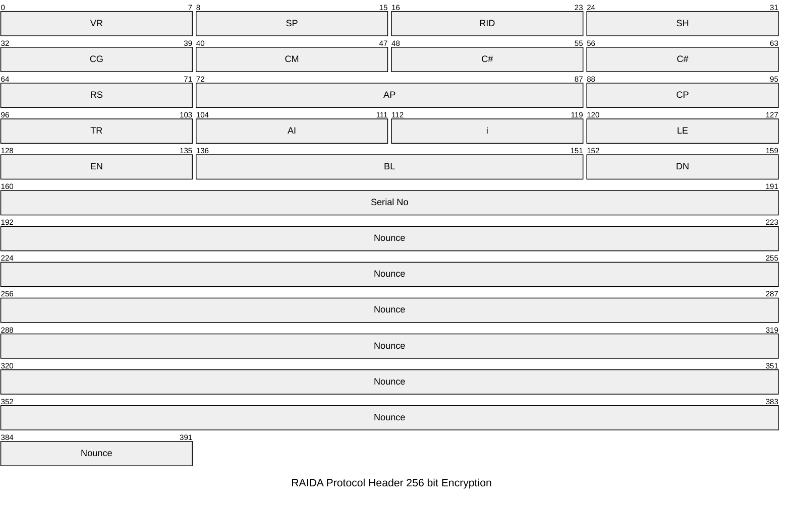
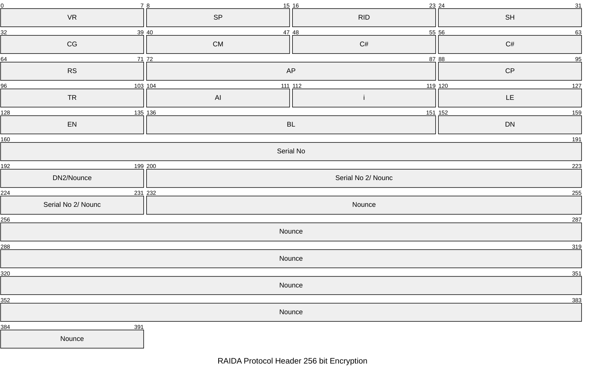

# Header Requests 256 bit
This prodocol allows clients to send requests to the RAIDA. This Request Header format is used when the Encryption Type is 4 and 5. Types 4 and 5 us 256 bit AES CTR encryption while Types 1-3 uses 128 bit.

## Table of Contents
[Overview](#overview)

[Encryption Type 4](#encryption-type-4)

[Encryption Type 5](#encryption-type-5)

## Overview
RAIDA Request Headers are different for requests that use 256 bit than requests that use 128 bit encryption.
* The encryption type is specified in byte 16 in headers.  
* This standard pertains to headers that uses encryption type 4 and 5.
* Type 4 and 5 use 256 bit AES CTR encryption while Types 1-3 uses 128 bit.
* The Request Headers have a fixed byte length. 
* The Request Header for 256 encryption has 48 bytes while the Request Header for 128 bit encryption has 32 bytes.
* The Request Headers are not encrypted.
* All requests made to the RAIDA must have a 48 byte headers
* The header that has a fixed length of 48 bytes
* If the header does not contain 48 bytes, there will be no response to the requester.
* All multibyte fields are considered big-endian. For example, the two "ID" byte located at 0x04 and 0x05, 0x04 is MSB and 0x05 is LSB
* Request Headers are made up of two groups of eight bytes and two groups of 16 bytes. The byte groups are named "Routing", "Presentation", "Encryption" and "Nounce".

## Encryption Type 4
The purpose of the Type 4 encryption is to allow computers to message each other using only one 256 bit AES CTR key that was exchanged using the DKE (Distributed Key Exchange) protocol. Encryption type 5 is used to combine two 128 bit keys that are dervived from the coin/key that the computer already has. 

RAIDA Protocol Header Encryption Type 4 has 48 bytes fixed.

### Packet Format

### Request Header Byte by Byte Code Meanings

Routing Section: 8 Bytes
Index | Group | Code | Name | Notes
---|---|---|---|---
00 | Routing | VR | Version | Should equal '1'
01 | Routing | SP | Split ID | For future use in case the token is to be split. Otherwise zero. 
02 | Routing | RI | RAIDA ID  |  Detection Agents called RAIDA Servers. Value must be 0-24. 
03 | Routing | SH | Shard ID  | For future use in case the token is to be sharded. For now, zero. 
04 | Routing | CG | [Command Group](commands.md#command-groups) | High order byte for command number
05 | Routing | CM | [Command](commands.md#commands)  | Low Number byte for command number
06 | Routing | ID  | C# | Coin number. Zero here for now. 
07 | Routing | ID  | C# | Coin number. CloudCoin is 6. see [Coin IDs]{coin_ids.md}

Presentation Section: 8 Bytes
Index | Group | Code | Name | Notes
---|---|---|---|---
08 | Presentation | RS | Reserved  | Reserved for future use. 
09  | Presentation | AP | Application 0| | Applications are generally numbered by the port they use 0-65535.
10 | Presentation | AP  | Application 1 |  0 means generic. 80 = HTTP, 25 =SMTP etc. 
11 | Presentation | CP | Compression | Future Use. 0 means none (Future Use)
12 | Presentation | TR | Translation | Future Use. 0 means none. Can be used to encode text-based protocols. 
13 | Presentation | AI  |AI Translation | Future Use. 0 means none. What type of AI should be used to translate.
14 | Presentation | ii |  i | The packet index number in the message array
15 | Presentation | LE |  AR | The length of packets in the message array.

Encryption ID Section: 8 Bytes
Index | Group | Code | Name | Notes
---|---|---|---|---
16 | Encryption | EN  | [Encryption](encryption-types.md) Type  |  0x00 means no encryption. See encryption codes table.
22 | Encryption | BL u16| Body Length | Length in bytes of the entire body including the last 2 terminating bytes. 
23 | Encryption | BL u16| Body Length| LOB. If more than 65,535 bytes are sent, files need to be sent using chunking. 
17 | Encryption | DE | [Denomination](denominations.md) | Denomination of the token used to encrypt the request body.
18 | Encryption | SN | Encryption token SN 0| Serial Number of the token used to encrypt the body. HOB
19 | Encryption | SN |  Encryption token SN 1 | 2nd Highest Order Byte
20 | Encryption | SN |  Encryption token SN 2 |  
21 | Encryption | SN |  Encryption token SN 3| Lowest Order Byte

Nonce Section: 24 Bytes
Index | Group | Code | Name | Notes
---|---|---|---|---
24 | Nonce | NO |  Nonce 0 | The nonce used in the encryption and should never be used twice. 
25 | Nonce | NO |  Nonce 1 | 
26 | Nonce | NO |  Nonce 2 |
27 | Nonce | NO |  Nonce 3 | 
28 | Nonce | NO |  Nonce 4 | 
29 | Nonce | NO |  Nonce 5 | 
30 | Nonce | NO |  Nonce 6 | 
31 | Nonce | NO |  Nonce 7 |
32 | Nonce | NO |  Nonce 8 | 
33 | Nonce | NO |  Nonce 9 | 
34 | Nonce | NO |  Nonce 10 | 
35 | Nonce | NO |  Nonce 11 | 
36 | Nonce | NO |  Nonce 12 |
37 | Nonce | NO |  Nonce 13 | 
38 | Nonce | NO |  Nonce 14 | 
39 | Nonce | NO |  Nonce 15 | 
40 | Nonce | NO |  Nonce 16 | 
41 | Nonce | NO |  Nonce 17 | 
42 | Nonce | NO |  Nonce 18 | 
43 | Nonce | NO |  Nonce 19 | 
44 | Nonce | NO |  Nonce 20 |
45 | Nonce | NO |  Nonce 21 | 
46 | Nonce | NO |  Nonce 22 | The raida echo the last two bytes of the nounce in the Return Header. 
47 | Nonce | NO |  Nonce 23 | The echo is to allow Clients to track which request the response was for. 

## Encryption Type 5 

The purpose of Encryption Type 5 is to allow computers that only have 128 bit AES CRT keys to concatenate them to be able to use 256 bit encryption. The computer will dervive a 256 bit key from the 128 bit coins/keys that the computer already has. Type 5 Encryption is used when computers want to talk to the raida using 256 bit encyption or if raida servers want to talk to each other using 256 bit encryption. 

This is different from Encryption Type 4 which is used when the client and server both have the same 256 bit key and do not need to combine keys. 

RAIDA Protocol Header Encryption Type 5 has 48 bytes fixed. It is exactly the same as Encryption Type 4 except that bytes 
24, 25, 26, 27 and 28 are used to identify a second key as well as be part of the nounce. Byte 24 is the denomination of the second key
and bytes 25 though 28 are the four byte serial number of the second key. 

### Packet Format

### Request Header Byte by Byte Code Meanings

Routing Section: 8 Bytes
Index | Group | Code | Name | Notes
---|---|---|---|---
00 | Routing | VR | Version | Should equal '1'
01 | Routing | SP | Split ID | For future use in case the token is to be split. Otherwise zero. 
02 | Routing | RI | RAIDA ID  |  Detection Agents called RAIDA Servers. Value must be 0-24. 
03 | Routing | SH | Shard ID  | For future use in case the token is to be sharded. For now, zero. 
04 | Routing | CG | [Command Group](commands.md#command-groups) | High order byte for command number
05 | Routing | CM | [Command](commands.md#commands)  | Low Number byte for command number
06 | Routing | ID  | C# | Coin number. Zero here for now. 
07 | Routing | ID  | C# | Coin number. CloudCoin is 6. see [Coin IDs]{coin_ids.md}

Presentation Section: 8 Bytes
Index | Group | Code | Name | Notes
---|---|---|---|---
08 | Presentation | BF | Bitfield  | Describes if the eight Routing fields are just random. The first bit is always random. 
09  | Presentation | AP | Application 0| | Applications are generally numbered by the port they use 0-65535.
10 | Presentation | AP  | Application 1 |  0 means generic. 80 = HTTP, 25 =SMTP etc. 
11 | Presentation | CP | Compression | Future Use. 0 means none (Future Use)
12 | Presentation | TR | Translation | Future Use. 0 means none. Can be used to encode text-based protocols. 
13 | Presentation | AI  |AI Translation | Future Use. 0 means none. What type of AI should be used to translate.
14 | Presentation | ii |  i | The packet index number in the message array
15 | Presentation | LE |  AR | The length of packets in the message array.

Encryption ID Section: 8 Bytes
Index | Group | Code | Name | Notes
---|---|---|---|---
16 | Encryption | EN  | [Encryption](encryption-types.md) Type  |  0x00 means no encryption. See encryption codes table.
22 | Encryption | BL u16| Body Length | Length in bytes of the entire body including the last 2 terminating bytes. 
23 | Encryption | BL u16| Body Length| LOB. If more than 65,535 bytes are sent, files need to be sent using chunking. 
17 | Encryption | DE | [Denomination](denominations.md) | Denomination of the token used to encrypt the request body.
18 | Encryption | SN | Encryption token SN 0| Serial Number of the token used to encrypt the body. HOB
19 | Encryption | SN |  Encryption token SN 1 | 2nd Highest Order Byte
20 | Encryption | SN |  Encryption token SN 2 |  
21 | Encryption | SN |  Encryption token SN 3| Lowest Order Byte

Nonce Section: 24 Bytes
Index | Group | Code | Name | Notes
---|---|---|---|---
24 | Nonce | NO |  DN 2 and Nonce 0 | This byte is the Denomination of key 2 but is also used in the nounce. 
25 | Nonce | NO |  SN2 0 and Nonce 1 | These four bytes are the SNs of key 2 but are also used in the nounce. 
26 | Nonce | NO |  SN2 and Nonce 2 |
27 | Nonce | NO |  SN3 and Nonce 3 | 
28 | Nonce | NO |  SN4 and Nonce 4 | 
29 | Nonce | NO |  Nonce 5 | 
30 | Nonce | NO |  Nonce 6 | 
31 | Nonce | NO |  Nonce 7 |
32 | Nonce | NO |  Nonce 8 | 
33 | Nonce | NO |  Nonce 9 | 
34 | Nonce | NO |  Nonce 10 | 
35 | Nonce | NO |  Nonce 11 | 
36 | Nonce | NO |  Nonce 12 |
37 | Nonce | NO |  Nonce 13 | 
38 | Nonce | NO |  Nonce 14 | 
39 | Nonce | NO |  Nonce 15 | 
40 | Nonce | NO |  Nonce 16 | 
41 | Nonce | NO |  Nonce 17 | 
42 | Nonce | NO |  Nonce 18 | 
43 | Nonce | NO |  Nonce 19 | 
44 | Nonce | NO |  Nonce 20 |
45 | Nonce | NO |  Nonce 21 | 
46 | Nonce | NO |  Nonce 22 | The raida echo the last two bytes of the nounce in the Return Header. 
47 | Nonce | NO |  Nonce 23 | The echo is to allow Clients to track which request the response was for. 
