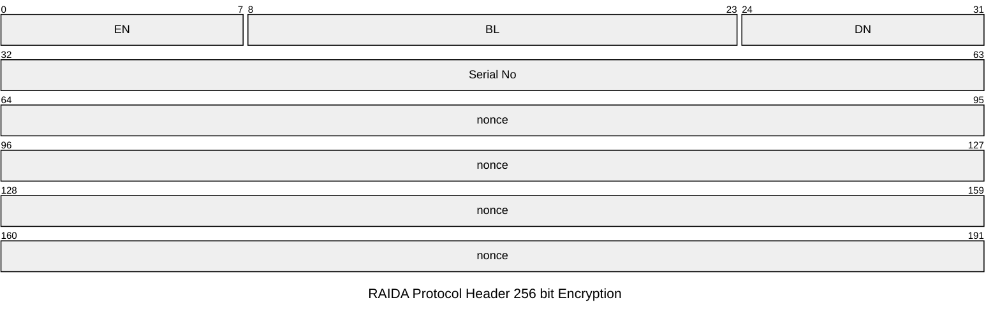
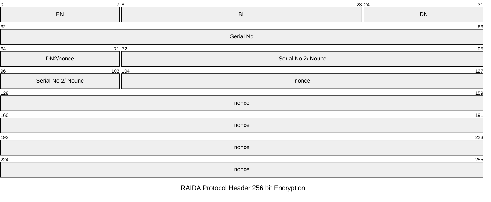

# Header Requests 256 bit
When the client makes requests using 256 bit encryption, the total request header size goes from 32 to 48 bytes. The first 16 bytes are the exact same as all other headers except for Encryption Type 6 which does not have 16 bytes infront of it.

You can see the first 16 bytes used for all headers here: https://github.com/worthingtonse/client-prompts/blob/main/CONTEXT/request-header-format.md
Encryption Types 4 and 5 us 256 bit AES CTR encryption.

## Table of Contents

[Encryption Type 4](#encryption-type-4)

[Encryption Type 5](#encryption-type-5)

[Encryption Type 6](#encryption-type-6)

## Differences between 4, 5 and 6
* Type 4 is used to allow two computers (such as a client and a RAIDA) to communciate using one 256 bit key.
* Type 5 allows the client to talk to the raida by using two cloudcoins by combining each's 128 bit Authenticity Numbers into one 256 bit key.
* Type 6 is used to allow two computers (such as a client and a content server) to communciate using one 256 bit key that they have previously exchanged using the Distributed Key Exchange Protocol (DKE) AKA RKE or QKey.

## Encryption Type 4
The purpose of the Type 4 encryption is to allow raida to message each other using only one 256 bit AES CTR key that was exchanged using the DKE (Distributed Key Exchange) protocol. Encryption type 5 is used to combine two 128 bit keys that are dervived from the coin/key that the computer already has. 

RAIDA Protocol Header Encryption Type 4 has 48 bytes fixed.

### Packet Format

### Request Header index bytes 16 to bytes 47

Index | Group | Code | Name | Notes
---|---|---|---|---
16 | Encryption | EN  | [Encryption](encryption-types.md) Type  |  0x00 means no encryption. See encryption codes table.
17 | Encryption | BL u16| Body Length | Length in bytes of the entire body including the last 2 terminating bytes. 
18 | Encryption | BL u16| Body Length| LOB. If more than 65,535 bytes are sent, files need to be sent using chunking. 
19 | Encryption | DE | [Denomination](denominations.md) | Denomination of the token used to encrypt the request body.
20 | Encryption | SN | Encryption token SN 0| Serial Number of the token used to encrypt the body. HOB
21 | Encryption | SN |  Encryption token SN 1 | 2nd Highest Order Byte
22 | Encryption | SN |  Encryption token SN 2 |  
23 | Encryption | SN |  Encryption token SN 3| Lowest Order Byte
24 | Nonce | NO |  Nonce 0 | The nonce used in the encryption and should never be used twice. 
25 | Nonce | NO |  Nonce 1 | 
26 | Nonce | NO |  Nonce 2 |
27 | Nonce | NO |  Nonce 3 | 
28 | Nonce | NO |  Nonce 4 | 
29 | Nonce | NO |  Nonce 5 | 
30 | Nonce | NO |  Nonce 6 | 
31 | Nonce | NO |  Nonce 7 |
32 | Nonce | NO |  Nonce 8 | 
33 | Nonce | NO |  Nonce 9 | 
34 | Nonce | NO |  Nonce 10 | 
35 | Nonce | NO |  Nonce 11 | 
36 | Nonce | NO |  Nonce 12 |
37 | Nonce | NO |  Nonce 13 | 
38 | Nonce | NO |  Nonce 14 | 
39 | Nonce | NO |  Nonce 15 | 
40 | Nonce | NO |  Nonce 16 | 
41 | Nonce | NO |  Nonce 17 | 
42 | Nonce | NO |  Nonce 18 | 
43 | Nonce | NO |  Nonce 19 | 
44 | Nonce | NO |  Nonce 20 |
45 | Nonce | NO |  Nonce 21 | 
46 | Nonce | NO |  Nonce 22 | The raida echo the last two bytes of the nonce in the Return Header. 
47 | Nonce | NO |  Nonce 23 | The echo is to allow Clients to track which request the response was for. 

## Encryption Type 5 

The purpose of Encryption Type 5 is to allow computers that only have 128 bit AES CRT keys to concatenate them to be able to use 256 bit encryption. The computer will dervive a 256 bit key from the 128 bit coins/keys that the computer already has. Type 5 Encryption is used when computers want to talk to the raida using 256 bit encyption or if raida servers want to talk to each other using 256 bit encryption. 

This is different from Encryption Type 4 which is used when the client and server both have the same 256 bit key and do not need to combine keys. 

RAIDA Protocol Header Encryption Type 5 has 48 bytes fixed. It is exactly the same as Encryption Type 4 except that bytes 
24, 25, 26, 27 and 28 are used to identify a second key as well as be part of the nonce. Byte 24 is the denomination of the second key
and bytes 25 though 28 are the four byte serial number of the second key. 

### Packet Format

### Request Header Byte by Byte Code Meanings

Index | Group | Code | Name | Notes
---|---|---|---|---
16 | Encryption | EN  | [Encryption](encryption-types.md) Type  |  0x00 means no encryption. See encryption codes table.
17 | Encryption | BL u16| Body Length | Length in bytes of the entire body including the last 2 terminating bytes. 
18 | Encryption | BL u16| Body Length| LOB. If more than 65,535 bytes are sent, files need to be sent using chunking. 
19 | Encryption | DE | [Denomination](denominations.md) | Denomination of the token used to encrypt the request body.
20 | Encryption | SN | Encryption token SN 0| Serial Number of the token used to encrypt the body. HOB
21 | Encryption | SN |  Encryption token SN 1 | 2nd Highest Order Byte
22 | Encryption | SN |  Encryption token SN 2 |  
23 | Encryption | SN |  Encryption token SN 3| Lowest Order Byte
24 | Nonce | NO |  DN 2 and Nonce 0 | This byte is the Denomination of key 2 but is also used in the nonce. 
25 | Nonce | NO |  SN2 0 and Nonce 1 | These four bytes are the SNs of key 2 but are also used in the nonce. 
26 | Nonce | NO |  SN2 and Nonce 2 |
27 | Nonce | NO |  SN3 and Nonce 3 | 
28 | Nonce | NO |  SN4 and Nonce 4 | 
29 | Nonce | NO |  Nonce 5 | 
30 | Nonce | NO |  Nonce 6 | 
31 | Nonce | NO |  Nonce 7 |
32 | Nonce | NO |  Nonce 8 | 
33 | Nonce | NO |  Nonce 9 | 
34 | Nonce | NO |  Nonce 10 | 
35 | Nonce | NO |  Nonce 11 | 
36 | Nonce | NO |  Nonce 12 |
37 | Nonce | NO |  Nonce 13 | 
38 | Nonce | NO |  Nonce 14 | 
39 | Nonce | NO |  Nonce 15 | 
40 | Nonce | NO |  Nonce 16 | 
41 | Nonce | NO |  Nonce 17 | 
42 | Nonce | NO |  Nonce 18 | 
43 | Nonce | NO |  Nonce 19 | 
44 | Nonce | NO |  Nonce 20 |
45 | Nonce | NO |  Nonce 21 | 
46 | Nonce | NO |  Nonce 22 | The raida echo the last two bytes of the nonce in the Return Header. 
47 | Nonce | NO |  Nonce 23 | The echo is to allow Clients to track which request the response was for. 

# Encryption Type 6 

## 1.0 Purpose & Architecture

Encryption Type 6 defines the protocol for creating and using a secure, direct communication tunnel between a client and a content server. Examples of content servers include QMail, DRD, Webservers, VPN endpoints. This protocol is used after the client has successfully derived a 256-bit shared secret using the Raida Key Exchange (RKE) protocol.

### 1.1 Architectural Overview

The architecture separates the key exchange from the data transfer for maximum security and efficiency:

**Key Exchange (RAIDA Network)**: The client interacts with the 25 RAIDA servers to fault-tolerantly derive a 256-bit AES encryption key. The RAIDA network's involvement ends here.

**Secure Tunnel (Direct Connection)**: The client then establishes a direct TCP connection to the content server. All traffic over this connection is encrypted using the derived key and follows the Encryption Type 6 protocol specified below.

## 2.0 Header Structure

Encryption Type 6 uses a streamlined 32-byte header format

### 2.1 Full Header Structure (32 Bytes Total)

| Byte Index | Group      | Code       | Field Name             | Value/Notes                                        |
|------------|------------|------------|------------------------|---------------------------------------------------|
| 0          | Header     | VE         | Version/Encryption Type| `0x06` – Combined version and encryption type      |
| 1          | Encryption | BL `u16`   | Body Length (High Byte)| High-order byte (HOB) of body length in bytes      |
| 2          | Encryption | BL `u16`   | Body Length (Low Byte) | Low-order byte (LOB) of body length in bytes       |
| 3          | Encryption | KI         | Key ID Byte 0          | First byte of 5-byte session key identifier        |
| 4          | Encryption | KI         | Key ID Byte 1          | Second byte of session key identifier              |
| 5          | Encryption | KI         | Key ID Byte 2          | Third byte of session key identifier               |
| 6          | Encryption | KI         | Key ID Byte 3          | Fourth byte of session key identifier              |
| 7          | Encryption | KI         | Key ID Byte 4          | Fifth byte of session key identifier               |
| 8          | Nonce      | NO         | Nonce 0                |                                                   |
| 9          | Nonce      | NO         | Nonce 1                |                                                   |
| 10         | Nonce      | NO         | Nonce 2                |                                                   |
| 11         | Nonce      | NO         | Nonce 3                |                                                   |
| 12         | Nonce      | NO         | Nonce 4                |                                                   |
| 13         | Nonce      | NO         | Nonce 5                |                                                   |
| 14         | Nonce      | NO         | Nonce 6                |                                                   |
| 15         | Nonce      | NO         | Nonce 7                |                                                   |
| 16         | Nonce      | NO         | Nonce 8                |                                                   |
| 17         | Nonce      | NO         | Nonce 9                |                                                   |
| 18         | Nonce      | NO         | Nonce 10               |                                                   |
| 19         | Nonce      | NO         | Nonce 11               |                                                   |
| 20         | Nonce      | NO         | Nonce 12               |                                                   |
| 21         | Nonce      | NO         | Nonce 13               |                                                   |
| 22         | Nonce      | NO         | Nonce 14               |                                                   |
| 23         | Nonce      | NO         | Nonce 15               |                                                   |
| 24         | Nonce      | NO         | Nonce 16               |                                                   |
| 25         | Nonce      | NO         | Nonce 17               |                                                   |
| 26         | Nonce      | NO         | Nonce 18               |                                                   |
| 27         | Nonce      | NO         | Nonce 19               |                                                   |
| 28         | Nonce      | NO         | Nonce 20               |                                                   |
| 29         | Nonce      | NO         | Nonce 21               |                                                   |
| 30         | Nonce      | NO         | Nonce 22               |                                                   |
| 31         | Nonce      | NO         | Nonce 23               |                                                   |

### 2.2 Field Descriptions

- **Version/Encryption Type (Byte 0)**: Combined field set to `0x06`, identifying both the protocol version and encryption type
- **Body Length (Bytes 1-2)**: 16-bit unsigned integer indicating the length of the encrypted payload following the header
- **Key ID (Bytes 3-7)**: 5-byte unique identifier for the encryption key
- **Nonce Field (Bytes 8-31)**: 24-byte field used for encryption and uniqueness, with structure depending on packet type

## 3.0 The Nonce Field Explained

The 24-byte Nonce field has a dual purpose, critical for establishing the session securely.

### 3.1 First Packet Nonce (Key Setup)

For the very first packet sent with a new Key ID, the nonce is structured to carry the key derivation information.

| Byte Range | Field Name        | Size    | Description                                                             |
|------------|-------------------|---------|-------------------------------------------------------------------------|
| 8–11       | RAIDA Bitmap      | 4 bytes | **32-bit bitmap** indicating which RAIDA servers responded successfully |
| 12–19      | Timestamp         | 8 bytes | **64-bit timestamp** from the key derivation process                    |
| 20–24      | Client_SN         | 5 bytes | **5-byte client identifier** that uniquely identifies the client        |
| 25         | Key_ID            | 1 byte  | **1-byte key set identifier** for the key exchange process              |
| 26–31      | CS_ID (Truncated) | 6 bytes | **First 6 bytes of CS_ID**, used to identify the content server         |

### 3.2 Subsequent Packet Nonce (Data Transfer)

For all other packets sent using an established Key ID, the entire 24-byte nonce field must be filled with completely random, unpredictable data.

| Byte Range | Field Name | Size | Description |
|------------|------------|------|-------------|
| 8-31 | Random Nonce | 24 bytes | Completely random, unpredictable data for all 24 bytes • Each byte: Random value (0x00-0xFF) |

