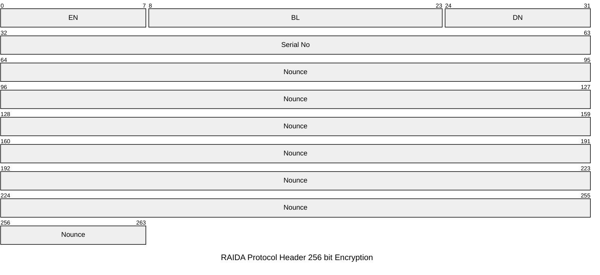
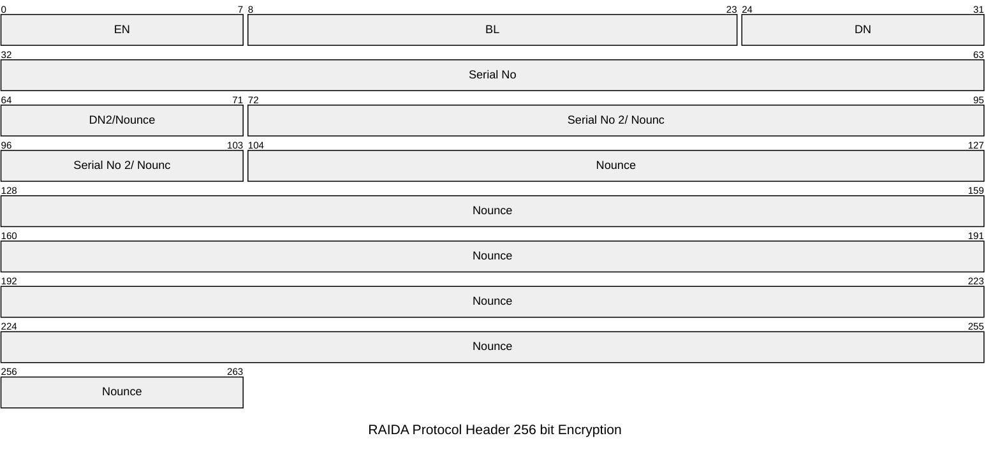

# Header Requests 256 bit
When the client makes requests using 256 bit encryption, the total request header size goes from 32 to 48 bytes. The first 16 bytes are the exact same as all other headers.

You can see the first 16 bytes used for all headers here: https://github.com/worthingtonse/client-prompts/blob/main/CONTEXT/request-header-format.md
Encryption Types 4 and 5 us 256 bit AES CTR encryption.

## Table of Contents

[Encryption Type 4](#encryption-type-4)

[Encryption Type 5](#encryption-type-5)

## Differences between 4 and 5
* Type 4 is used to allow two computers (such as a client and a server) to communciate using one 256 bit key.
* Type 5 allows the client to talk to the raida by using two cloudcoins by combining each's 128 bit Authenticity Numbers into one 256 bit key. 

## Encryption Type 4
The purpose of the Type 4 encryption is to allow computers to message each other using only one 256 bit AES CTR key that was exchanged using the DKE (Distributed Key Exchange) protocol. Encryption type 5 is used to combine two 128 bit keys that are dervived from the coin/key that the computer already has. 

RAIDA Protocol Header Encryption Type 4 has 48 bytes fixed.

### Packet Format

### Request Header index bytes 16 to bytes 47

Index | Group | Code | Name | Notes
---|---|---|---|---
16 | Encryption | EN  | [Encryption](encryption-types.md) Type  |  0x00 means no encryption. See encryption codes table.
17 | Encryption | BL u16| Body Length | Length in bytes of the entire body including the last 2 terminating bytes. 
18 | Encryption | BL u16| Body Length| LOB. If more than 65,535 bytes are sent, files need to be sent using chunking. 
19 | Encryption | DE | [Denomination](denominations.md) | Denomination of the token used to encrypt the request body.
20 | Encryption | SN | Encryption token SN 0| Serial Number of the token used to encrypt the body. HOB
21 | Encryption | SN |  Encryption token SN 1 | 2nd Highest Order Byte
22 | Encryption | SN |  Encryption token SN 2 |  
23 | Encryption | SN |  Encryption token SN 3| Lowest Order Byte
24 | Nonce | NO |  Nonce 0 | The nonce used in the encryption and should never be used twice. 
25 | Nonce | NO |  Nonce 1 | 
26 | Nonce | NO |  Nonce 2 |
27 | Nonce | NO |  Nonce 3 | 
28 | Nonce | NO |  Nonce 4 | 
29 | Nonce | NO |  Nonce 5 | 
30 | Nonce | NO |  Nonce 6 | 
31 | Nonce | NO |  Nonce 7 |
32 | Nonce | NO |  Nonce 8 | 
33 | Nonce | NO |  Nonce 9 | 
34 | Nonce | NO |  Nonce 10 | 
35 | Nonce | NO |  Nonce 11 | 
36 | Nonce | NO |  Nonce 12 |
37 | Nonce | NO |  Nonce 13 | 
38 | Nonce | NO |  Nonce 14 | 
39 | Nonce | NO |  Nonce 15 | 
40 | Nonce | NO |  Nonce 16 | 
41 | Nonce | NO |  Nonce 17 | 
42 | Nonce | NO |  Nonce 18 | 
43 | Nonce | NO |  Nonce 19 | 
44 | Nonce | NO |  Nonce 20 |
45 | Nonce | NO |  Nonce 21 | 
46 | Nonce | NO |  Nonce 22 | The raida echo the last two bytes of the nounce in the Return Header. 
47 | Nonce | NO |  Nonce 23 | The echo is to allow Clients to track which request the response was for. 

## Encryption Type 5 

The purpose of Encryption Type 5 is to allow computers that only have 128 bit AES CRT keys to concatenate them to be able to use 256 bit encryption. The computer will dervive a 256 bit key from the 128 bit coins/keys that the computer already has. Type 5 Encryption is used when computers want to talk to the raida using 256 bit encyption or if raida servers want to talk to each other using 256 bit encryption. 

This is different from Encryption Type 4 which is used when the client and server both have the same 256 bit key and do not need to combine keys. 

RAIDA Protocol Header Encryption Type 5 has 48 bytes fixed. It is exactly the same as Encryption Type 4 except that bytes 
24, 25, 26, 27 and 28 are used to identify a second key as well as be part of the nounce. Byte 24 is the denomination of the second key
and bytes 25 though 28 are the four byte serial number of the second key. 

### Packet Format

### Request Header Byte by Byte Code Meanings

Index | Group | Code | Name | Notes
---|---|---|---|---
16 | Encryption | EN  | [Encryption](encryption-types.md) Type  |  0x00 means no encryption. See encryption codes table.
17 | Encryption | BL u16| Body Length | Length in bytes of the entire body including the last 2 terminating bytes. 
18 | Encryption | BL u16| Body Length| LOB. If more than 65,535 bytes are sent, files need to be sent using chunking. 
19 | Encryption | DE | [Denomination](denominations.md) | Denomination of the token used to encrypt the request body.
20 | Encryption | SN | Encryption token SN 0| Serial Number of the token used to encrypt the body. HOB
21 | Encryption | SN |  Encryption token SN 1 | 2nd Highest Order Byte
22 | Encryption | SN |  Encryption token SN 2 |  
23 | Encryption | SN |  Encryption token SN 3| Lowest Order Byte
24 | Nonce | NO |  DN 2 and Nonce 0 | This byte is the Denomination of key 2 but is also used in the nounce. 
25 | Nonce | NO |  SN2 0 and Nonce 1 | These four bytes are the SNs of key 2 but are also used in the nounce. 
26 | Nonce | NO |  SN2 and Nonce 2 |
27 | Nonce | NO |  SN3 and Nonce 3 | 
28 | Nonce | NO |  SN4 and Nonce 4 | 
29 | Nonce | NO |  Nonce 5 | 
30 | Nonce | NO |  Nonce 6 | 
31 | Nonce | NO |  Nonce 7 |
32 | Nonce | NO |  Nonce 8 | 
33 | Nonce | NO |  Nonce 9 | 
34 | Nonce | NO |  Nonce 10 | 
35 | Nonce | NO |  Nonce 11 | 
36 | Nonce | NO |  Nonce 12 |
37 | Nonce | NO |  Nonce 13 | 
38 | Nonce | NO |  Nonce 14 | 
39 | Nonce | NO |  Nonce 15 | 
40 | Nonce | NO |  Nonce 16 | 
41 | Nonce | NO |  Nonce 17 | 
42 | Nonce | NO |  Nonce 18 | 
43 | Nonce | NO |  Nonce 19 | 
44 | Nonce | NO |  Nonce 20 |
45 | Nonce | NO |  Nonce 21 | 
46 | Nonce | NO |  Nonce 22 | The raida echo the last two bytes of the nounce in the Return Header. 
47 | Nonce | NO |  Nonce 23 | The echo is to allow Clients to track which request the response was for. 
