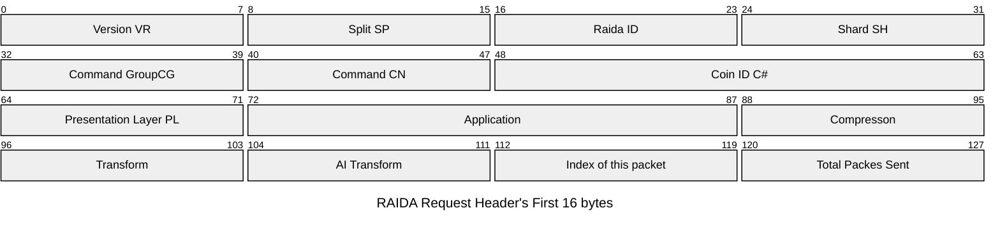
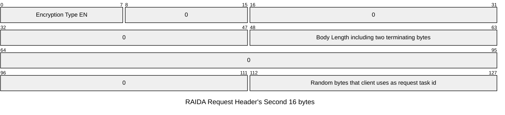

This specification is for when the client is sending unencrypted requests or requests encrypted in 128 bit AES. 

[Request Headers Overview](#overview)

[Request Headers First 16 bytes](#first-16-bytes)

[Request Headers Second 16 bytes](#second-16-bytes)

# Overview
This prodocol allows clients to send requests to the RAIDA. 

All requests made to the RAIDA must have a header that is 32 bytes in length.

If the header is not 32 bytes, the Raida will ignore the request and not return anything. 

The first 16 bytes of the request header are the same for all calls regardless of what their encryption type is. 

There are a lot of bytes in the first 16 bytes that are for future use. 

The second 16 bytes of the header are different depending on the encryption type used. 

The Request Headers are never encrypted but the bodies of the requests are. 

The second 16 bytes of the header vary depending on the encryption type. 

All multibyte fields are considered big-endian. For example, the two "Body Length" bytes located at 22 and 23, byte index 22 is MSB and index 23 is LSB.

The 32 bytes are broken into four different catagories with 8 bytes in each catagory:

```javascript
VR SP RI SH CG CM C# C#  // 8 Routing Bytes
VR AP AP CP TR AI RE RE  // 8 Presentation Bytes
EN DN SN SN SN SN BL BL  // 8 Encryption Bytes
NO NO NO NO NO NO EC EC  // 8 Nounce Bytes
```


# First 16 Bytes
The first sixteen bytes can be shown like this with a dollar sign represending a variable that goes in that index number. All the other numbers are fixed so that all 
that is needed is to replace the variables and leave the fixed amounts as shown: 

```
00 00 $2 00 $4 $5 00 06 00 00 00 00 00 00 01 01  
```
Filling in the Variables

Index Number | Possible values | Description | How to calculate
---|---|---|---
$2 | 0-24 | Each raida server has a id number | Each call will use a different ID. The [Raida IP addresses and port numbers](https://github.com/worthingtonse/client-prompts/blob/main/CONTEXT/raida-ips.csv) are located in the [raidas.csv](https://github.com/worthingtonse/client-prompts/blob/main/CONTEXT/program-file-structure.md) file. 
$4 | 0-13 | Code of the Command group the command fall in. | Commands fall within command groups to better organize them. Use the [lookup table]
$5 | 0-255 | Code of the Command. | Each command has a code | Use the [lookup table] to see a command's code. 




# Second 16 Bytes
The second 16 bytes are determined by the [Encryption Type](https://github.com/worthingtonse/client-prompts/blob/main/CONTEXT/encryption-types-used-in-requests.md).

[Request Header for Encryption Type 0](#encryption-type-0)

[Request Header for Encryption Type 1](#encryption-type-1)

[Request Header for Encryption Type 2](#encryption-type-2)

[Request Header for Encryption Type 3](#encryption-type-3)

[Request Header for Encryption Type 4](#encryption-type-2)

[Request Header for Encryption Type 5](#encryption-type-3)


## Encryption Type 0
Type zero uses no encryption so the values are almost always the same. Here is the second 16 bytes of the request header with the static numbers required and the variables numbers with a dollar sign. 

```
00 00 00 00 00 $22 $23 00 00 00 00 00 00 00 $30 $31
```
Filling in the Variables

Index Number | Possible values | Description | How to calculate
---|---|---|---
$22 | 0-65535 for 22 and 23 together | Body Length including two terminating bytes |byte index 22 is MSB
$23 | -  | - |byte index 23 is LSB.
$30 | 0-255 | This byte will be returned to the caller unchanged | random byte used by the client to identify return requests. 
$31 | 0-255  | This byte will be returned to the caller unchanged |random byte used by the client to identify return requests. 



### Request Header Byte by Byte Code Meanings

Index | Group | Code | Name | Notes
---|---|---|---|---
16 | Encryption | EN  | [Encryption](https://github.com/worthingtonse/client-prompts/blob/main/CONTEXT/encryption-types-used-in-requests.md) Type  |  0x00 means no encryption. See encryption codes table.
17 | Encryption | 0 | Not needed | Use zero for encryption type 0.
18 | Encryption | 0 | Not needed| Use zero for encryption type 0.
19 | Encryption | 0 |  Not needed | Use zero for encryption type 0.
20 | Encryption | 0 |  Not needed |  Use zero for encryption type 0.
21 | Encryption | 0 |  Not needed| Use zero for encryption type 0.
22 | Encryption | BL u16| Body Length | Length in bytes of the entire body including the last 2 terminating bytes. 
23 | Encryption | BL u16| Body Length| LOB. if more than 65,535 bytes are sent, then bytes 22 and 23 will be FF FF and bytes 24, 25, 26 and 27 will be the body length. 
24 | Nonce | 0 |  Not needed | Use zero for encryption type 0.
25 | Nonce | 0 |  Not needed | Use zero for encryption type 0.
26 | Nonce | 0 |  Not needed |Use zero for encryption type 0.
27 | Nonce | 0 |  Not needed| Use zero for encryption type 0.
28 | Nonce | 0 |  Not needed | Use zero for encryption type 0.
29 | Nonce | 0 |  Not needed | Use zero for encryption type 0.
30 | Nonce | random |  Echo 0 | Random byte.  These bytes are always echoed back to the client so the client knows what the response if for. 
31 | Nonce | random |   Echo 1 | Random byte.

* If EN (byte 16) is zero (no encryption) then bytes 17-31 may take any values. In 'no encryption' mode, these values will be ignored except for the two echo bytes. 

