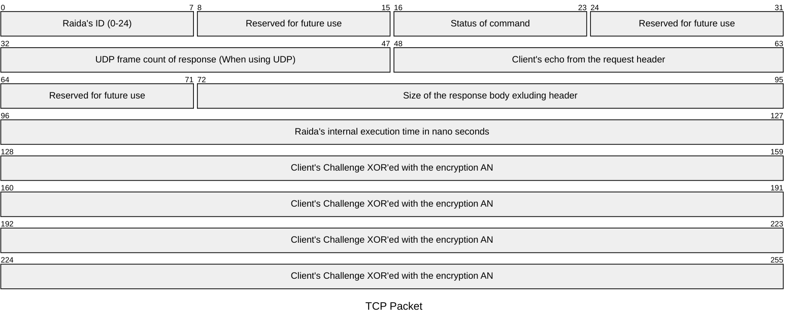

# Response Header Format
The radia responds with a response header and a response body. 

# Response Headers
Response Headers are 
* always 32 bytes long.
* Never encrypted.
  
Response Header layout (32 bytes fixed):

## Response Header Codes
Index | Code | Name | Info
--- |---|---|---
00 |RI | RAIDA ID  |  Integer 0 through 24. If the response is from RAIDA 3 it will be 3
01 |SH | SHARD ID  |  Zero unless sharding is implemented
02 |SS | Status    | That status code that is returned. See return [Status](https://github.com/worthingtonse/client-prompts/blob/main/CONTEXT/status-codes-from-raida.md) codes.   
03 | RV | Reserved  | For future use
04 |UD | UDP Frame Count 0   |  This allows the client to know how to put the returned packets together in order. 
05 |UD | UDP Frame Count 1   |  Lower Order Byte.
06 |EC | Client Echo 0 | Returns exact info that Client supplied in the Request Header.  
07 |EC | Client Echo 1 | last byte of the request header.
08 |RE | Reserved | Reserved for future use. Use zero for now.
09 |SZ | Size of body 0 |  The length in bytes of the response packet excluding the Response Header. Only used with...
10 |SZ | Size of body 1 |   TCP. (This is not needed with UDP)
11 |SZ | Size of body 2  |  
12 |EX | Execution Time  0 | Nano seconds the RAIDA needed to process the request. Up to 4,294,967,295...
13 |EX | Execution Time 1  | helps evaluation server performance.
14 |Ex | Execution Time 2 |  
15 |Ex | Execution Time 3  |  
16 |HS | Signature 0 | 16 bytes Client's challenge is XOR'ed with the Encyption AN.
17 |HS | Signature 1 | 1. Take the clients challenge and unencrypt it.
18 |HS | Signature 2| 2. XOR the unencrypted challenge with the AN used to encrypt it. 
19 |HS | Signature 3| 3. Put this in the Header. 
20 |HS | Signature 4| Example: 
21 |HS | Signature 5| Challenge is eb159806b4024f65af86dc25edbe3a1d
22 |HS | Signature 6| Encryption AN is 66689ef5bde040479416b4f6d9576172
23 |HS | Signature 7| XOR is 8d7d06f309e20f223b9068d334e95b6f
24 |HS | Signature 8| 
25 |HS | Signature 9| 
26 |HS | Signature A| 
27 |HS | Signatuee B|
28 |HS | Signature C| 
29 |HS | Signature D| 
30 |HS | Signature E| 
31 |HS | Signature F| 

