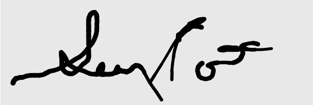
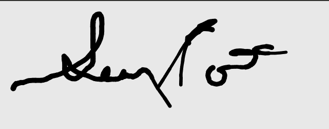

# Binary SVG (Scalled Vector Graphics)
This standard is designed to massivly reduce the size of an SVG file. 
For example, a file that requires 16,686 bytes with the standard SVG would only take 2. 

Replaces all control characters with 6 bit characters and all number values to 12 bits.  

Note that the quality of the images is identical. 
## The original image required 16,618 bytes. 
100% of the original size

## The binary version required 1,468 byte and just around 720 after ZIP
96% compression rate.

## **Key Changes for 12-bit Encoding:**

✅ **Precision**: 0.2 instead of 0.1 (values like 1.6, 1.8, 2.0, 2.2, etc.)  
✅ **Range**: Covers 0 to 819.2 possible values. Only one digit of precision
✅ **Bits needed**: Exactly 12 bits (2¹² = 4,096 values)  
✅ **Quality**: Minimal impact - maximum error is only ±0.1 from original

## **Conversion Examples:**
- 18.7 → 18.8 (error: +0.1)
- 23.7 → 23.8 (error: +0.1) 
- 5.5 → 5.6 (error: +0.1)
- 4.9 → 5.0 (error: +0.1)

## **Storage Efficiency:**
- **963 numbers × 12 bits = 11,556 bits = ~1.4KB**
- **Original text file**: ~14KB
- **Compression**: 90% file size reduction
- **Quality loss**: Virtually none (±0.1 maximum error)

The visual appearance is essentially identical to the original, but now each coordinate can be stored in exactly 12 bits instead of 13, saving you about 120 bytes while maintaining excellent quality!
