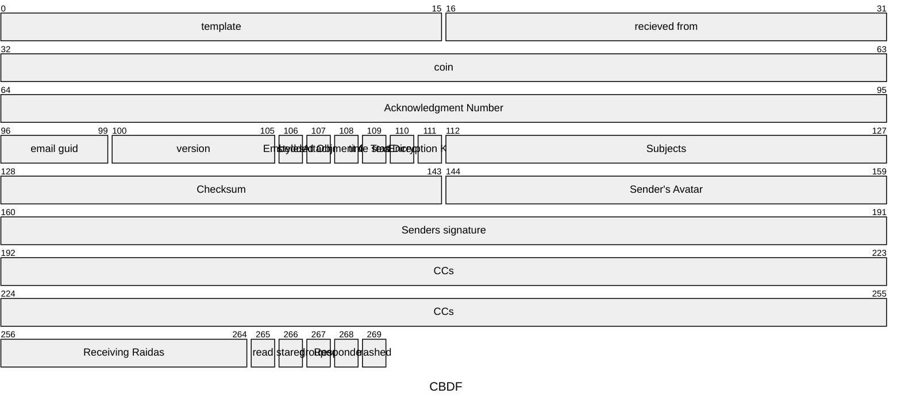

# **Compact Binary Document Format (CBDF) \- v0.1 Specification**

## **1\. Overview**

The Compact Binary Document Format (CBDF) is designed for the efficient storage and transmission of binary documents. 
Its primary goals are to be significantly smaller than equivalent files and to provide a flexable format that can be used for
any application.

The format achieves its compactness through several key strategies:

* **Predefined Fixed Table:** 
* **Predefined Resource Table:** 

The standard character encoding for all text content is **UTF-8**.

## **2\. File Structure**

A CBDF file consists of two main sections: a **Fixed** followed by a **Variable**.

\+------------------------+  
|         FIXED          |  
|    Fixed size fields   |  
|    that are required   |  
\+------------------------+  
|        VARIABLE        |  
|   Fields that vary in  |  
| length or are optional |  
\+------------------------+

## **3\. The Fixed Section**

The Fixed Section defines all the fields that do not change and are always the same length. 
The structure is defined in a table that looks like this: 

| Field                     | Size (Bytes) | Description                                                                 |
|---------------------------|--------------|-----------------------------------------------------------------------------|
| Fixed Field 1                  |  Fixed Bytes            | Binary-encoded, fixed length              |
| Fixed Field 2                  |  Fixed Bytes            | Binary-encoded, fixed length              |
| Fixed Field 3                  |  Fixed Bytes            | Binary-encoded, fixed length              |
| Fixed Field 4                  |  Fixed Bytes            | Binary-encoded, fixed length              |

## **4\. The Variable Section**
The Variable Section must be parsed by the reader. It starts with a single byte that specifies how many key-value pairs there are (up to 255). 
Then the 

| Field                     | Size (Bytes) | Description                                                                 |
|---------------------------|--------------|-----------------------------------------------------------------------------|
| Number of Key-Value Pairs | 1            | Unsigned integer (0–255) indicating the number of key-value pairs that follow. |
| Key-Value Pair(s)         | Variable     | Repeated for each pair (as specified by Number of Key-Value Pairs):         |
| &nbsp;&nbsp;Key           | 1            | Unsigned integer (0–255) representing a predefined key (e.g., 0 = "name").  |
| &nbsp;&nbsp;Value Length  | 1            | Unsigned integer (0–255) specifying the length of the value in bytes.       |
| &nbsp;&nbsp;Value         | 0–255        | Binary data for the value (length as specified by Value Length).            |

Key Table

Key | Name
---|---
1: |"template"
2: |"recieved from"
3: |"coin"
4: |"Acknowledgment Number"
5:| "email guid"
6:| "version"
7:| "styles"
8: |"Embedded Object Table"
9: |"Attachment GUIDs"
10: |"time stamp"
11:| "Text Direction"
12:| "Encryption Key ID"
13:| "Subjects"
128-143:| "Checksum"
144-159:| "Sender's Avatar"
160-191: |"Senders signature"
192-255:| "CCs"
256-264:| "Receiving Raidas"
265: |"read"
266: |"stared"
267: |"grouped"
268: |"Responded to"
269: |"trashed"

Header Sections: Note: If the email will be shown as plain text, it should still work if control characters are removed. 
Starter Code | Name | Description
---|---|---
^1 | Fixed Section | This is the fixed portion of the header
^2 | Background Styles |Length depends on the template. Style includes Color, Img, Width%, Height%, Default will be golden ratio. 
^3 | Containers Styles | This is the fixed portion of the header
^4 | Text Styles | This is the fixed portion of the header
^5 | Events | What happens when ...
^6 | Links | text of what happens ...
^6 | Links | text of what happens ...

