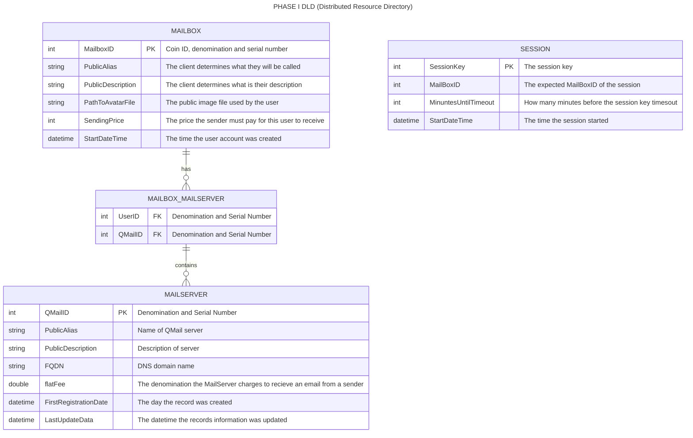

## Distributed Resource Directory
1. The DRD allows users to post information about themselves so that others can find them.
2. A Mail Box Number is a seven byte number than includes a two byte coin ID, 1 byte Denomination and a 4 byte serial number. 
3. Users can get a Mailbox Number by obtaining a certicate (CloudCoin). The coin ID for  CloudCoin is 0x0006.
4. Users can get tickets by authenticating their CloudCoin certificate with RAIDA servers.
5. Users can give their tickets to a DRD server who will confirm that they are authentic with the RAIDA servers.
6. Authenticated Users can associate their Mailbox ID with data that they put into the DRD. 
7. Users can delete their entire record in the DRD or update it. 
8. DRD records are kept in a SQLight Databased on the DRD server
7. There should be no empty fields in the user's DRD records.
8. The DRD servers also contain files such as the user's avatar.
9. Everything in the DRD is public information except the user's comment on why they made the last update.
10. The client may register the same information with multiple DRD servers for redundancy.
11. DRD servers may syncronize themselves.

## DRD workflow. 
1. The DRD server must go through the DKE [Distributed key Exchange Process](https://github.com/worthingtonse/WEST-Protocol/blob/main/Q.%20Distributed%20Key%20Exchange.md)
2. The DRD client must find the DRD's DKE servers and get a shared AES 256 bit CTR key with the DRD server.
3. The DRD client must choose a CloudCoin that they will use as a Mail Box Address .
4. The DRD client will get tickets from the RAIDA by calling the [get_ticket](https://github.com/worthingtonse/WEST-Protocol/blob/main/F.%20Healing%20Services.md#get-ticket) service. 
5. DRD client will use the key created in the DKE exchange process to connect to the DRD server's [Create Session Service](https://github.com/worthingtonse/client-prompts/blob/main/Ideas%20In%20Progress/QMAIL/start-session.md#start-session-api---simplified-guide) and send it its tickets. Clients use encryption type 6.

## DRD Services
   
[INSERT UPDATE DELETE DRD](#insert-update-delete-drd)

[SEARCH DIRECTORY](#search-directory)

## DRD's Entity Relationship Diagram


##
```
/directory_root/
└── mailboxes/
    └── 000634FC89A4E6/
        ├── .avatar.png
        ├── devices/
        │   ├── D_A1B2C3D4.json
        │   └── D_E5F6G7H8.json
        └── policies/
            ├── blacklist.bin
            └── whiteList.bin
```

## Column Codes
Many DLD Services deal with data. Data Columns are encoded for the binary calls using Key IDs.  

Table | Column | Column Code 
---|---|---
mailbox | mailbox_id | 10
mailbox | public_alias | 11
mailbox | public_description | 12
mailbox | avatar_file_name | 13
mailbox | avatar_data | 14
mailbox | send_price | 15
mailbox | start_date_time | 16
mailbox_mailserver | mailbox_id | 251
mailbox_mailserver | qmail_server_id | 200


## Insert Update Delete DRD

Sample Request:
```c
CH CH CH CH CH CH CH CH CH CH CH CH CH CH CH CH
SE SE SE SE SE SE SE SE SE SE SE SE SE SE SE SE
Update CBD file
E3 E3
```

Directory Update CBDF Fixed Fields: Note: All data is in binary. Strings are UTC-8 Encoded.
Key Code | Value Bytes | Name & Description
---|---|---
0 | 1 | Number of Key-value pairs
1 | 2 | Payment Coin Code. 0006 for Cloudcoin.
2 | 16 | Payment Locker Code
11 | varies (max 255)| "Display Name/Alias". Primary display name or chosen alias for the user encoded in UTF-8
12 | varies (max 255) | "Self Description" Public info about self
13 | varies | Avatar file name
14 | varies (255x100)| Avatar file
15 | 3 | Amount that senders must pay reciever. Coin type (2 bytes) and Denomination ( 0x0000  Cloudcoin by default)
200 | 8 | QMail[0] CT CT IP IP IP IP PT PT  // coin id, ip address, port
201 | 8 | QMail[1] CT CT IP IP IP IP PT PT  // coin id, ip address, port
202-230 | 8 | QMail[2-40] CT CT IP IP IP IP PT PT  // coin id, ip address, port
231 | 8 | QMail[31] CT CT IP IP IP IP PT PT  // coin id, ip address, port


Return Status Codes
```C
STATUS_SUCCESS = 250
ERROR_FEW_COINS_IN_LOCKER = 153,
ERROR_LOCKER_EMPTY_OR_NOT_EXISTS = 179,
ERROR_INVALID_PARAMETER = 198,
```

Nothing in Response Body
```
E3 E3
```

## Search Directory
This allows the user to search for a person in the directory. It will only warn people if they are blacklisted. 

```C
CH CH CH CH CH CH CH CH CH CH CH CH CH CH CH CH
SE SE SE SE SE SE SE SE SE SE SE SE SE SE SE SE
Search Directory CBDF
E3 E3
```
Directory Search CBDF
Directory Update CBDF Fixed Fields: Note: All data is in binary. Strings are UTC-8 Encoded.
Key Code | Value Bytes | Name & Description
---|---|---
0 | 1 | Number of Key-value pairs
1 | 2 | Payment Coin Code. 0006 for Cloudcoin.
2 | 16 | Payment Locker Code
3 | Varies | Select Column Codes. One byte per Column in the Column Code table above. 
4 | 1 | Limit in KB.  
5 | 1 | Page. Default is 0
6 | 3 | Where Clause. Directory Key, Comparison Operator ( 0= Not Equal To, 1= Equal To, 2 = Greater than, 3 = Less Than, 4 = Contains, 5 = Does Not Contain), Number (0) or Text (1) field, Number or Text (length varies)
7 | 3 | AND Where Clause. Directory Key, Comparison Operator ( 0= Not Equal To, 1= Equal To, 2 = Greater than, 3 = Less Than, 4 = Contains, 5 = Does Not Contain), Number (0) or Text (1) field, Number or Text (length varies)
8 | 3 | OR Where Clause. Directory Key, Comparison Operator ( 0= Not Equal To, 1= Equal To, 2 = Greater than, 3 = Less Than, 4 = Contains, 5 = Does Not Contain), Number (0) or Text (1) field, Number or Text (length varies)

Response Status Codes
```C
STATUS_SUCCESS = 250
ERROR_FEW_COINS_IN_LOCKER = 153,
ERROR_LOCKER_EMPTY_OR_NOT_EXISTS = 179,
ERROR_INVALID_PARAMETER = 198,
ERROR_DATABASE_RETURNED_ZERO_RECORDS = 9,
ERROR_DATABASE_REPORTED_AN_ERROR = 10,
```

Response Body:
```C
CBDF File
E3 E3
```

Directory Search Results CBDF
Fixed Key | Bytes | Description
---|---|---

Key Code | Value Bytes | Name & Description
---|---|---
0 | 1 | Number of Key-value pairs
1 | 2 | How many rows where returned up to 65,535.
2 | 1 | Columns Per Row, Up to 255
3 | 1 | The return rows. The byte does not really matter. The size of the response can be chained. 

Variable Fields. Note that in the case of it returning more than one row, we will see the IDs repeat.
The following shows three rows being returned: 
```
0A 10 ca8d0787f2a84b4babf1ef9f3d118b16 // Column Code (key), Length of value, Value )These are ficticious)
02 0F 4b4babfca8d0787f2a81ef9f3d118b
06 03 1ef9f3
0A 0E 4babf1ef9f3d11ca8d0787f2a84b
02 0E 81ef9f3d114b4babfca8d0787f2a
06 02 1ef9
0A 10 ca8d0787f2a84b4babf1ef9f3d118b16
02 0F 4b4babfca8d0787f2a81ef9f3d118b
06 03 1ef9f3
```


# Questions and Answers: 

## Authentication & Security Questions

**Session Management:**
- How are session keys generated and what's their format?
  - The session keys are 16 byte keys generated by the client (GUIDs). 
- What happens when a session times out - is there automatic cleanup?
   - Before the session times out, the server will respond to the client's ping request telling it to renew the client. If the client PINGs again, the session key will be extended. Otherwise, the client will need to get tickets from the RAIDA and call the start session service again.     
- Can multiple concurrent sessions exist for the same mailbox?
   - Yes. This may happen if a user is signed in using different devices such as a laptop and a cell phone.     

**Ticket System:**
- What's the format and structure of tickets from RAIDA servers?
- How long are tickets valid?
- What specific validation does the DRD server perform with RAIDA?

## Technical Implementation Gaps

**Synchronization:**
- How do DRD servers discover each other for synchronization?
- What conflict resolution strategy is used when servers have different data?
- How often does synchronization occur?

**File Storage:**
- What are the size limits for avatar files beyond the "255x100" mention?
- Are there format restrictions for avatar files?
- How are the blacklist.bin and whiteList.bin files structured and used?

**Database Operations:**
- What happens during partial failures when updating multiple related tables?
- Are there any indexing strategies mentioned for search performance?
- How are database migrations handled?

## Protocol Specification Issues

**Binary Format Clarity:**
- The CBDF format structure isn't fully defined
- Variable-length field encoding rules need clarification
- Endianness for multi-byte values isn't specified

**Error Handling:**
- What happens if a user tries to register with an already-used mailbox ID?
- How are network failures during operations handled?
- What's the retry strategy for failed RAIDA validations?

## Business Logic Questions

**Pricing Model:**
- How is the "SendingPrice" enforced and collected?
- What prevents users from setting prices to zero?
- How do payments flow between users and servers?

**Data Validation:**
- What constitutes valid data for each field?
- Are there character limits beyond what's mentioned?
- How are malicious or inappropriate content submissions handled?

The specification provides a good architectural overview but would benefit from more detailed implementation guidance, error scenarios, and operational procedures.
