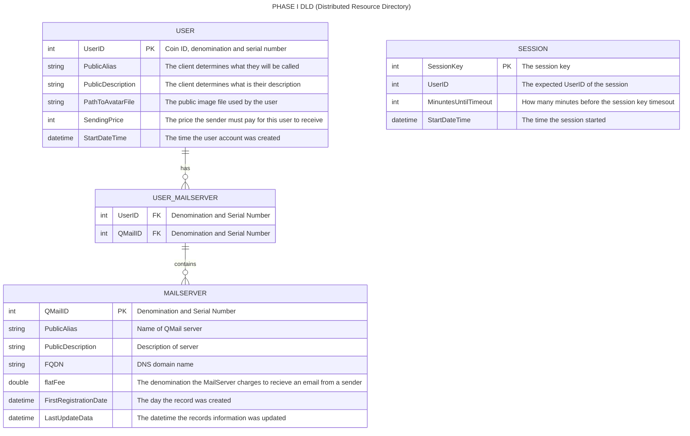

## Distributed Resource Directory
1. The DRD allows users to post information about themselves so that others can find them.
2. A Mail Box Number is a seven byte number than includes a two byte coin ID, 1 byte Denomination and a 4 byte serial number. 
3. Users can get a Mailbox Number by obtaining a certicate (CloudCoin). The coin ID for  CloudCoin is 0x0006.
4. Users can get tickets by authenticating their CloudCoin certificate with RAIDA servers.
5. Users can give their tickets to a DRD server who will confirm that they are authentic with the RAIDA servers.
6. Authenticated Users can associate their Mailbox ID with data that they put into the DRD. 
7. Users can delete their entire record in the DRD or update it. 
8. DRD records are kept in a SQLight Databased on the DRD server
7. There should be no empty fields in the user's DRD records.
8. The DRD servers also contain files such as the user's avatar.
9. Everything in the DRD is public information except the user's comment on why they made the last update.
10. The client may register the same information with multiple DRD servers for redundancy.
11. DRD servers may syncronize themselves.

## DRD workflow. 
1. The DRD server must go through the DKE [Distributed key Exchange Process](https://github.com/worthingtonse/WEST-Protocol/blob/main/Q.%20Distributed%20Key%20Exchange.md)
2. The DRD client must find the DRD's DKE servers and get a shared AES 256 bit CTR key with the DRD server.
3. The DRD client must choose a CloudCoin that they will use as a Mail Box Address .
4. The DRD client will get tickets from the RAIDA by calling the [get_ticket](https://github.com/worthingtonse/WEST-Protocol/blob/main/F.%20Healing%20Services.md#get-ticket) service. 
5. DRD client will use the key created in the DKE exchange process to connect to the DRD server's [Create Session Service](https://github.com/worthingtonse/client-prompts/blob/main/Ideas%20In%20Progress/QMAIL/start-session.md#start-session-api---simplified-guide) and send it its tickets. Clients use encryption type 6.

## DRD Services
   
[INSERT UPDATE DELETE DRD](#insert-update-delete-drd)

[SEARCH DIRECTORY](#search-directory)

## DRD's Entity Relationship Diagram


##
```
/directory_root/
└── users/
    └── 000634FC89A4E6/
        ├── .avatar.png
        ├── devices/
        │   ├── D_A1B2C3D4.json
        │   └── D_E5F6G7H8.json
        └── policies/
            ├── blacklist.bin
            └── whiteList.bin
```


## Insert Update Delete DRD

Sample Request:
```c
CH CH CH CH CH CH CH CH CH CH CH CH CH CH CH CH
SE SE SE SE SE SE SE SE SE SE SE SE SE SE SE SE
Update CBD file
E3 E3
```

Directory Update CBDF Fixed Fields: Note: All data is in binary. Strings are UTC-8 Encoded.
Key Code | Value Bytes | Name & Description
---|---|---
0 | 1 | Number of Key-value pairs
1 | 2 | Payment Coin Code. 0006 for Cloudcoin.
2 | 16 | Payment Locker Code
3 | varies (max 255)| "Display Name/Alias". Primary display name or chosen alias for the user encoded in UTF-8
4 | varies (max 255) | "Self Description" Public info about self
5 | 3 | Amount that senders must pay reciever. Coin type (2 bytes) and Denomination ( 0x0000  Cloudcoin by default)
6 | varies | Avatar file name
7 | varies (255x100)| Avatar file
10 | 8 | QMail[0] CT CT IP IP IP IP PT PT  // coin id, ip address, port
11 | 8 | QMail[1] CT CT IP IP IP IP PT PT  // coin id, ip address, port
12-40 | 8 | QMail[2-40] CT CT IP IP IP IP PT PT  // coin id, ip address, port
41 | 8 | QMail[31] CT CT IP IP IP IP PT PT  // coin id, ip address, port


Return Status Codes
```C
STATUS_SUCCESS = 250
ERROR_FEW_COINS_IN_LOCKER = 153,
ERROR_LOCKER_EMPTY_OR_NOT_EXISTS = 179,
ERROR_INVALID_PARAMETER = 198,
```

Nothing in Response Body
```
E3 E3
```

## Search Directory
This allows the user to search for a person in the directory. It will only warn people if they are blacklisted. 

```C
CH CH CH CH CH CH CH CH CH CH CH CH CH CH CH CH
SE SE SE SE SE SE SE SE SE SE SE SE SE SE SE SE
Search Directory CBDF
E3 E3
```
Directory Search CBDF
Directory Update CBDF Fixed Fields: Note: All data is in binary. Strings are UTC-8 Encoded.
Key Code | Value Bytes | Name & Description
---|---|---
0 | 1 | Number of Key-value pairs
1 | 2 | Payment Coin Code. 0006 for Cloudcoin.
2 | 16 | Payment Locker Code
3 | Varies | Return Key IDs (columns) One byte per resource in the Resource Table CDFD Key Table above in the Update Directory Service above. 
4 | 1 | Limit in KB.  
5 | 1 | Page. Default is 0
6 | 3 | Where Clause. Directory Key, Comparison Operator ( 0= Not Equal To, 1= Equal To, 2 = Greater than, 3 = Less Than, 4 = Contains, 5 = Does Not Contain), Number (0) or Text (1) field, Number or Text (length varies)
7 | 3 | AND Where Clause. Directory Key, Comparison Operator ( 0= Not Equal To, 1= Equal To, 2 = Greater than, 3 = Less Than, 4 = Contains, 5 = Does Not Contain), Number (0) or Text (1) field, Number or Text (length varies)
8 | 3 | OR Where Clause. Directory Key, Comparison Operator ( 0= Not Equal To, 1= Equal To, 2 = Greater than, 3 = Less Than, 4 = Contains, 5 = Does Not Contain), Number (0) or Text (1) field, Number or Text (length varies)

Response Status Codes
```C
STATUS_SUCCESS = 250
ERROR_FEW_COINS_IN_LOCKER = 153,
ERROR_LOCKER_EMPTY_OR_NOT_EXISTS = 179,
ERROR_INVALID_PARAMETER = 198,
ERROR_DATABASE_RETURNED_ZERO_RECORDS = 9,
ERROR_DATABASE_REPORTED_AN_ERROR = 10,
```

Response Body:
```C
CBDF File
E3 E3
```

Directory Search Results CBDF
Fixed Key | Bytes | Description
---|---|---

Key Code | Value Bytes | Name & Description
---|---|---
0 | 1 | Number of Key-value pairs
1 | 2 | How many rows where returned up to 65,535.
2 | 1 | Columns Per Row, Up to 255
3 | 1 | The return rows. The byte does not really matter. The size of the response can be chained. 

Variable Fields. Note that in the case of it returning more than one row, we will see the IDs repeat.
The following shows three rows being returned: 
```
01 10 ca8d0787f2a84b4babf1ef9f3d118b16
02 0F 4b4babfca8d0787f2a81ef9f3d118b
06 03 1ef9f3
01 0E 4babf1ef9f3d11ca8d0787f2a84b
02 0E 81ef9f3d114b4babfca8d0787f2a
06 02 1ef9
01 10 ca8d0787f2a84b4babf1ef9f3d118b16
02 0F 4b4babfca8d0787f2a81ef9f3d118b
06 03 1ef9f3
```
