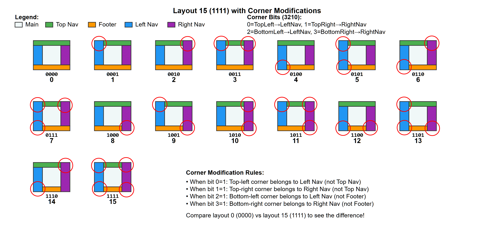

# Template Code
Each qmail file has a one byte template code. These Template codes may also contain modifiers and sub templates. 

The template code consistis of one byte. The first four bits are the major template and the next four bits are for control of the corners in realation ship to the side bars. 

