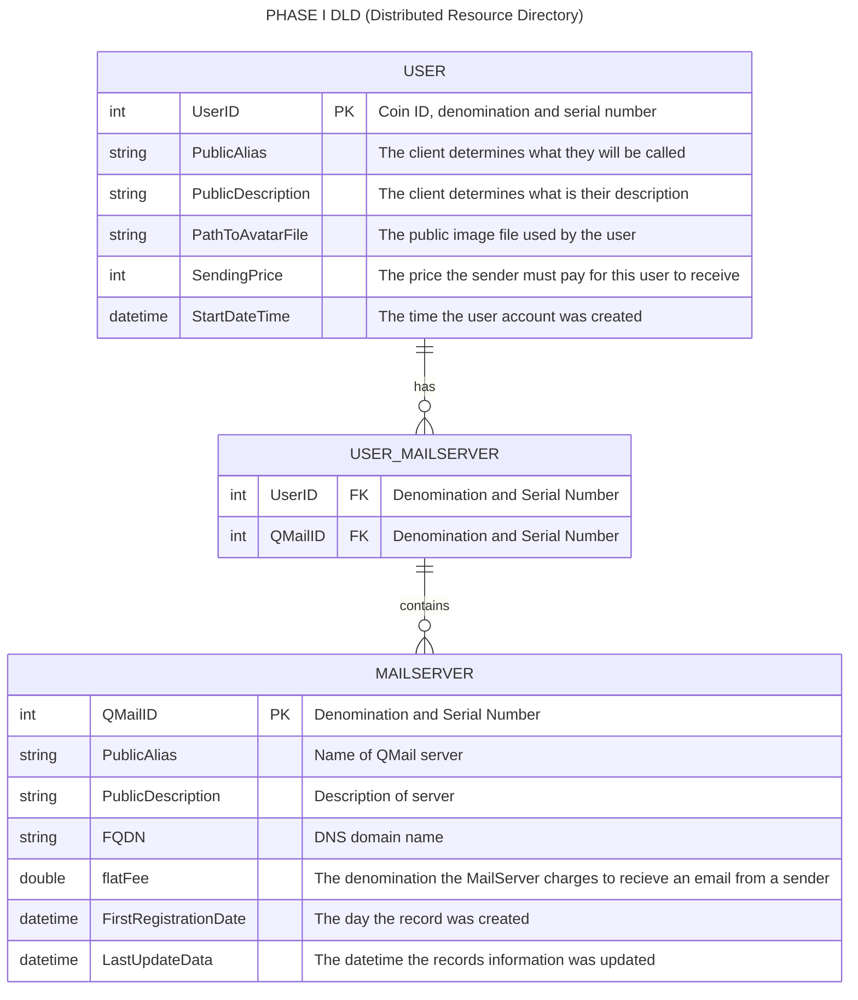
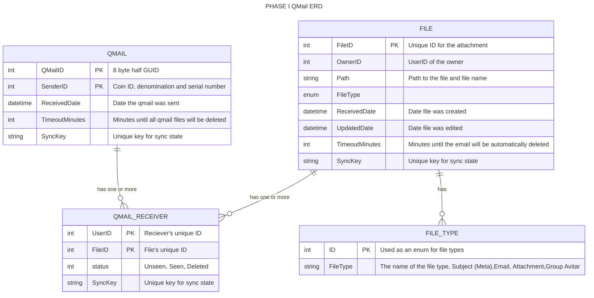
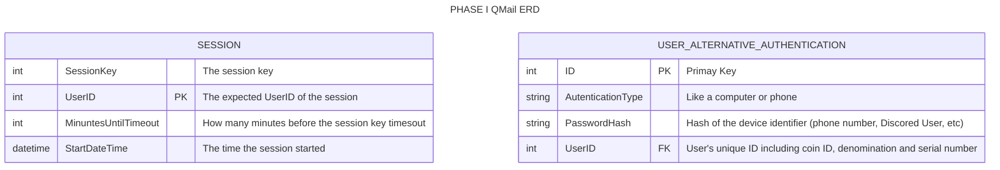
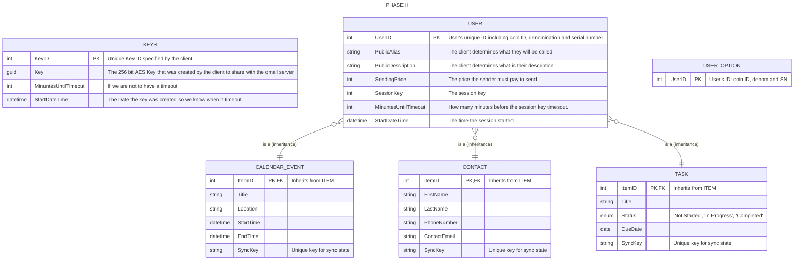

# Goals of the QMail system
1. The system provides security and quantum safety by taking emails and deviding them bit by bit into stripes. These stripes are uploaded to an array of QMail servers with each server getting a different stripe.
2. The QMail servers should not be able to read any meta date about an qmail except the IP address of the sender and the time an email was received.
3. Users can publish themselves in the Distributed Resource Directory so people can find them or they can refrane from doing so. 
4. The emails are distributed in stripes over many servers. This is why hidden data such as the subject are kept in files that the user can download and put togetgher on their client machines.
5. Users need to be able to check their email on different devices such as desktops and phones. These devices should be able to sync up.
6. A Qmail consists of many files including the meta file (subject, time, receipients), the qmail file (text that is marked up), attachment files and special peer-to-peer secrets such as avatar images not published in the Distributed Resource Directory. 
7. The sender should be able to update (overwrite)the qmail they send and even delete the email and all of its attachments.
8. 
   
# Server ERD
## Distributed Resource Directory

## QMail

## Utility Tables



## Phase II (Work in progress so ignore this)



### File System Structure

Let's use a base directory, say `/mailroot/`, to hold everything. The structure would look like this, using a user `john.doe@example.com` as an example:

```
/mailroot/
└── users/
    └── john.doe@example.com/
        ├── .profile.json
        ├── devices/
        │   ├── D_A1B2C3D4.json
        │   └── D_E5F6G7H8.json
        ├── folders/
        │   ├── F_INBOX/
        │   │   ├── I_1.eml
        │   │   ├── I_2.eml.meta
        │   │   └── I_3.eml
        │   ├── F_CALENDAR/
        │   │   ├── I_4.ics
        │   │   └── I_4.ics.meta
        │   ├── F_CONTACTS/
        │   │   ├── I_5.vcf
        │   │   └── I_6.vcf
        │   └── F_TASKS/
        │       └── I_7.json
        └── policies/
            └── P_Default.json
```

-----

### Mapping Entities to Files/Folders

Here’s how each part of the ERD is represented:

  * **USER**: Each user is a directory within `/mailroot/users/`. The directory name is their email address (sanitized for file system safety). A `.profile.json` file inside their directory can hold user-specific settings.
  * **DEVICE**: The `devices/` subdirectory holds a JSON file for each registered device. The filename could be a unique ID assigned to the device (e.g., `D_A1B2C3D4.json`). This file would contain device info (model, OS) and its current sync state.
  * **POLICY**: The `policies/` subdirectory contains JSON files defining the security policies. A policy could be linked to a device by referencing its filename inside the device's JSON file.
  * **FOLDER**: The `folders/` subdirectory contains a directory for each of the user's folders (e.g., `F_INBOX/`, `F_CALENDAR/`). The prefix `F_` helps distinguish them as data folders.
  * **ITEM (Email, Calendar, Contact, Task)**: These are the individual files inside the folder directories. The key is to use standard file formats:
      * **Email**: `.eml` files, a standard format that includes headers, body, and can even contain attachments.
      * **Calendar Event**: `.ics` (iCalendar) files.
      * **Contact**: `.vcf` (vCard) files.
      * **Task**: A custom `.json` file would work well here.

-----

### Handling Relationships and State

This is where it gets tricky and requires strict conventions.

  * **Item ID**: The filename itself serves as the unique ID for an item (e.g., `I_1`, `I_2`). The `I_` prefix makes it clear this is an item.
  * **Attachments**: For an email like `I_2.eml` that has attachments, you could create a corresponding directory named `I_2.attachments/` and place the attachment files inside it.
  * **State Management (Read/Unread)**: This is a classic challenge. You could:
    1.  **Rename the file**: An unread message is `I_3_UNREAD.eml`, and when read, it's renamed to `I_3.eml`. This is simple but involves a lot of file renaming operations.
    2.  **Use a metadata file**: For each item `I_2.eml`, you could have an optional `I_2.eml.meta` file. This JSON file would store flags like `{"read": true, "flagged": false}`. This is more flexible and avoids constant renaming.

### The Big Trade-Offs

While this file-system-only approach is possible, you are essentially building a database engine from scratch in your application code.

  * **Searching is Inefficient**: To find all emails from "boss@example.com", you have to open and read *every single `.eml` file* in the Inbox folder. A database does this instantly with an index.
  * **Concurrency is Hard**: What happens if two devices try to modify the same metadata file at the exact same time? You could corrupt the file. Databases have locking mechanisms to prevent this.
  * **Performance Degrades**: A folder with 50,000 files in it will be much slower for the operating system to list and access than a folder with 500 files. A database is designed to handle millions of records with consistent performance.

In conclusion, using the file system is a great way to prototype or for a small, single-user system. However, the moment you need to support multiple users, perform fast searches, or guarantee data integrity under heavy use, the benefits of a real database like **SQLite** (which is just a single file, no server needed) or **PostgreSQL** become immediately apparent.
