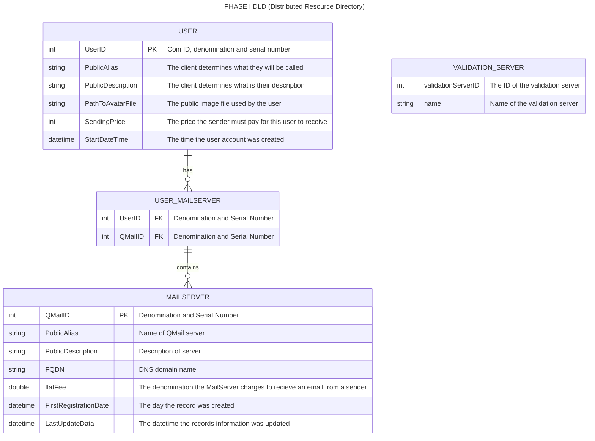

## Distributed Resource Directory
1. The DRD allows users to post information about themselves so that others can find them. 
2. Users can get a user ID by obtaining a certicate that has their user id on it.
3. Users can get tickets by authenticating with RAIDA servers.
4. Users can give their tickets to a DRD server who will confirm that they are authentic with the RAIDA servers.
5. Authenticated Users can associate their user ID with data that they put into the DRD. 
6. Users can delete their entire record in the DRD or update it. 
7. DRD records are kept in a SQLight Databased on the DRD server
7. There should be no empty fields in the user's DRD records.
8. The DRD servers also contain files such as the user's avatar.
9. Everything in the DRD is public information.
10. The client may register the same information with multiple DRD servers for redundancy.
11. DRD servers may syncronize themselves. 
12. DRD Servers use the same request and response format as the raida.
13. DRD servers must exchange AES keys with the client computers using the Distributed Key Exchange protocol.
14. DRD servers communicate with clients using encryption type 6.
15. DRD servers use session keys.
16. DRD servers provide the following DRD Services:
   
[INSERT UPDATE DELETE](#insert-update-delete)
[SEARCH](#search)

## DRD's Entity Relationship Diagram


##
```
/directory_root/
└── users/
    └── 000634FC89A4E6/
        ├── .avatar.png
        ├── devices/
        │   ├── D_A1B2C3D4.json
        │   └── D_E5F6G7H8.json
        └── policies/
            └── P_Default.json
```
## Insert Update Delete 
This service usses the same command to insert, update or delete records in the DLD

