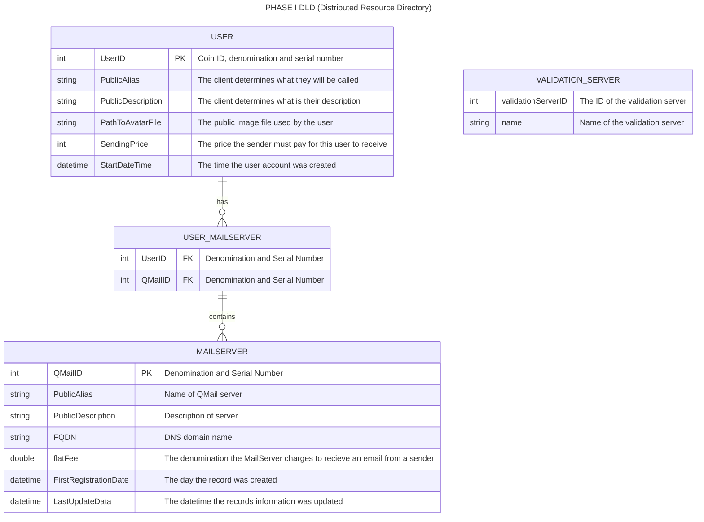

## Distributed Resource Directory
1. The DRD allows users to post information about themselves so that others can find them. 
2. Users can get a user ID by obtaining a certicate that has their user id on it.
3. Users can get tickets by authenticating with RAIDA servers.
4. Users can give their tickets to a DRD server who will confirm that they are authentic with the RAIDA servers.
5. Authenticated Users can associate their user ID with data that they put into the DRD. 
6. Users can delete their entire record in the DRD or update it. 
7. DRD records are kept in a SQLight Databased on the DRD server
7. There should be no empty fields in the user's DRD records.
8. The DRD servers also contain files such as the user's avatar.
9. Everything in the DRD is public information.
10. The client may register the same information with multiple DRD servers for redundancy.
11. DRD servers may syncronize themselves. 
12. DRD Servers use the same request and response format as the raida.
13. DRD servers must exchange AES keys with the client computers using the Distributed Key Exchange protocol.
14. DRD servers communicate with clients using encryption type 6.
15. DRD servers use session keys.
16. DRD servers provide the following DRD Services:
   
[INSERT UPDATE DELETE](#insert-update-delete)

[SEARCH DIRECTORY](#search-directory)

## DRD's Entity Relationship Diagram


##
```
/directory_root/
└── users/
    └── 000634FC89A4E6/
        ├── .avatar.png
        ├── devices/
        │   ├── D_A1B2C3D4.json
        │   └── D_E5F6G7H8.json
        └── policies/
            └── P_Default.json
```
## Insert Update Delete 
This service is usesd to Update Directory, create a new record and delete existing ones. When this is called, if there is no existing record, it will be created. If this is called and the information is left blank, the Raida server will delete the record. 

This uploads information into the DRD (Distributed Resource Directory). Every Raida server has a compy of the directory so this is uploaded 25 different times. 


The updating the direcotry can be complicated so we use the Compact Binary Document Format within the body of the request. 
This request body should be encrypted because it will include a CloudCoin (in a locker code) to pay the Directory Raida. 
By default, it costs one CloudCoin to create, update, read or delete from the directory. 


```C
CH CH CH CH CH CH CH CH CH CH CH CH CH CH CH CH // Challenge
Update Directory CBDF
E3 E3 //end of body
```

### CBDF Key Table Version 0
This is for phase I. There is a much larger list available for phase II. See the overview of how the [CBDF](cbdf.md) fiiles work. 

Directory Update CBDF Fixed Fields:
Name | Bytes | Description
---|---|---
Update Directory Resource Table Version | 0 | Allows for many different listed key tables in the future (Default is zero) 
Payment Coin Code | 2 | What coin is being used for payment? Default is 0x0006 for CloudCoin and only CloudCoin is used for Phase I. 
Payment Locker Code | ca8d0787f2a84b4babf1ef9f3d118b16 | Locker code that will include the payment for the update.

Note: All data is in binary. Strings are UTC-8 Encoded.

** Update Request Resource Table Version 0 **
ID | Field Name | Example | Description
---|---|---|---
1 |"Display Name/Alias" | Varies |"TechWizard" | Primary display name or chosen alias for the user encoded in UTF-8
2 |"Self Description" | Varies |"I'm a nice guy" | Public info about self
6 | Amount that senders must pay reciever | 0x0000v 08 | 3 bytes. Coin type (2 bytes) and Denomination ( 0x0000  Cloudcoin by default) Phase I will just use 0x00 which means 1. 
7 | Thumbnail Stripe| 00 00 18 77 Data  | Data Type (0 for thumbnaile) RAID type, Stripe number, Total Stripes, Data rounded to 100. Up to 
10 |"Email Server 0" | 00 00 8E 82 89 mail.server.com | Raida ID (0-255) First 2 Byte: Coin type, Three Bytes: Port Number, Variable Bytes: Server Name or IP max 250 bytes.
11 |"Email Server 11" | - - -  | There is a different ID for each raida that the receiver uses to receive.  
- - -  | - - - | - - -  | - - - 
35 |"Email Server 35" | 00 00 8E 82 89 mail2.server.com | First Byte: Coin type, Three Bytes: Port Number, Variable Bytes: Server Name or IP max 250 bytes


Return Status Codes
```C
STATUS_SUCCESS = 250
ERROR_FEW_COINS_IN_LOCKER = 153,
ERROR_LOCKER_EMPTY_OR_NOT_EXISTS = 179,
ERROR_INVALID_PARAMETER = 198,
```

Nothing in Response Body
```
E3 E3
```

## Search Directory
This allows the user to search for a person in the directory. It will only warn people if they are blacklisted. 

```C
CH CH CH CH CH CH CH CH CH CH CH CH CH CH CH CH 
Search Directory CBDF
E3 E3
```
Directory Search CBDF
Fixed Key | Bytes | Description
---|---|---
Payment Coin Code | 2 | What coin is being used for payment? Default is 0x0006 for CloudCoin and only CloudCoin is used for Phase I. 
Payment Locker Code | 16 | | Locker code that will include the payment for the search like: ca8d0787f2a84b4babf1ef9f3d118b16 

ID | Field Name | Example | Description
---|---|---|---
1 | Return Key IDs | 05 DE 23 | One byte per resource in the Resource Table CDFD Key Table above in the Update Directory Service above. 
2 | Limit | 0xA5 | 25.6KB max Kilibytes. Maximum number of killbytes of data to return. 
3 | Page | 3 bytes | 25.6KB per page. Default is 0
4 | Where Clause | 3 bytes | Directory Key, Comparison Operator ( 0= Not Equal To, 1= Equal To, 2 = Greater than, 3 = Less Than, 4 = Contains, 5 = Does Not Contain), Number (0) or Text (1) field, Number or Text (length varies)
5 | AND Where Clause | 3 bytes | Directory Key, Comparison Operator ( 0= Not Equal To, 1= Equal To, 2 = Greater than, 3 = Less Than, 4 = Contains, 5 = Does Not Contain), Number (0) or Text (1) field, Number or Text (length varies)
6 | OR Where Clause | 3 bytes | Directory Key, Comparison Operator ( 0= Not Equal To, 1= Equal To, 2 = Greater than, 3 = Less Than, 4 = Contains, 5 = Does Not Contain), Number (0) or Text (1) field, Number or Text (length varies)

Response Status Codes
```C
STATUS_SUCCESS = 250
ERROR_FEW_COINS_IN_LOCKER = 153,
ERROR_LOCKER_EMPTY_OR_NOT_EXISTS = 179,
ERROR_INVALID_PARAMETER = 198,
ERROR_DATABASE_RETURNED_ZERO_RECORDS = 9,
ERROR_DATABASE_REPORTED_AN_ERROR = 10,
```

Response Body:
```C
CBDF File
E3 E3
```

Directory Search Results CBDF
Fixed Key | Bytes | Description
---|---|---
Number of rows returned| 2 | How many rows where returned up to 65,535.
Columns Per Row | 1 |  Up to 255|

Variable Fields. Note that in the case of it returning more than one row, we will see the IDs repeat.
The following shows three rows being returned: 
```
01 10 ca8d0787f2a84b4babf1ef9f3d118b16
02 0F 4b4babfca8d0787f2a81ef9f3d118b
06 03 1ef9f3
01 0E 4babf1ef9f3d11ca8d0787f2a84b
02 0E 81ef9f3d114b4babfca8d0787f2a
06 02 1ef9
01 10 ca8d0787f2a84b4babf1ef9f3d118b16
02 0F 4b4babfca8d0787f2a81ef9f3d118b
06 03 1ef9f3
```

ID | Field Name | Example | Description
---|---|---|---
1 |"Display Name/Alias" | Varies |"TechWizard" | Primary display name or chosen alias for the user encoded in UTF-8
2 |"Self Description" | Varies |"I'm a nice guy" | Public info about self
6 | Amount that senders must pay reciever | 0x0000v 08 | 3 bytes. Coin type (2 bytes) and Denomination ( 0x0000  Cloudcoin by default) Phase I will just use 0x00 which means 1. 
7 | Thumbnail Stripe| 00 00 18 77 Data  | Data Type (0 for thumbnaile) RAID type, Stripe number, Total Stripes, Data rounded to 100. Up to 
10 |"Email Server 0" | 00 00 8E 82 89 mail.server.com | Raida ID (0-255) First 2 Byte: Coin type, Three Bytes: Port Number, Variable Bytes: Server Name or IP max 250 bytes.
11 |"Email Server 11" | - - -  | There is a different ID for each raida that the receiver uses to receive.  
- - -  | - - - | - - -  | - - - 
35 |"Email Server 35" | 00 00 8E 82 89 mail2.server.com | First Byte: Coin type, Three Bytes: Port Number, Variable Bytes: Server Name or IP max 250 bytes


