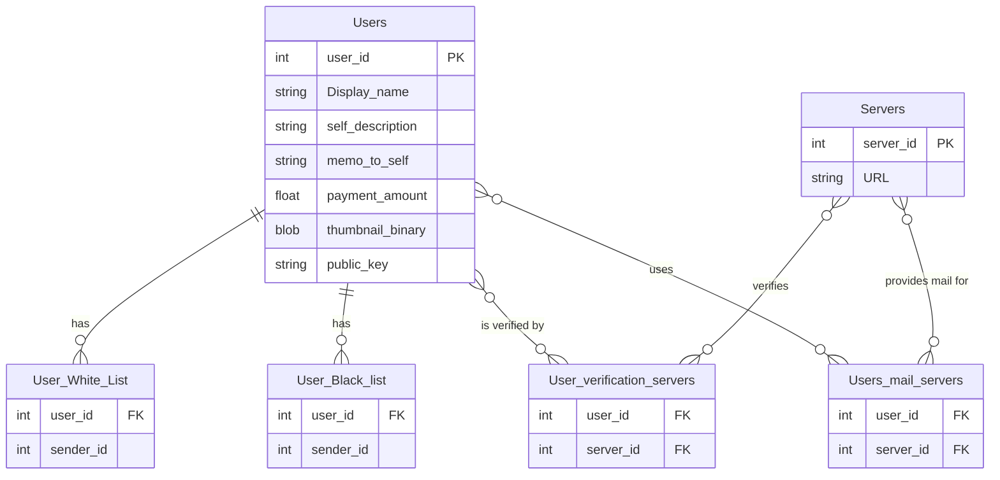

# Send Qmail
Allows people to send and receive qmail including attachments. 

## File Transfer
Send Qmail is a file transfer protocol that transfer files from the user's computer to the mail folder owned by the receiver that is located on the Qmail server. 
The qmail files are named like "e85105d6-7972-4493-8e98-63261d6cf643.stripe005.type001.gmail" with the qmail id, stipe number and type.
If the file is stored on the client computer, it's stipe ID will be replaced with the word "whole".
Each file is sent seperatly. Therefor, there will need to be an extra call to the QMail server for every attachment that is included. 
Each call to the send-qmail service that includes many files must use the same qmail ID (GUID), but with a unque file type. 

## Editing Sent Qmails
If the user would like to update the qmail after it is was sent, they can upload a file with the same GUID and file type with the
"Overwrite" command set. 
If the overwrite is successful, and the email has not already been received by the sender, then the QMail server will respond with success (0xFA). 
However, if the file to be overwritten is no longer on the server, because it has been downloaded, the overwrite request status
will be failed (). 


1Qmail 
Note that each file that is uploaded must have the same GUID but a different File Type/Index

Name | Bytes | Description
---|---|---
Email's GUID | 16 | A unique number randomly generated by the client and used for all raida mail servers for the same email. This number is put on the email file and all subsequent attachment files
File Type/index | 1 | 0 if it is an email file. 1 = first attachment and up as more files are added. There  
First Receiver ID | 6 | 2 byte for coin ID, 1 Denomination, 4 Serial Number. Coin ID will be 0x0006 for Phase I. 
RAID Type | 1 | 0 = Stripe, 1 = Mirror, 5 = Stripe with Parity, 6 = Stripe with Vertical Parity, Stripe with Horizontal Parity, 7 = Striped with Horizontal and Vertical Parity, 8 = Striped with Horizontal, Vertical and Diagnal Parity, 10 = Mirroed stripes
Stripe Number | 1 | A number 0 to N (up to 32 servers)
Of Number |1 | Such as "7" of "25" Where 25 is the Of Number


Send Mail Resource Table
ID | Field Name | Example | Description
---|---|---|---
1 | To | 00 06 12 45 43 A4 00 06 12 D3 35 02 | Seven bytes each. Coin type 0x0006, Denomination, 4 byte serial number. 
2 | CCs | 00 06 12 09 73 A4 00 06 12 09 73 A4  | Seven bytes each. Coin type 0x0006, Denomination, 4 byte serial number. 
3 | BCCs | 00 06 12 09 73 A4  | Seven bytes each. Coin type 0x0006, Denomination, 4 byte serial number. 
4 | Subject Stripe | 05 DE 23 | Raid type, Stripe Number, 'Of Number' all remaining bytes (253) can be used for the subject. 
5 | Shuffle Table Shard 1 | A square of the Of Number. If there are 16 servers, the shuffle table will be 16 x 16 or 256 bytes. This is the first 8 rows.  The numbers in each cell will be represented by five bits. See table below. | PHASE II
6 | Shuffle Table Shard 2 | Like above. This is the Second 8 rows. | PHASE II
7 | Shuffle Table Shard 3 | Like above. This is the Second 8 rows. | PHASE II


Return Status Codes
```C
STATUS_SUCCESS = 250
ERROR_FEW_COINS_IN_LOCKER = 153,
ERROR_LOCKER_EMPTY_OR_NOT_EXISTS = 179,
ERROR_INVALID_PARAMETER = 198,
```


## Resource Directory Layout



## Update Directory Phase I
Not the Update Directory is also used to create a new record and delete existing ones. When this is called, if there is no existing record, it will be created. If this is called and the information is left blank, the Raida server will delete the record. 
This uploads information into the DRD (Distributed Resource Directory). Every Raida server has a compy of the directory so this is uploaded 25 different times. 
It is a whole file designed so everyone can see it. However, it does allow for some permissions based on the two built-in user groups (White List and Black list)

** Permission Groups **
* White List can see everything.
* Blacklist can see nothing.


The updating the direcotry can be complicated so we use the Compact Binary Document Format within the body of the request. 
This request body should be encrypted because it will include a CloudCoin (in a locker code) to pay the Directory Raida. 
By default, it costs one CloudCoin to create, update, read or delete from the directory. 


```C
CH CH CH CH CH CH CH CH CH CH CH CH CH CH CH CH // Challenge
Update Directory CBDF
E3 E3 //end of body
```

### CBDF Key Table Version 0
This is for phase I. There is a much larger list available for phase II. 

Directory Update CBDF Fixed Fields:
Name | Bytes | Description
---|---|---
Update Directory Resource Table Version | 0 | Allows for many different listed key tables in the future (Default is zero) 
Payment Coin Code | 2 | What coin is being used for payment? Default is 0x0000 for CloudCoin and only CloudCoin is used for Phase I. 
Payment Locker Code | ca8d0787f2a84b4babf1ef9f3d118b16 | Locker code that will include the payment for the update.

Note: All data is in binary. Strings are UTC-8 Encoded.

** Update Request Resource Table Version 0 **
ID | Field Name | Example | Description
---|---|---|---
1 |"Display Name/Alias" | Varies |"TechWizard" | Primary display name or chosen alias for the user encoded in UTF-8
2 |"Self Description" | Varies |"I'm a nice guy" | Public info about self
3 |"Memo to self" | Varies | This is not read by other people but allows the user to remember why they made updates to the Directory
4 | ACL Allow (White List) | 0x0000 A3 67 98 E6 72 | The ID of senders who don't need to pay to send. An array of coin type (Cloudcoin is zero), Denomination, and four byte Serial Number 
5 | ACL Deny (Black List) | 0x0000 A3 67 98 E6 72 | Cannot Send. An array of coin type (Cloudcoin is zero),  Denomination, and four byte Serial Number 
6 | Amount that senders must pay reciever | 0x0000v 08 | 3 bytes. Coin type (2 bytes) and Denomination ( 0x0000  Cloudcoin by default) Phase I will just use 0x00 which means 1. 
7 | Thumbnail Stripe| 00 00 18 77 Data  | Data Type (0 for thumbnaile) RAID type, Stripe number, Total Stripes, Data rounded to 100. Up to 250x100=25K bytes
8 | public key| 00 00 18 77 Data  | Data Type (0 for thumbnaile) RAID type, Stripe number, Total Stripes, Data rounded to 100. Up to 250x100=25K bytes
9 | Verification Servers  |0x0000 8E 82 89 mail.server.com | First Byte: Coin type, Three Bytes: Port Number, Variable Bytes: FQDN. Ampersam seperates servers bytes. 
10 |"Email Server 0" | 00 00 8E 82 89 mail.server.com | Raida ID (0-255) First 2 Byte: Coin type, Three Bytes: Port Number, Variable Bytes: Server Name or IP max 250 bytes.
11 |"Email Server 11" | - - -  | There is a different ID for each raida that the receiver uses to receive.  
- - -  | - - - | - - -  | - - - 
35 |"Email Server 35" | 00 00 8E 82 89 mail2.server.com | First Byte: Coin type, Three Bytes: Port Number, Variable Bytes: Server Name or IP max 250 bytes


Return Status Codes
```C
STATUS_SUCCESS = 250
ERROR_OVERWRITE_FAILED_FILE_WAS_REMOVED_OR_NEVER_EXISTED = 
ERROR_FEW_COINS_IN_LOCKER = 153,
ERROR_LOCKER_EMPTY_OR_NOT_EXISTS = 179,
ERROR_INVALID_PARAMETER = 198,
```


## Search Directory
This allows the user to search for a person in the directory. It will only warn people if they are blacklisted. 

```C
CH CH CH CH CH CH CH CH CH CH CH CH CH CH CH CH 
Search Directory CBDF
E3 E3
```
Directory Search CBDF
Fixed Key | Bytes | Description
---|---|---
Payment Coin Code | 2 | What coin is being used for payment? Default is 0x0000 for CloudCoin and only CloudCoin is used for Phase I. 
Payment Locker Code | 16 | | Locker code that will include the payment for the search like: ca8d0787f2a84b4babf1ef9f3d118b16 

ID | Field Name | Example | Description
---|---|---|---
1 | Return Key IDs | 05 DE 23 | One byte per resource in the Resource Table CDFD Key Table above in the Update Directory Service above. 
2 | Limit | 0xA5 | 25.6KB max Kilibytes. Maximum number of killbytes of data to return. 
3 | Page | 3 bytes | 25.6KB per page. Default is 0
4 | Where Clause | 3 bytes | Directory Key, Comparison Operator ( 0= Not Equal To, 1= Equal To, 2 = Greater than, 3 = Less Than, 4 = Contains, 5 = Does Not Contain), Number (0) or Text (1) field, Number or Text (length varies)
5 | AND Where Clause | 3 bytes | Directory Key, Comparison Operator ( 0= Not Equal To, 1= Equal To, 2 = Greater than, 3 = Less Than, 4 = Contains, 5 = Does Not Contain), Number (0) or Text (1) field, Number or Text (length varies)
6 | OR Where Clause | 3 bytes | Directory Key, Comparison Operator ( 0= Not Equal To, 1= Equal To, 2 = Greater than, 3 = Less Than, 4 = Contains, 5 = Does Not Contain), Number (0) or Text (1) field, Number or Text (length varies)


Resaponse: 
The reaponse will be a CBDF file like this: 

** Update Request Resource Table Version 0 **
ID | Field Name | Example | Description
---|---|---|---
1 |"Display Name/Alias" | Varies |"TechWizard" | Primary display name or chosen alias for the user encoded in UTF-8
2 |"Self Description" | Varies |"I'm a nice guy" | Public info about self
3 |"Memo to self" | Varies | This is not read by other people but allows the user to remember why they made updates to the Directory
4 | ACL Allow (White List) | 0x0000 A3 67 98 E6 72 | The ID of senders who don't need to pay to send. An array of coin type (Cloudcoin is zero), Denomination, and four byte Serial Number 
5 | ACL Deny (Black List) | 0x0000 A3 67 98 E6 72 | Cannot Send. An array of coin type (Cloudcoin is zero),  Denomination, and four byte Serial Number 
6 | Amount that senders must pay reciever | 0x0000v 08 | 3 bytes. Coin type (2 bytes) and Denomination ( 0x0000  Cloudcoin by default) Phase I will just use 0x00 which means 1. 
7 | Thumbnail Stripe| 00 00 18 77 Data  | Data Type (0 for thumbnaile) RAID type, Stripe number, Total Stripes, Data rounded to 100. Up to 250x100=25K bytes
8 | public key| 00 00 18 77 Data  | Data Type (0 for thumbnaile) RAID type, Stripe number, Total Stripes, Data rounded to 100. Up to 250x100=25K bytes
9 | Verification Servers  |0x0000 8E 82 89 mail.server.com | First Byte: Coin type, Three Bytes: Port Number, Variable Bytes: FQDN. Ampersam seperates servers bytes. 
10 |"Email Server 0" | 00 00 8E 82 89 mail.server.com | Raida ID (0-255) First 2 Byte: Coin type, Three Bytes: Port Number, Variable Bytes: Server Name or IP max 250 bytes.
11 |"Email Server 11" | - - -  | There is a different ID for each raida that the receiver uses to receive.  
- - -  | - - - | - - -  | - - - 
35 |"Email Server 35" | 00 00 8E 82 89 mail2.server.com | First Byte: Coin type, Three Bytes: Port Number, Variable Bytes: Server Name or IP max 250 bytes


## Send Mail One to One
This service sends an email from one person to another. 

Phase one just sends text based emails. 

```c
CH CH CH CH CH CH CH CH CH CH CH CH CH CH CH CH
Send Email CBDF
E3 E3 
```


Shuffle bytes needed: 

16 x 16  = One Shad __ bytes. 

