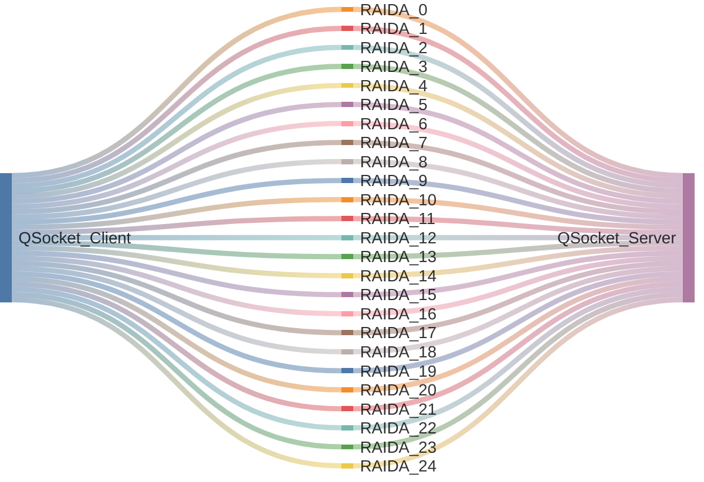
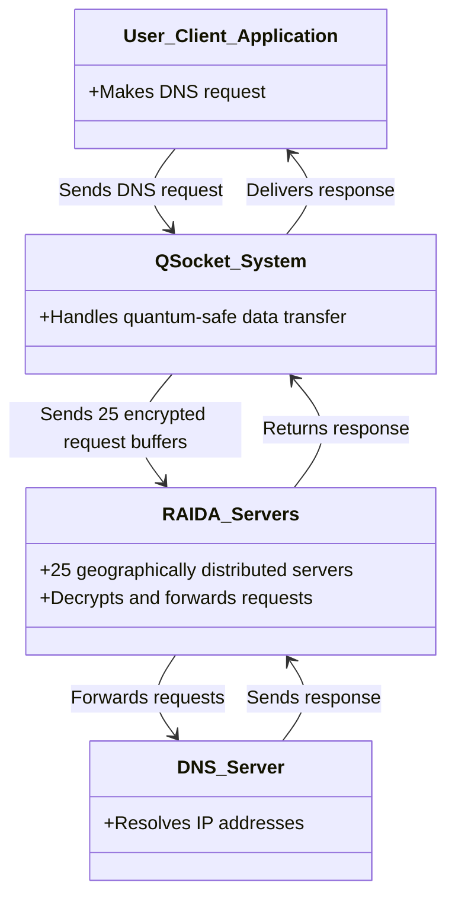
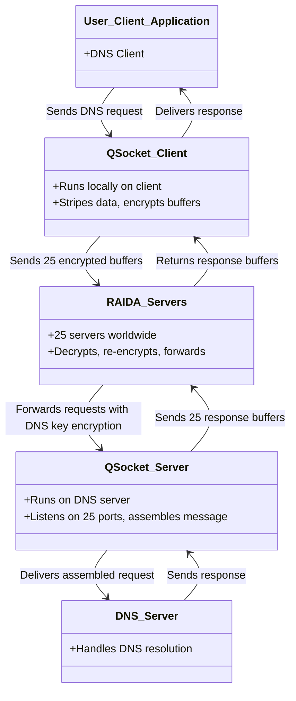
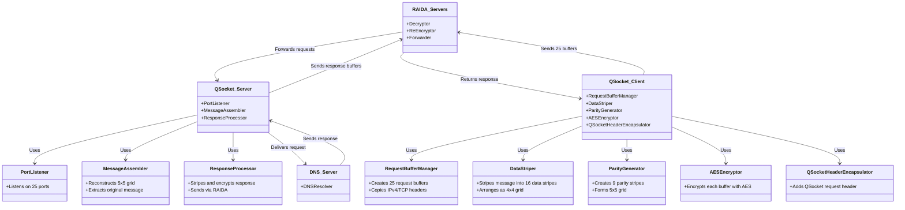

# QSocket 
QSocket is a quantum safe protocol that uses a new patent-pending key exchange system that does not need to be included in the diagrams.

## Requirements
1. Users can swap keys before hand to have a 256 bit encrypted session.
2. People can apply to have access to the QSocket server using the KYC prossess.
3. Must have mutual authentication.
4. There must be a white list and a black list.
5. There must be a list of resources.
6. Must be a list of users
7. List of User Groups
8. List of Resource Groups.
9. 

### Here is how the protocol works: 

The user's client application (such as a DNS service) wants to make a call to a server such as 1.1.1.1 to resolve an IP address. 

The client's request is sent to the QSocket Client software running locally.  

QSocket client takes the request and copies the IPv4 and TCP headers into 25 different request buffers. 

Then, QSocket Client takes the message encapsilated in the transport header and stripes it into 16 data stripes. These stipes are aranged logically as a 4x4 square. 

Then the QSocket Cient creates nine paratiy stipes to create horizontal, vertical and one diagnal parity stipe so that there is now a logical 5x5 grid: 16 data and 9 parity. These stipes are then added to the request buffers (one stripe per buffer).

The QSocket Client then encrypts each buffer using AES and encapcilates it int a QSocket request header. Each request is then sent to one server in an array of 25 servers called the "RAIDA". Each RAIDA server is located in a different part of the world. 

Each of the 25 RAIDA servers decrypt the message, read the IP header. Then encrypt the whole thing again using the DNS server's key. Then the requests are sent to the "QSocket Server that is runninig on the DNS server. 

The DNS server's QSocket Server is listening on 25 ports and assembles the message. The message is then dumped on the DNS server so that the DNS server gets the message and can respond back the the QSocket Server. The QSocket server then does the whole process in reverse sending the message back to the QSocket Client and then to the service doing the DNS call. 

## 0. Sankey Diagram
    

## 1. System Context Diagram
This diagram shows the high-level context of the QSocket system, including the user's client application, the QSocket system, the RAIDA servers, and the DNS server.

## 2. Container Diagram
This diagram breaks down the QSocket system into containers: QSocket Client, QSocket Server, RAIDA Servers, and the DNS Server, showing their interactions.

## 3. Component Diagram
This diagram details the internal components of the QSocket Client and QSocket Server, focusing on the data striping, encryption, and message assembly processes.

