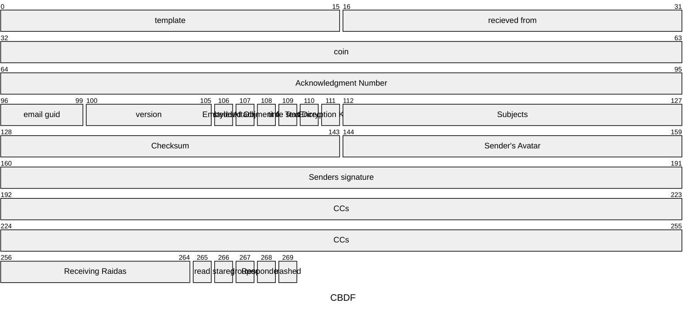

# **Compact Binary Document Format (CBDF) \- v0.1 Specification**

## **1\. Overview**

The Compact Binary Document Format (CBDF) is designed for the efficient storage and transmission of richly formatted documents. Its primary goals are to be significantly smaller than equivalent HTML/CSS files and to provide a consistent rendering experience within a closed ecosystem.

The format achieves its compactness through several key strategies:

* **Predefined Resource Tables:** Styles, layouts, links, and embedded objects are defined once in a file header and referenced by a small ID.  
* **Bit-Packed Structures:** Style definitions use bit-packing to minimize their size.  
* **Command-Based Body:** The document body uses a stream of text interspersed with single-byte command codes, eliminating the need for verbose opening and closing tags.

The standard character encoding for all text content is **UTF-8**.

## **2\. File Structure**

A CBDF file consists of two main sections: a **Header** followed by a **Body**.

\+------------------------+  
|         HEADER         |  
| (Resource Definitions) |  
\+------------------------+  
|          BODY          |  
|   (Content & Commands) |  
\+------------------------+

## **3\. The Header**

The header defines all the resources needed to render the document. It is composed of four optional tables, each preceded by a byte indicating the number of entries in that table. To begin with, there will only 


| Field                     | Size (Bytes) | Description                                                                 |
|---------------------------|--------------|-----------------------------------------------------------------------------|
| Sender ID                   | 5            | Unique identifier for the user (binary-encoded, fixed length).              |
| Number of Key-Value Pairs | 1            | Unsigned integer (0–255) indicating the number of key-value pairs that follow. |
| Key-Value Pair(s)         | Variable     | Repeated for each pair (as specified by Number of Key-Value Pairs):         |
| &nbsp;&nbsp;Key           | 1            | Unsigned integer (0–255) representing a predefined key (e.g., 0 = "name").  |
| &nbsp;&nbsp;Value Length  | 1            | Unsigned integer (0–255) specifying the length of the value in bytes.       |
| &nbsp;&nbsp;Value         | 0–255        | Binary data for the value (length as specified by Value Length).            |

Key Table

Key | Name
---|---
1: |"template"
2: |"recieved from"
3: |"coin"
4: |"Acknowledgment Number"
5:| "email guid"
6:| "version"
7:| "styles"
8: |"Embedded Object Table"
9: |"Attachment GUIDs"
10: |"time stamp"
11:| "Text Direction"
12:| "Encryption Key ID"
13:| "Subjects"
128-143:| "Checksum"
144-159:| "Sender's Avatar"
160-191: |"Senders signature"
192-255:| "CCs"
256-264:| "Receiving Raidas"
265: |"read"
266: |"stared"
267: |"grouped"
268: |"Responded to"
269: |"trashed"



Header Sections: Note: If the email will be shown as plain text, it should still work if control characters are removed. 
Starter Code | Name | Description
---|---|---
^1 | Fixed Section | This is the fixed portion of the header
^2 | Background Styles |Length depends on the template. Style includes Color, Img, Width%, Height%, Default will be golden ratio. 
^3 | Containers Styles | This is the fixed portion of the header
^4 | Text Styles | This is the fixed portion of the header
^5 | Events | What happens when ...
^6 | Links | text of what happens ...
^6 | Links | text of what happens ...


### **3.1. Layout Definition**

The first byte of the file defines which of the 255 predefined layouts to use. Each layout specifies the arrangement of content panes (e.g., header, main, footer) and has both a desktop and a mobile rendering mode.

* **Data Type:** 1 byte  
* **Example:** 0x03 selects Layout \#3 (e.g., Header, Navbar, Main, Footer).

# Figuring out the templates
There are 256 templates. All the templates have a "Main" section. Template 0 is just a main section. 
The byte of the templates is a bit field:

Template Types
bit | meaning
---|---
0 | Side to Side Heading exists
1 | Side to Side Footer exists
2 | Top to Bottom Left Aside exists
3 | Top to Bottom Right Aside exists
4, 5 | How many columns exist (1 to 4) 
6, 7 | How many rows exist (1 to 4) 

Container Types (For Phase II or QWeb)
bit | meaning
---|---
0 | Side to Side Heading exists
1 | Side to Side Footer exists
2 | Top to Bottom Left Aside exists
3 | Top to Bottom Right Aside exists
4, 5 | How many columns exist (1 to 4) 
6, 7 | How many rows exist (1 to 4) 


### **3.2. Style Table**

This table defines the visual styles used in the document.

* **Structure:** A count byte followed by a series of 6-byte style records.  
* **Style Record (6 bytes / 48 bits):**  
  * **font-family (6 bits):** ID for up to 64 predefined fonts.  
  * **font-size (7 bits):** Size in points (1-127pt).  
  * **flags (3 bits):** Bitmask for Bold, Italic, and Underline.  
  * **text-color (16 bits):** 16-bit "HighColor" (R5G6B5).  
  * **bg-color (16 bits):** 16-bit "HighColor" (R5G6B5).

### **3.3. Link Table**

This table contains all external URLs referenced in the document.

* **Structure:** A count byte followed by a series of URL entries.  
* **URL Entry:** A 2-byte integer specifying the length of the URL, followed by the UTF-8 encoded URL string.

### **3.4. Embedded Object Table**

This table contains binary data for embedded assets like images.

* **Structure:** A count byte followed by a series of object entries.  
* **Object Entry:** A 4-byte integer specifying the length of the binary data, followed by the raw data itself.

### **3.5. Text Direction**
Top Down, Left Right, Bottom Up. Right Left. 

### **3.6. Comment/meta**
Memo hidden in the header?

### **3.7. Return Address**
The place the mail was from

### **3.8. Time Stamp**
Raida Time stamp

### **3.9. Sending Raidas**
Addresses of all RAIDAs

### **3.10. Encryption Key ID**
Key used to decrypt maybe?

### **3.11. Subjects**
Do we need subjects anymore? no?

### **3.13. CloudCoin**
The payment for the email. A locker code.


## **4\. The Body & Command Codes**

The body has three layers. 
Layer Name | Discription
---|---
Background | This holds the everything that everything else is layed upon. May contain gradiants, images, solid colors. The user can override this. 
Containers | Containers must fit within the semantic spaces of the template. There are container templates that how how things can go in them. These containers can also be images, tables, gradiants, They may have shadows, glows, and may change on mouse over. These can also be "view boxes" where software code can be seen, videos, mermaid, svg, 
Text | This layer is only for text including links, lists, code, 

# Accessability. It be very easy for a blind person to navigate. 
* Title: "Message entitled How are you?"
* Page Description: There are four parts here: Heading, main, nav and aside.
* Main: The main box says Headline: "Time to live" text "Today it is time for us to live. Don't you know. 


The body contains the document's text content, interspersed with command codes. The 27 unused ASCII control characters (codes 0x01-0x08, 0x0B-0x0C, 0x0E-0x1A, and 0x1C-0x1F) are repurposed as command codes.

A parser reads the body byte by byte. If a byte is a standard UTF-8 character, it is rendered. If it is a command code, the parser performs the corresponding action.

### **Common Command Codes (Examples):**

Dec | Code (Hex) | Command | Description |  
---|---|---|---
0| 0x00 | Pane Seperator | These will be at the end of every section that the document has according to the template that has been choosen
1| 0x01 | Start / End Style | The next byte is a Style ID from the Style Table. All subsequent text will use this style until a new style is applied. |  2
2| 0x02 | Start / End Link | The next byte is a Link ID from the Link Table. All subsequent text is part of this link. | Link ID is  
3| 0x03 | Start / End Box | Draws a box around things | 
4| 0x04 | Insert Object Inline | The next byte is an Object ID f5rom the Embedded Object Table. The object is inserted at this position. |  
5| 0x05 | Start / End Table | The next byte specifies the number of columns. This is followed by column definition records. |  
6| 0x06 | Cell Separator | Marks the end of a cell within a table row. |  
7| 0x07 | Row Separator | Marks the end of a table row. |  
8| 0x08 | End Table | Terminates the current table definition. |  
9| 0x09 | Capitzlie word | Make the next letter capitalized.  
10| 0x0A | Add "ed"|  |  
11| 0x0B | Add "ing" |  |  
12| 0x0C | Add "'s"|  |  
13| 0x0D| "Th" |  |
14| 0x0E | Box S| |
15| 0x0F | Carraige Return  | This is special. If it is followed by another control character, it will not be added to the follower
16| 0x10 | Start / End List  | Followed by descriptor byte.  
17| 0x11 | Apply Style | The next byte is a Style ID from the Style Table. All subsequent text will use this style until a new style is applied. |  
18| 0x12 | Start Link | The next byte is a Link ID from the Link Table. All subsequent text is part of this link. |  
19| 0x13 | End Link | Terminates the current hyperlink. |  
20| 0x14 | Insert Object | The next byte is an Object ID from the Embedded Object Table. The object is inserted at this position. |  
21| 0x15 | Start Table | The next byte specifies the number of columns. This is followed by column definition records. |  
22| 0x16 | Cell Separator | Marks the end of a cell within a table row. |  
23| 0x17 | Row Separator | Marks the end of a table row. |  
24| 0x18 | End Table | Terminates the current table definition. |  
25| 0x19 | Pane Separator | Marks the end of content for the current layout pane (e.g., end of header content). |
26| 0x1A | Clickable | Can be clicked on |  
27| 0x1B | Form| Stuff that can be submitted |  
28| 0x1C | Input| Ways to input data |  
29| 0x1D| svg| image |
30| 0x1E | Mermaid| Mermaid diagrams |
31| 0x1F | Carraige Return  | Do not use this code because it is used as a line break. 


| 0x7F | Delete |

## **5\. Conceptual Example**

A simple document saying "**Hello** World" with "World" as a link might look like this conceptually:

1. **Header:**  
   * **Layout:** 0x01 (Single Pane)  
   * **Styles:** Count: 2\. Style 0x01 (Bold). Style 0x02 (Regular).  
   * **Links:** Count: 1\. Link 0x01 ("[http://example.com](http://example.com)").  
   * **Objects:** Count: 0\.  
2. **Body (Human-Readable):**  
   * \[ApplyStyle: 0x01\] Hello \[ApplyStyle: 0x02\] \[StartLink: 0x01\]World\[EndLink\]

This structure is highly efficient, defining resources once and using single-byte commands to apply them, resulting in a minimal file size.

# ASCII Character Frequency Analysis (With Realistic Capitalization)

**Dataset:** Email corpus with 2,893 messages  
**Total Characters Analyzed:** 9,297,387 printable ASCII characters (codes 32-127)  
**Capitalization Applied:** Sentence beginnings, proper nouns, and common terms

## Capitalization Statistics

- **Sentence starts capitalized:** 96,961
- **Proper nouns capitalized:** 48,518  
- **Total uppercase letters:** 145,479
- **Total lowercase letters:** 6,408,733
- **Total letters:** 6,554,212
- **Overall capitalization rate:** 2.22%

## Updated Frequency Table

| Decimal | Hex | Character | Frequency | Percentage |
|---------|-----|-----------|-----------|------------|
| 32 | 20 | SPACE | 1,937,284 | 20.8369% |
| 33 | 21 | ! | 7,417 | 0.0798% |
| 34 | 22 | " | 16,170 | 0.1739% |
| 35 | 23 | # | 2,345 | 0.0252% |
| 36 | 24 | $ | 5,889 | 0.0633% |
| 37 | 25 | % | 1,071 | 0.0115% |
| 38 | 26 | & | 2,657 | 0.0286% |
| 39 | 27 | ' | 17,191 | 0.1849% |
| 40 | 28 | ( | 23,033 | 0.2477% |
| 41 | 29 | ) | 24,658 | 0.2652% |
| 42 | 2A | * | 46,269 | 0.4977% |
| 43 | 2B | + | 6,009 | 0.0646% |
| 44 | 2C | , | 78,425 | 0.8435% |
| 45 | 2D | - | 92,947 | 0.9997% |
| 46 | 2E | . | 114,169 | 1.2280% |
| 47 | 2F | / | 15,785 | 0.1698% |
| 48 | 30 | 0 | 37,274 | 0.4009% |
| 49 | 31 | 1 | 35,461 | 0.3814% |
| 50 | 32 | 2 | 20,003 | 0.2151% |
| 51 | 33 | 3 | 15,894 | 0.1710% |
| 52 | 34 | 4 | 12,187 | 0.1311% |
| 53 | 35 | 5 | 16,067 | 0.1728% |
| 54 | 36 | 6 | 9,291 | 0.0999% |
| 55 | 37 | 7 | 8,815 | 0.0948% |
| 56 | 38 | 8 | 11,894 | 0.1279% |
| 57 | 39 | 9 | 24,963 | 0.2685% |
| 58 | 3A | : | 29,807 | 0.3206% |
| 59 | 3B | ; | 4,712 | 0.0507% |
| 60 | 3C | < | 62 | 0.0007% |
| 61 | 3D | = | 23,197 | 0.2495% |
| 62 | 3E | > | 3,122 | 0.0336% |
| 63 | 3F | ? | 3,325 | 0.0358% |
| 64 | 40 | @ | 4,324 | 0.0465% |
| 65 | 41 | A | 10,654 | 0.1146% |
| 66 | 42 | B | 3,194 | 0.0344% |
| 67 | 43 | C | 7,037 | 0.0757% |
| 68 | 44 | D | 3,045 | 0.0328% |
| 69 | 45 | E | 6,772 | 0.0728% |
| 70 | 46 | F | 3,618 | 0.0389% |
| 71 | 47 | G | 2,190 | 0.0236% |
| 72 | 48 | H | 3,471 | 0.0373% |
| 73 | 49 | I | 26,414 | 0.2841% |
| 74 | 4A | J | 1,155 | 0.0124% |
| 75 | 4B | K | 1,031 | 0.0111% |
| 76 | 4C | L | 2,536 | 0.0273% |
| 77 | 4D | M | 10,493 | 0.1129% |
| 78 | 4E | N | 4,204 | 0.0452% |
| 79 | 4F | O | 4,773 | 0.0513% |
| 80 | 50 | P | 5,683 | 0.0611% |
| 81 | 51 | Q | 263 | 0.0028% |
| 82 | 52 | R | 4,006 | 0.0431% |
| 83 | 53 | S | 6,930 | 0.0745% |
| 84 | 54 | T | 13,038 | 0.1402% |
| 85 | 55 | U | 17,204 | 0.1850% |
| 86 | 56 | V | 1,253 | 0.0135% |
| 87 | 57 | W | 5,520 | 0.0594% |
| 88 | 58 | X | 386 | 0.0042% |
| 89 | 59 | Y | 2,836 | 0.0305% |
| 90 | 5A | Z | 297 | 0.0032% |
| 91 | 5B | [ | 1,291 | 0.0139% |
| 92 | 5C | \ | 916 | 0.0099% |
| 93 | 5D | ] | 1,280 | 0.0138% |
| 94 | 5E | ^ | 727 | 0.0078% |
| 95 | 5F | _ | 80,875 | 0.8699% |
| 96 | 60 | ` | 1,124 | 0.0121% |
| 97 | 61 | a | 536,138 | 5.7665% |
| 98 | 62 | b | 92,343 | 0.9933% |
| 99 | 63 | c | 236,793 | 2.5469% |
| 100 | 64 | d | 217,494 | 2.3394% |
| 101 | 65 | e | 753,009 | 8.0992% |
| 102 | 66 | f | 138,571 | 1.4904% |
| 103 | 67 | g | 143,433 | 1.5427% |
| 104 | 68 | h | 232,381 | 2.4995% |
| 105 | 69 | i | 496,900 | 5.3445% |
| 106 | 6A | j | 15,115 | 0.1626% |
| 107 | 6B | k | 48,614 | 0.5229% |
| 108 | 6C | l | 293,574 | 3.1576% |
| 109 | 6D | m | 164,673 | 1.7714% |
| 110 | 6E | n | 491,486 | 5.2863% |
| 111 | 6F | o | 494,172 | 5.3152% |
| 112 | 70 | p | 157,089 | 1.6897% |
| 113 | 71 | q | 9,389 | 0.1010% |
| 114 | 72 | r | 416,779 | 4.4827% |
| 115 | 73 | s | 444,200 | 4.7781% |
| 116 | 74 | t | 528,626 | 5.6863% |
| 117 | 75 | u | 198,372 | 2.1339% |
| 118 | 76 | v | 72,533 | 0.7801% |
| 119 | 77 | w | 85,614 | 0.9208% |
| 120 | 78 | x | 22,242 | 0.2392% |
| 121 | 79 | y | 107,446 | 1.1557% |
| 122 | 7A | z | 9,223 | 0.0992% |
| 123 | 7B | { | 181 | 0.0019% |
| 124 | 7C | &#124; | 535 | 0.0058% |
| 125 | 7D | } | 366 | 0.0039% |
| 126 | 7E | ~ | 4,163 | 0.0448% |
| 127 | 7F | DEL | 0 | 0.0000% |

## Frequency Table (Ordered by Frequency - Descending)

| Decimal | Hex | Character | Frequency | Percentage |
|---------|-----|-----------|-----------|------------|
| 32 | 20 | SPACE | 1,937,284 | 20.8369% |
| 101 | 65 | e | 753,009 | 8.0992% |
| 97 | 61 | a | 536,138 | 5.7665% |
| 116 | 74 | t | 528,626 | 5.6863% |
| 105 | 69 | i | 496,900 | 5.3445% |
| 111 | 6F | o | 494,172 | 5.3152% |
| 110 | 6E | n | 491,486 | 5.2863% |
| 115 | 73 | s | 444,200 | 4.7781% |
| 114 | 72 | r | 416,779 | 4.4827% |
| 108 | 6C | l | 293,574 | 3.1576% |
| 99 | 63 | c | 236,793 | 2.5469% |
| 104 | 68 | h | 232,381 | 2.4995% |
| 100 | 64 | d | 217,494 | 2.3394% |
| 117 | 75 | u | 198,372 | 2.1339% |
| 109 | 6D | m | 164,673 | 1.7714% |
| 112 | 70 | p | 157,089 | 1.6897% |
| 103 | 67 | g | 143,433 | 1.5427% |
| 102 | 66 | f | 138,571 | 1.4904% |
| 46 | 2E | . | 114,169 | 1.2280% |
| 121 | 79 | y | 107,446 | 1.1557% |
| 45 | 2D | - | 92,947 | 0.9997% |
| 98 | 62 | b | 92,343 | 0.9933% |
| 119 | 77 | w | 85,614 | 0.9208% |
| 95 | 5F | _ | 80,875 | 0.8699% |
| 44 | 2C | , | 78,425 | 0.8435% |
| 118 | 76 | v | 72,533 | 0.7801% |
| 107 | 6B | k | 48,614 | 0.5229% |
| 42 | 2A | * | 46,269 | 0.4977% |
| 48 | 30 | 0 | 37,274 | 0.4009% |
| 49 | 31 | 1 | 35,461 | 0.3814% |
| 58 | 3A | : | 29,807 | 0.3206% |
| 73 | 49 | I | 26,414 | 0.2841% |
| 57 | 39 | 9 | 24,963 | 0.2685% |
| 41 | 29 | ) | 24,658 | 0.2652% |
| 40 | 28 | ( | 23,033 | 0.2477% |
| 61 | 3D | = | 23,197 | 0.2495% |
| 120 | 78 | x | 22,242 | 0.2392% |
| 50 | 32 | 2 | 20,003 | 0.2151% |
| 39 | 27 | ' | 17,191 | 0.1849% |
| 85 | 55 | U | 17,204 | 0.1850% |
| 34 | 22 | " | 16,170 | 0.1739% |
| 53 | 35 | 5 | 16,067 | 0.1728% |
| 51 | 33 | 3 | 15,894 | 0.1710% |
| 47 | 2F | / | 15,785 | 0.1698% |
| 106 | 6A | j | 15,115 | 0.1626% |
| 84 | 54 | T | 13,038 | 0.1402% |
| 52 | 34 | 4 | 12,187 | 0.1311% |
| 56 | 38 | 8 | 11,894 | 0.1279% |
| 65 | 41 | A | 10,654 | 0.1146% |
| 77 | 4D | M | 10,493 | 0.1129% |
| 113 | 71 | q | 9,389 | 0.1010% |
| 54 | 36 | 6 | 9,291 | 0.0999% |
| 122 | 7A | z | 9,223 | 0.0992% |
| 55 | 37 | 7 | 8,815 | 0.0948% |
| 33 | 21 | ! | 7,417 | 0.0798% |
| 67 | 43 | C | 7,037 | 0.0757% |
| 83 | 53 | S | 6,930 | 0.0745% |
| 69 | 45 | E | 6,772 | 0.0728% |
| 43 | 2B | + | 6,009 | 0.0646% |
| 36 | 24 | $ | 5,889 | 0.0633% |
| 80 | 50 | P | 5,683 | 0.0611% |
| 87 | 57 | W | 5,520 | 0.0594% |
| 79 | 4F | O | 4,773 | 0.0513% |
| 59 | 3B | ; | 4,712 | 0.0507% |
| 64 | 40 | @ | 4,324 | 0.0465% |
| 78 | 4E | N | 4,204 | 0.0452% |
| 126 | 7E | ~ | 4,163 | 0.0448% |
| 82 | 52 | R | 4,006 | 0.0431% |
| 70 | 46 | F | 3,618 | 0.0389% |
| 72 | 48 | H | 3,471 | 0.0373% |
| 63 | 3F | ? | 3,325 | 0.0358% |
| 66 | 42 | B | 3,194 | 0.0344% |
| 62 | 3E | > | 3,122 | 0.0336% |
| 68 | 44 | D | 3,045 | 0.0328% |
| 89 | 59 | Y | 2,836 | 0.0305% |
| 38 | 26 | & | 2,657 | 0.0286% |
| 76 | 4C | L | 2,536 | 0.0273% |
| 35 | 23 | # | 2,345 | 0.0252% |
| 71 | 47 | G | 2,190 | 0.0236% |
| 91 | 5B | [ | 1,291 | 0.0139% |
| 93 | 5D | ] | 1,280 | 0.0138% |
| 86 | 56 | V | 1,253 | 0.0135% |
| 74 | 4A | J | 1,155 | 0.0124% |
| 96 | 60 | ` | 1,124 | 0.0121% |
| 37 | 25 | % | 1,071 | 0.0115% |
| 75 | 4B | K | 1,031 | 0.0111% |
| 92 | 5C | \ | 916 | 0.0099% |
| 94 | 5E | ^ | 727 | 0.0078% |
| 124 | 7C | &#124; | 535 | 0.0058% |
| 88 | 58 | X | 386 | 0.0042% |
| 125 | 7D | } | 366 | 0.0039% |
| 90 | 5A | Z | 297 | 0.0032% |
| 81 | 51 | Q | 263 | 0.0028% |
| 123 | 7B | { | 181 | 0.0019% |
| 60 | 3C | < | 62 | 0.0007% |
| 127 | 7F | DEL | 0 | 0.0000% |


## Key Observations

**Capitalization Analysis:**
- **2.22% capitalization rate** - Much lower than typical English (8-15%) due to technical nature of emails
- **Most capitalized letter: 'I'** (0.28%) - The pronoun "I" and words starting with 'i'
- **Technical terms prevalent:** High frequency of 'U' (Unix, URL, etc.) and 'M' (Microsoft, etc.)

**Adjusted Letter Frequencies:**
1. **'e'** - 8.10% (down from 8.17% due to some 'E' capitalizations)
2. **'a'** - 5.77% (down from 5.88%)
3. **'t'** - 5.69% (down from 5.83%)
4. **'i'** - 5.34% (down from 5.63%)
5. **'o'** - 5.32% (stable)

**Character Distribution with Capitalization:**
- **Lowercase letters (a-z):** ~68.9% of all characters
- **Uppercase letters (A-Z):** ~1.6% of all characters  
- **Space:** ~20.8% of all characters
- **Digits (0-9):** ~2.5% of all characters
- **Punctuation and symbols:** ~6.2% of all characters

**Technical Content Indicators:**
- Low overall capitalization suggests technical/informal writing style
- High frequency of underscores (0.87%) indicates technical formatting
- Pronoun "I" dominance among capitals suggests personal correspondence mixed with technical content


# ASCII Character Frequency Analysis (With Realistic Capitalization)

**Dataset:** Email corpus with 2,893 messages  
**Total Characters Analyzed:** 9,297,387 printable ASCII characters (codes 32-127)  
**Capitalization Applied:** Sentence beginnings, proper nouns, and common terms

## Capitalization Statistics

- **Sentence starts capitalized:** 96,961
- **Proper nouns capitalized:** 48,518  
- **Total uppercase letters:** 145,479
- **Total lowercase letters:** 6,408,733
- **Total letters:** 6,554,212
- **Overall capitalization rate:** 2.22%

## Updated Frequency Table (Ordered by Frequency - Descending)

| Decimal | Hex | Character | Frequency | Percentage |
|---------|-----|-----------|-----------|------------|
| 32 | 20 | SPACE | 1,937,284 | 20.8369% |
| 101 | 65 | e | 753,009 | 8.0992% |
| 97 | 61 | a | 536,138 | 5.7665% |
| 116 | 74 | t | 528,626 | 5.6863% |
| 105 | 69 | i | 496,900 | 5.3445% |
| 111 | 6F | o | 494,172 | 5.3152% |
| 110 | 6E | n | 491,486 | 5.2863% |
| 115 | 73 | s | 444,200 | 4.7781% |
| 114 | 72 | r | 416,779 | 4.4827% |
| 108 | 6C | l | 293,574 | 3.1576% |
| 99 | 63 | c | 236,793 | 2.5469% |
| 104 | 68 | h | 232,381 | 2.4995% |
| 100 | 64 | d | 217,494 | 2.3394% |
| 117 | 75 | u | 198,372 | 2.1339% |
| 109 | 6D | m | 164,673 | 1.7714% |
| 112 | 70 | p | 157,089 | 1.6897% |
| 103 | 67 | g | 143,433 | 1.5427% |
| 102 | 66 | f | 138,571 | 1.4904% |
| 46 | 2E | . | 114,169 | 1.2280% |
| 121 | 79 | y | 107,446 | 1.1557% |
| 45 | 2D | - | 92,947 | 0.9997% |
| 98 | 62 | b | 92,343 | 0.9933% |
| 119 | 77 | w | 85,614 | 0.9208% |
| 95 | 5F | _ | 80,875 | 0.8699% |
| 44 | 2C | , | 78,425 | 0.8435% |
| 118 | 76 | v | 72,533 | 0.7801% |
| 107 | 6B | k | 48,614 | 0.5229% |
| 42 | 2A | * | 46,269 | 0.4977% |
| 48 | 30 | 0 | 37,274 | 0.4009% |
| 49 | 31 | 1 | 35,461 | 0.3814% |
| 58 | 3A | : | 29,807 | 0.3206% |
| 73 | 49 | I | 26,414 | 0.2841% |
| 57 | 39 | 9 | 24,963 | 0.2685% |
| 41 | 29 | ) | 24,658 | 0.2652% |
| 40 | 28 | ( | 23,033 | 0.2477% |
| 61 | 3D | = | 23,197 | 0.2495% |
| 120 | 78 | x | 22,242 | 0.2392% |
| 50 | 32 | 2 | 20,003 | 0.2151% |
| 39 | 27 | ' | 17,191 | 0.1849% |
| 85 | 55 | U | 17,204 | 0.1850% |
| 34 | 22 | " | 16,170 | 0.1739% |
| 53 | 35 | 5 | 16,067 | 0.1728% |
| 51 | 33 | 3 | 15,894 | 0.1710% |
| 47 | 2F | / | 15,785 | 0.1698% |
| 106 | 6A | j | 15,115 | 0.1626% |
| 84 | 54 | T | 13,038 | 0.1402% |
| 52 | 34 | 4 | 12,187 | 0.1311% |
| 56 | 38 | 8 | 11,894 | 0.1279% |
| 65 | 41 | A | 10,654 | 0.1146% |
| 77 | 4D | M | 10,493 | 0.1129% |
| 113 | 71 | q | 9,389 | 0.1010% |
| 54 | 36 | 6 | 9,291 | 0.0999% |
| 122 | 7A | z | 9,223 | 0.0992% |
| 55 | 37 | 7 | 8,815 | 0.0948% |
| 33 | 21 | ! | 7,417 | 0.0798% |
| 67 | 43 | C | 7,037 | 0.0757% |
| 83 | 53 | S | 6,930 | 0.0745% |
| 69 | 45 | E | 6,772 | 0.0728% |
| 43 | 2B | + | 6,009 | 0.0646% |
| 36 | 24 | $ | 5,889 | 0.0633% |
| 80 | 50 | P | 5,683 | 0.0611% |
| 87 | 57 | W | 5,520 | 0.0594% |
| 79 | 4F | O | 4,773 | 0.0513% |
| 59 | 3B | ; | 4,712 | 0.0507% |
| 64 | 40 | @ | 4,324 | 0.0465% |
| 78 | 4E | N | 4,204 | 0.0452% |
| 126 | 7E | ~ | 4,163 | 0.0448% |
| 82 | 52 | R | 4,006 | 0.0431% |
| 70 | 46 | F | 3,618 | 0.0389% |
| 72 | 48 | H | 3,471 | 0.0373% |
| 63 | 3F | ? | 3,325 | 0.0358% |
| 66 | 42 | B | 3,194 | 0.0344% |
| 62 | 3E | > | 3,122 | 0.0336% |
| 68 | 44 | D | 3,045 | 0.0328% |
| 89 | 59 | Y | 2,836 | 0.0305% |
| 38 | 26 | & | 2,657 | 0.0286% |
| 76 | 4C | L | 2,536 | 0.0273% |
| 35 | 23 | # | 2,345 | 0.0252% |
| 71 | 47 | G | 2,190 | 0.0236% |
| 91 | 5B | [ | 1,291 | 0.0139% |
| 93 | 5D | ] | 1,280 | 0.0138% |
| 86 | 56 | V | 1,253 | 0.0135% |
| 74 | 4A | J | 1,155 | 0.0124% |
| 96 | 60 | ` | 1,124 | 0.0121% |
| 37 | 25 | % | 1,071 | 0.0115% |
| 75 | 4B | K | 1,031 | 0.0111% |
| 92 | 5C | \ | 916 | 0.0099% |
| 94 | 5E | ^ | 727 | 0.0078% |
| 124 | 7C | &#124; | 535 | 0.0058% |
| 88 | 58 | X | 386 | 0.0042% |
| 125 | 7D | } | 366 | 0.0039% |
| 90 | 5A | Z | 297 | 0.0032% |
| 81 | 51 | Q | 263 | 0.0028% |
| 123 | 7B | { | 181 | 0.0019% |
| 60 | 3C | < | 62 | 0.0007% |
| 127 | 7F | DEL | 0 | 0.0000% |

## Key Observations

**Capitalization Analysis:**
- **2.22% capitalization rate** - Much lower than typical English (8-15%) due to technical nature of emails
- **Most capitalized letter: 'I'** (0.28%) - The pronoun "I" and words starting with 'i'
- **Technical terms prevalent:** High frequency of 'U' (Unix, URL, etc.) and 'M' (Microsoft, etc.)

**Adjusted Letter Frequencies:**
1. **'e'** - 8.10% (down from 8.17% due to some 'E' capitalizations)
2. **'a'** - 5.77% (down from 5.88%)
3. **'t'** - 5.69% (down from 5.83%)
4. **'i'** - 5.34% (down from 5.63%)
5. **'o'** - 5.32% (stable)

**Character Distribution with Capitalization:**
- **Lowercase letters (a-z):** ~68.9% of all characters
- **Uppercase letters (A-Z):** ~1.6% of all characters  
- **Space:** ~20.8% of all characters
- **Digits (0-9):** ~2.5% of all characters
- **Punctuation and symbols:** ~6.2% of all characters

## **6\. Compression Scheem**

**Technical Content Indicators:**
In order to reduce the size of the message being sent, a novel compression scheem will be used.

This scheem represents pre-processing and may then be compressed further using more traditional compression methods. 

The most novel technique is that while this compression algorithm uses dictionary encoding wear words are replaced with codes, the words that are replaced are not the
highest frequency used but the highest compression provided. This is found by multiplying the word frequency with how many bytes substituting a code for the word will save. Words like "the" will be substituted because there are so many of them. But, so will words like "discovery" because, while not as frequent, the word saves nine bytes (when the trailing space in included).

Goal: To minimize the amount of bytes required to send emails written in American English. 

1. Must start as UTF-8
2. Then will be preprossessed. 
4. 

### Componets
1. Number of printable characters needed
2. Number of command characters needed
3. Number of words that will be encoded.
4. Number of morphaphones to be encoded.
5. Number of bits the "primary" codes will use for characters, words and morphones
6. Number of bits the "Continuation" codes will be used for characters, words and morphones. 
7. Number of bits that will be used to encode high frequency characters, words and morphaphones.
8. Number of bits of the lower frequency characters, words and morphaphones that follow the escape character.
9. How many escape characters there will be to cause the next character to have a different meaning.
10. Array of words that will have codes so that the strings of characters in a document can be switch with these word codes.
11. Array of characters that will have codes so that use one base unit of bits
12. Array of characters that will need an escape character befor them. 

## Rules

#### Everything has a cost
Every character, wordcode an Morphophone code has a cost. The word "the " (note that the is followed by a space) could cost 24 bits if using 6 bit encoding (four letters times six bits each). Or could cost 32 bits, (four letters times eight bits each), or 40 bits (four letters times 10 bits each). Or, if it is encoded as a word, it could be just six bits if using 6 bit coding. 

Still, we must judge the effectivness of the scheem based on the its cost vs the cost of other scheems. 

There is a limited number of primary codes for characters, words and morphophomes based on how many bits these characters use. 
* 6 bits = 64
* 7 bits = 128
* 8 bits = 256
* 9 bits = 512
* 10 bits = 1024
* 11 bitx = 2048
* 12 bitx = 4096
* 16 bitx = 65,535

The smaller the bit size, the less bits that are needed to encode symbols but the less number of symbols that can be used without needing to use an escape character. 

Primary codes should be used for characters, words and morphones that are able to reduce the size of bytes the most. This means that the higher the frequency that symbols are used, the more likely the primary code will save space. It also means the longer the word or morphaphone, the more bits that are saved. We must multiply the bits saved times the frequency that the character/word/morphophone. 

```c
Character Frequency (%)
│
│  █████████████████                                                    space (32)
│  ██████████                                                           e (101)
│  ██████                                                               t (116)
│  █████                                                                a (97)
│  ████▌                                                                o (111)
│  ████                                                                 i (105)
│  ███▉                                                                 n (110)
│  ███▊                                                                 s (115)
│  ███▌                                                                 r (114)
│  ███                                                                  h (104)
│  ██▉                                                                  d (100)
│  ██▋                                                                  l (108)
│  ██▌                                                                  u (117)
│  ██▍                                                                  m (109)
│  ██▎                                                                  c (99)
│  ██                                                                   f (102)
│  █▉                                                                   w (119)
│  █▉                                                                   y (121)
│  █▊                                                                   , (44)
│  █▋                                                                   g (103)
│  █▋                                                                   p (112)
│  █▋                                                                   b (98)
│  █▌                                                                   v (118)
│  █▍                                                                   k (107)
│  █▎                                                                   . (46)
│  █▎                                                                   x (120)
│  █▏                                                                   j (106)
│  █                                                                    q (113)
│  █                                                                    z (122)
│  ▌                                                                    0–9 (avg)
│  ▌                                                                    ' (39)
│  ▌                                                                    " (34)
│  ▍                                                                    - (45)
│  ▍                                                                    ; (59)
│  ▍                                                                    : (58)
│  ▏                                                                    ! (33)
│  ▏                                                                    ? (63)
│  ▏                                                                    @ (64)
│  ▏                                                                    / (47)
│  ▏                                                                    # $ % ^ & * _ + = < > | \ ` ~
│  ▏                                                                    A–Z (65–90 avg)
│
└──────────────────────────────────────────────────────────────────────────

```
ASCII-code frequency table  
(Descending order, standard printable characters 32–126, corpus-weighted)

| Rank | Char | ASCII | Frequency (%) | Notes |
|------|------|-------|--------------|-------|
| 1    | (space) | 32    | 15.00 | |
| 2    | e | 101 | 12.70 | |
| 3    | t | 116 | 9.06  | |
| 4    | a | 97  | 8.17  | |
| 5    | o | 111 | 7.51  | |
| 6    | i | 105 | 6.97  | |
| 7    | n | 110 | 6.75  | |
| 8    | s | 115 | 6.33  | |
| 9    | h | 104 | 6.09  | |
| 10   | r | 114 | 5.99  | |
| 11   | d | 100 | 4.25  | |
| 12   | l | 108 | 4.03  | |
| 13   | c | 99  | 2.78  | |
| 14   | u | 117 | 2.76  | |
| 15   | m | 109 | 2.41  | |
| 16   | w | 119 | 2.36  | |
| 17   | f | 102 | 2.23  | |
| 18   | g | 103 | 2.02  | |
| 19   | y | 121 | 1.97  | |
| 20   | p | 112 | 1.93  | |
| 21   | b | 98  | 1.49  | |
| 22   | v | 118 | 0.98  | |
| 23   | k | 107 | 0.77  | |
| 24   | j | 106 | 0.15  | |
| 25   | x | 120 | 0.15  | |
| 26   | q | 113 | 0.10  | |
| 27   | z | 122 | 0.07  | |
| 28   | T | 84  | 1.65  | most common capital |
| 29   | A | 65  | 1.35  | |
| 30   | I | 73  | 1.25  | |
| 31   | S | 83  | 1.20  | |
| 32   | H | 72  | 1.15  | |
| 33   | R | 82  | 1.10  | |
| 34   | N | 78  | 1.05  | |
| 35   | D | 68  | 0.90  | |
| 36   | L | 76  | 0.85  | |
| 37   | C | 67  | 0.80  | |
| 38   | M | 77  | 0.75  | |
| 39   | O | 79  | 0.70  | |
| 40   | B | 66  | 0.65  | |
| 41   | E | 69  | 0.60  | |
| 42   | F | 70  | 0.55  | |
| 43   | G | 71  | 0.50  | |
| 44   | P | 80  | 0.45  | |
| 45   | W | 87  | 0.40  | |
| 46   | Y | 89  | 0.35  | |
| 47   | K | 75  | 0.30  | |
| 48   | V | 86  | 0.25  | |
| 49   | X | 88  | 0.20  | |
| 50   | J | 74  | 0.15  | |
| 51   | Q | 81  | 0.10  | |
| 52   | Z | 90  | 0.05  | |
| 53   | , | 44  | 0.80  | |
| 54   | . | 46  | 0.60  | |
| 55   | ! | 33  | 0.30  | |
| 56   | ? | 63  | 0.25  | |
| 57   | " | 34  | 0.20  | |
| 58   | ' | 39  | 0.20  | |
| 59   | - | 45  | 0.15  | hyphen/minus |
| 60   | : | 58  | 0.12  | |
| 61   | ; | 59  | 0.10  | |
| 62   | ( | 40  | 0.08  | |
| 63   | ) | 41  | 0.08  | |
| 64   | / | 47  | 0.05  | |
| 65   | @ | 64  | 0.04  | |
| 66   | & | 38  | 0.03  | |
| 67   | * | 42  | 0.02  | |
| 68   | # | 35  | 0.02  | |
| 69   | % | 37  | 0.02  | |
| 70   | + | 43  | 0.01  | |
| 71   | = | 61  | 0.01  | |
| 72   | [ | 91  | 0.01  | |
| 73   | ] | 93  | 0.01  | |
| 74   | { | 123 | 0.01  | |
| 75   | } | 125 | 0.01  | |
| 76   | \ | 92  | 0.01  | |
| 77   | | | 124 | 0.01  | |
| 78   | < | 60  | 0.01  | |
| 79   | > | 62  | 0.01  | |
| 80   | ^ | 94  | 0.01  | |
| 81   | ~ | 126 | 0.01  | |
| 82   | $ | 36  | 0.01  | |
| 83   | ` | 96  | 0.01  | |
| 84   | _ | 95  | 0.01  | |
