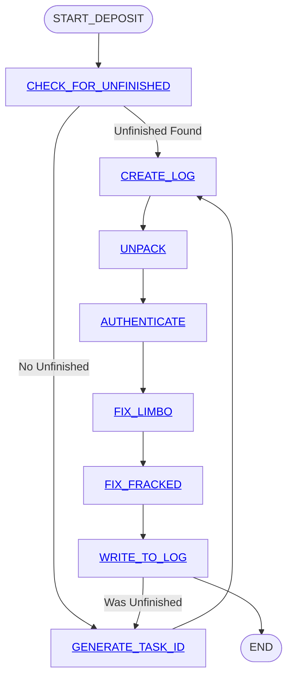

# Deposit 


## Load Coins function
```
This function returns an array of strings when give a path to a folder.
The function also accepts a debug parameter that tells the function if it is in debug mode or not. 
The function first validates the path parameter and formatts it so that it will work on all operating systems. 
The function will catch exceptions. 
If the function is in debug mode, it will write any errors it has to the console.
If there is an error, a string will be created with comma seperated values. These values include the word "error", the error code, an error description that was returned and some information that we can add that would help understand and resolve the issue (Such as instructions on what the user might do to fix the problem). This error string will be added to the bottom of the return array of strings. 
The function will go to the folder specified in the path and return a list of all files in the folder. 
The function will look in the list to see if there are any .zip files.
If .zip files are found it will unzip them so that all the files in the zip file are now in the same folder as the path points to.
If the files in the .zip file have the same names as thouse in the path folder, the program will put those files into the "../Trash" folder.
A folder called "Trash" has the same parent as the path folder.
The program the moves the unzipped zip files into the "../Imported" folder. 
Now the function will need to get a list of all the files in the path folder again.
Any files that do not end in ".bin", ".png" and ".txt" will be ignored.
The function will now call three subfunctions that parse binary files, parse png files and parse text files.
Each of these three functions will need an array of file names that end with the corroponding file extension. 
Each of these three functions will return an array of strings and these strings will be added to the top of the return array.
Then the array of strings that has been created will be returned. 
```
function parseBin( array of lists)
```
This function accepts an array of file names that end with the .bin extension.
A variable is created that tracks the the total number of coins being returned. 
The function will loop through each file name.
Each loop the contents of the file is read as binary.
Variables will need to be extracted from the 32 byte file header.
The variables must be validated.
Byte 0 is named "Format_type" and must be one of the following:  '8', '9', 'A' or 'B'.
Byte 1 is the Cloud_ID.
Byte 2 and 3  is the "token_ID"
Byte 4 is called "Reserved"
Byte 5 is the "Encryption_Type"
Byte 6 is the 	token Count	How many note are in the file. Not the tota value but total count.
HS	7	MD5 Hash of encryption password	First 7 bytes of a hash of the encryption key used to encrypt the token seeds. (if used). Otherwise zeros if no encyption. This is used to tell if the password that the user used was correct.
FL	1	Flags	Represents 8 bitfields. 00000000 means no flags. 00000001 means encoded with email recovery. Custom for applications.
RC	16	Receipt Number	A transaction's GUID to help software track transactions internally. Can be all random or zeros. But can be used by applications for anything. However, if there is no Receipt number, then the following hex should be used "4C 69 76 65 20 46 72 65 65 20 4F 72 20 44 69 65". This transalates to "Live Free or Die" in ASCII.

The number of coins in the file are determined by looking at the ___ byte.
The number 
The 

```

## Generate_PAN

```python
This function returns an array of GUIDs each formatted as a 32 character hexidecimal number string that capitalize all letters.
THe input parameters include an array of 16 byte numbers, the "generation mode" string and a "seed" 16 byte number.
The generation mode must be either "random", "seed_hash", "addition" or "include_raida_id_hash" and these will each be a seperate case.
If random mode, the program uses a strong encryption library to create an array of random GUIDs and fills the 16 byte array parameters each with a 16 byte number.
Check to see if the number starts with a zero and make sure the GUID actually has 32 bytes. If not, generate another one.
If in seed_hash mode, each of the array elements will be filled by taking the number that is already in the array, hashing it and putting it back into the array at the same index.
If in addition mode, each of the array elements values will be added to the seed number and put back into the array at the same index.
If in "include_raida_id" mode, each of the array elements will be removed and it's index

 


```
