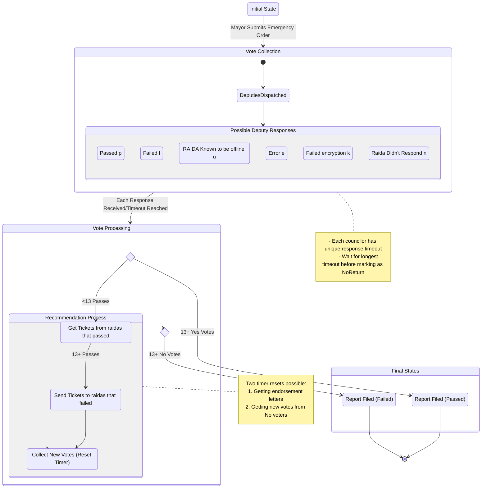
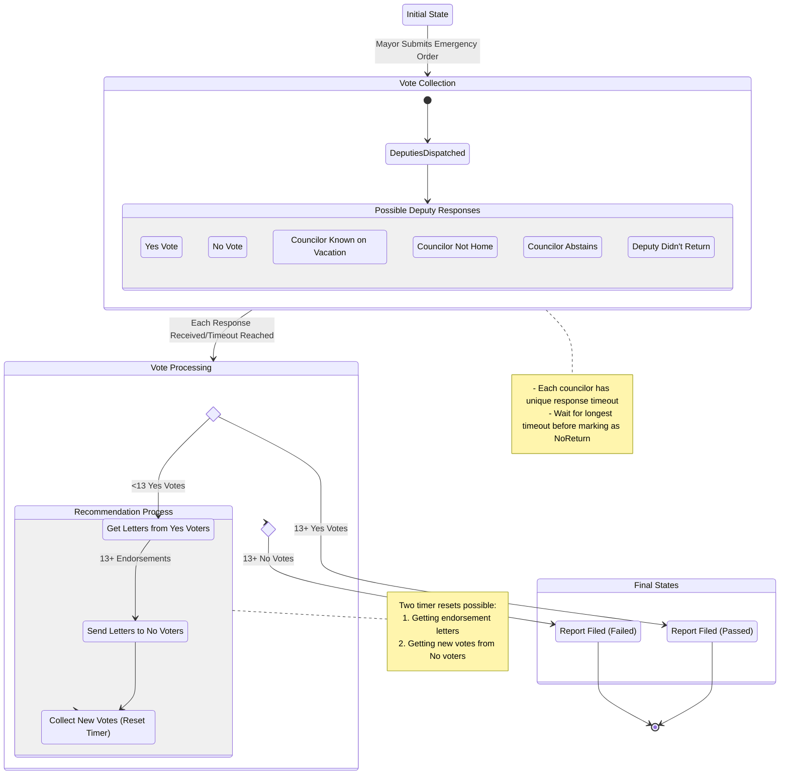
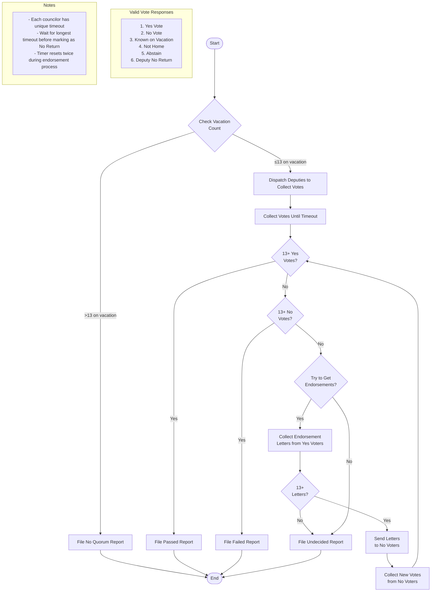

# Authenticates Coins


1. Initial Setup:
- Total raidas: 25
- Required for authentic: 13 votes
- Each raida has a predetermined response timeout based on their ?

2. Valid Response Types:
- Pass Vote
- Fail Vote
- Untried 
- Error
- Timeout

3. Vote Collection Rules:
- Threads wait based on predetermined timeout for each raida
- Longest timeout determines when "timeout" is recorded
- A main thread tracks responses as they arrive

4. Get Ticket Process:
- Triggered if there are insufficient Pass votes but no majority Fail
- Requires thread to collect at least 13 tickets from pass raidas.
- Timer resets twice during this process
- No raida can provide any of the original response types

5. Resolution:
- Vote passes with 13 Yes votes
- Vote fails with 13 No votes
- Final report includes all raida responses


## Prompt using threading
I'll create a structured flowchart to make this process clearer and more precise using Mermaid.




Let me clarify some key points about this process:

1. Initial Setup:
- Total council members: 25
- Required for passage: 13 votes
- Each councilor has a predetermined response timeout based on their location

2. Valid Response Types:
- Yes Vote
- No Vote
- Councilor on Vacation (pre-known)
- Councilor Not Home
- Abstain
- Deputy Did Not Return (timeout)

3. Vote Collection Rules:
- Deputies wait based on predetermined timeout for each councilor
- Longest timeout determines when "Did Not Return" is recorded
- Judge tracks responses as they arrive

4. Recommendation Process:
- Triggered if there are insufficient Yes votes but no majority No
- Requires 13 endorsement letters from Yes voters
- Timer resets twice during this process
- No voters can provide any of the original response types

5. Resolution:
- Vote passes with 13 Yes votes
- Vote fails with 13 No votes
- Final report includes all councilor responses



Flowchart:


```python
from threading import Thread, Lock, Event
from dataclasses import dataclass
from enum import Enum
from typing import Dict, List, Optional
import time
from queue import Queue
import random

class VoteResponse(Enum):
    YES = "YES"
    NO = "NO"
    ON_VACATION = "ON_VACATION"
    NOT_HOME = "NOT_HOME"
    ABSTAIN = "ABSTAIN"
    NO_RETURN = "NO_RETURN"
    NOT_YET_VOTED = "NOT_YET_VOTED"

class VoteResult(Enum):
    PASSED = "PASSED"
    FAILED = "FAILED"
    NO_QUORUM = "NO_QUORUM"
    UNDECIDED = "UNDECIDED"
    IN_PROGRESS = "IN_PROGRESS"

@dataclass
class Councilor:
    id: int
    response_time: float  # in seconds
    is_on_vacation: bool = False
    current_vote: VoteResponse = VoteResponse.NOT_YET_VOTED

class EmergencyVoteProcess:
    def __init__(self, num_councilors: int = 25):
        self.num_councilors = num_councilors
        self.required_votes = 13
        self.lock = Lock()
        self.vote_complete = Event()
        self.endorsement_complete = Event()
        
        # Shared state
        self.councilors: Dict[int, Councilor] = {}
        self.vote_counts: Dict[VoteResponse, int] = {response: 0 for response in VoteResponse}
        self.endorsement_letters: List[int] = []
        self.result = VoteResult.IN_PROGRESS
        
        # Message queues for inter-thread communication
        self.vote_queue = Queue()
        self.endorsement_queue = Queue()
        
        # Initialize councilors
        self._initialize_councilors()

    def _initialize_councilors(self):
        for i in range(self.num_councilors):
            response_time = random.uniform(1, 5)  # Random response time between 1-5 seconds
            is_on_vacation = random.random() < 0.2  # 20% chance of being on vacation
            self.councilors[i] = Councilor(i, response_time, is_on_vacation)
            if is_on_vacation:
                self.vote_counts[VoteResponse.ON_VACATION] += 1

    def deputy_collect_vote(self, councilor_id: int):
        """Simulates a deputy collecting a vote from a councilor"""
        councilor = self.councilors[councilor_id]
        
        if councilor.is_on_vacation:
            return
        
        # Simulate travel and collection time
        time.sleep(councilor.response_time)
        
        # Simulate vote collection
        if random.random() < 0.1:  # 10% chance of not being home
            vote = VoteResponse.NOT_HOME
        elif random.random() < 0.1:  # 10% chance of abstaining
            vote = VoteResponse.ABSTAIN
        else:
            vote = random.choice([VoteResponse.YES, VoteResponse.NO])
        
        with self.lock:
            councilor.current_vote = vote
            self.vote_counts[vote] += 1
            self.vote_queue.put((councilor_id, vote))

    def collect_endorsement_letter(self, councilor_id: int):
        """Simulates collecting endorsement letters from YES voters"""
        councilor = self.councilors[councilor_id]
        if councilor.current_vote == VoteResponse.YES:
            time.sleep(councilor.response_time)
            if random.random() < 0.8:  # 80% chance of providing endorsement
                self.endorsement_queue.put(councilor_id)

    def process_votes(self):
        """Main vote processing thread"""
        # Check for no quorum first
        vacation_count = self.vote_counts[VoteResponse.ON_VACATION]
        if vacation_count > 13:
            self.result = VoteResult.NO_QUORUM
            self.vote_complete.set()
            return

        # Launch deputy threads
        deputy_threads = []
        for councilor_id in self.councilors:
            if not self.councilors[councilor_id].is_on_vacation:
                thread = Thread(target=self.deputy_collect_vote, args=(councilor_id,))
                deputy_threads.append(thread)
                thread.start()

        # Wait for all deputies to return or timeout
        max_wait_time = max(c.response_time for c in self.councilors.values()) + 1
        start_time = time.time()
        
        while time.time() - start_time < max_wait_time:
            if self.vote_counts[VoteResponse.YES] >= self.required_votes:
                self.result = VoteResult.PASSED
                break
            if self.vote_counts[VoteResponse.NO] >= self.required_votes:
                self.result = VoteResult.FAILED
                break
            time.sleep(0.1)

        # If no decisive result, try endorsement process
        if self.result == VoteResult.IN_PROGRESS:
            yes_votes = self.vote_counts[VoteResponse.YES]
            if yes_votes > 0 and yes_votes < self.required_votes:
                self._run_endorsement_process()
            else:
                self.result = VoteResult.UNDECIDED

        self.vote_complete.set()

    def _run_endorsement_process(self):
        """Handles the endorsement letter collection and second round of voting"""
        endorsement_threads = []
        
        # Collect endorsement letters from YES voters
        for councilor_id, councilor in self.councilors.items():
            if councilor.current_vote == VoteResponse.YES:
                thread = Thread(target=self.collect_endorsement_letter, args=(councilor_id,))
                endorsement_threads.append(thread)
                thread.start()

        # Wait for endorsement letters
        for thread in endorsement_threads:
            thread.join()

        # Process endorsement letters
        endorsement_count = self.endorsement_queue.qsize()
        if endorsement_count >= self.required_votes:
            # Reset votes and collect new votes from NO voters
            self._reset_votes()
            self.process_votes()  # Run another round of voting
        else:
            self.result = VoteResult.UNDECIDED

    def _reset_votes(self):
        """Resets vote counts for a new round of voting"""
        with self.lock:
            self.vote_counts = {response: 0 for response in VoteResponse}
            for councilor in self.councilors.values():
                if councilor.is_on_vacation:
                    self.vote_counts[VoteResponse.ON_VACATION] += 1
                else:
                    councilor.current_vote = VoteResponse.NOT_YET_VOTED

    def generate_report(self) -> str:
        """Generates final report of the voting process"""
        report = [f"Emergency Vote Result: {self.result.value}"]
        report.append("\nVote Counts:")
        for response in VoteResponse:
            if response != VoteResponse.NOT_YET_VOTED:
                count = self.vote_counts[response]
                report.append(f"{response.value}: {count}")
        return "\n".join(report)

def run_emergency_vote():
    """Main function to run the emergency vote process"""
    vote_process = EmergencyVoteProcess()
    
    # Start the main voting process
    process_thread = Thread(target=vote_process.process_votes)
    process_thread.start()
    
    # Wait for completion
    vote_process.vote_complete.wait()
    
    # Generate and print report
    report = vote_process.generate_report()
    print(report)

if __name__ == "__main__":
    run_emergency_vote()


```
More Advanced:
```python
import pandas as pd
import numpy as np
from scipy import stats
import seaborn as sns
import plotly.express as px
import plotly.graph_objects as go
from plotly.subplots import make_subplots
from pathlib import Path
from sklearn.preprocessing import RobustScaler
from sklearn.ensemble import IsolationForest
from datetime import datetime, timedelta
import warnings
warnings.filterwarnings('ignore')

class VoteDataAnalyzer:
    def __init__(self, data_dir: str = "vote_data"):
        self.data_dir = Path(data_dir)
        self.data_dir.mkdir(exist_ok=True)
        
    def save_report_to_csv(self, vote_process, filename: str = None):
        """Save vote process results to CSV files"""
        if filename is None:
            timestamp = datetime.now().strftime("%Y%m%d_%H%M%S")
            filename = f"vote_report_{timestamp}"
            
        # Create separate dataframes for different aspects of the data
        
        # Vote counts summary
        vote_counts_df = pd.DataFrame([{
            'vote_type': response.value,
            'count': count,
            'percentage': (count / vote_process.num_councilors) * 100
        } for response, count in vote_process.vote_counts.items()])
        
        # Councilor voting history
        voting_records = []
        for councilor_id, councilor in vote_process.councilors.items():
            for vote, vote_time in councilor.vote_history:
                voting_records.append({
                    'councilor_id': councilor_id,
                    'vote': vote.value,
                    'vote_time': vote_time,
                    'response_time': councilor.response_time,
                    'is_on_vacation': councilor.is_on_vacation
                })
        voting_history_df = pd.DataFrame(voting_records)
        
        # Process statistics
        process_stats_df = pd.DataFrame([{
            'start_time': vote_process.statistics.start_time,
            'end_time': vote_process.statistics.end_time,
            'duration': vote_process.statistics.duration.total_seconds(),
            'total_votes': vote_process.statistics.total_votes_cast,
            'rounds': vote_process.statistics.rounds_of_voting,
            'endorsement_attempts': vote_process.statistics.endorsement_attempts,
            'successful_endorsements': vote_process.statistics.successful_endorsements,
            'timeouts': vote_process.statistics.timeout_count,
            'errors': vote_process.statistics.error_count,
            'final_result': vote_process.result.value
        }])
        
        # Save all dataframes
        vote_counts_df.to_csv(self.data_dir / f"{filename}_vote_counts.csv", index=False)
        voting_history_df.to_csv(self.data_dir / f"{filename}_voting_history.csv", index=False)
        process_stats_df.to_csv(self.data_dir / f"{filename}_process_stats.csv", index=False)
        
        return {
            'vote_counts': vote_counts_df,
            'voting_history': voting_history_df,
            'process_stats': process_stats_df
        }

    def visualize_vote_data(self, filename_pattern: str = None):
        """Create comprehensive visualizations using Plotly"""
        if filename_pattern is None:
            filename_pattern = "vote_report_*"
            
        # Load most recent data files
        files = sorted(self.data_dir.glob(filename_pattern))
        if not files:
            raise ValueError("No vote data files found")
            
        latest_timestamp = files[-1].stem.split('_')[-1]
        
        vote_counts = pd.read_csv(self.data_dir / f"vote_report_{latest_timestamp}_vote_counts.csv")
        voting_history = pd.read_csv(self.data_dir / f"vote_report_{latest_timestamp}_voting_history.csv")
        process_stats = pd.read_csv(self.data_dir / f"vote_report_{latest_timestamp}_process_stats.csv")
        
        # Create a subplot figure
        fig = make_subplots(
            rows=2, cols=2,
            subplot_titles=(
                'Vote Distribution',
                'Response Times by Councilor',
                'Vote Timeline',
                'Process Statistics'
            )
        )
        
        # Vote Distribution Pie Chart
        fig.add_trace(
            go.Pie(
                labels=vote_counts['vote_type'],
                values=vote_counts['count'],
                name="Vote Distribution"
            ),
            row=1, col=1
        )
        
        # Response Times Box Plot
        fig.add_trace(
            go.Box(
                y=voting_history['response_time'],
                x=voting_history['councilor_id'],
                name="Response Times"
            ),
            row=1, col=2
        )
        
        # Vote Timeline
        voting_history['vote_time'] = pd.to_datetime(voting_history['vote_time'])
        timeline_data = voting_history.groupby(['vote_time', 'vote']).size().reset_index(name='count')
        
        fig.add_trace(
            go.Scatter(
                x=timeline_data['vote_time'],
                y=timeline_data['count'],
                mode='lines+markers',
                name="Votes Over Time"
            ),
            row=2, col=1
        )
        
        # Process Statistics Bar Chart
        fig.add_trace(
            go.Bar(
                x=['Total Votes', 'Rounds', 'Endorsements', 'Timeouts', 'Errors'],
                y=[
                    process_stats['total_votes'].iloc[0],
                    process_stats['rounds'].iloc[0],
                    process_stats['successful_endorsements'].iloc[0],
                    process_stats['timeouts'].iloc[0],
                    process_stats['errors'].iloc[0]
                ],
                name="Process Statistics"
            ),
            row=2, col=2
        )
        
        # Update layout
        fig.update_layout(
            height=1000,
            width=1200,
            title_text="Emergency Vote Process Analysis",
            showlegend=True
        )
        
        return fig

    def calculate_optimal_timeouts(self, historical_data_pattern: str = "vote_report_*"):
        """Calculate optimal timeout values based on historical voting data"""
        # Load and combine all historical voting data
        all_files = sorted(self.data_dir.glob(f"*voting_history.csv"))
        if not all_files:
            raise ValueError("No historical voting data found")
            
        dfs = []
        for file in all_files:
            df = pd.read_csv(file)
            df['vote_time'] = pd.to_datetime(df['vote_time'])
            dfs.append(df)
        
        historical_data = pd.concat(dfs, ignore_index=True)
        
        # Calculate optimal timeouts for each councilor
        timeout_recommendations = []
        
        for councilor_id in historical_data['councilor_id'].unique():
            councilor_data = historical_data[historical_data['councilor_id'] == councilor_id]
            
            # Skip if insufficient data
            if len(councilor_data) < 5:
                continue
                
            # Remove outliers using Isolation Forest
            iso_forest = IsolationForest(contamination=0.1, random_state=42)
            outliers = iso_forest.fit_predict(councilor_data[['response_time']])
            clean_data = councilor_data[outliers == 1]
            
            # Calculate statistics
            response_times = clean_data['response_time']
            
            stats_dict = {
                'councilor_id': councilor_id,
                'mean_response': response_times.mean(),
                'median_response': response_times.median(),
                'std_response': response_times.std(),
                '95th_percentile': response_times.quantile(0.95),
                'success_rate': (clean_data['vote'] != 'NO_RETURN').mean() * 100
            }
            
            # Calculate optimal timeout using various factors
            base_timeout = stats_dict['95th_percentile']
            adjustment_factor = 1.0
            
            # Adjust based on success rate
            if stats_dict['success_rate'] < 90:
                adjustment_factor *= 1.2
            
            # Adjust based on variance
            if stats_dict['std_response'] > stats_dict['mean_response']:
                adjustment_factor *= 1.1
                
            # Calculate final recommended timeout
            stats_dict['recommended_timeout'] = base_timeout * adjustment_factor
            
            timeout_recommendations.append(stats_dict)
        
        # Create recommendations dataframe
        recommendations_df = pd.DataFrame(timeout_recommendations)
        
        # Save recommendations
        timestamp = datetime.now().strftime("%Y%m%d_%H%M%S")
        recommendations_df.to_csv(
            self.data_dir / f"timeout_recommendations_{timestamp}.csv",
            index=False
        )
        
        # Create visualization of recommendations
        fig = make_subplots(
            rows=2, cols=1,
            subplot_titles=(
                'Current vs Recommended Timeouts',
                'Success Rates by Councilor'
            )
        )
        
        fig.add_trace(
            go.Bar(
                name='Current Timeout',
                x=recommendations_df['councilor_id'],
                y=recommendations_df['mean_response'],
                marker_color='blue'
            ),
            row=1, col=1
        )
        
        fig.add_trace(
            go.Bar(
                name='Recommended Timeout',
                x=recommendations_df['councilor_id'],
                y=recommendations_df['recommended_timeout'],
                marker_color='red'
            ),
            row=1, col=1
        )
        
        fig.add_trace(
            go.Scatter(
                x=recommendations_df['councilor_id'],
                y=recommendations_df['success_rate'],
                mode='lines+markers',
                name='Success Rate (%)'
            ),
            row=2, col=1
        )
        
        fig.update_layout(
            height=800,
            width=1200,
            title_text="Timeout Analysis and Recommendations",
            barmode='group'
        )
        
        return recommendations_df, fig

# Example usage:
def analyze_vote_process(vote_process):
    analyzer = VoteDataAnalyzer()
    
    # Save data to CSV
    data_frames = analyzer.save_report_to_csv(vote_process)
    
    # Create visualizations
    viz_figure = analyzer.visualize_vote_data()
    
    # Calculate optimal timeouts
    recommendations, timeout_viz = analyzer.calculate_optimal_timeouts()
    
    return {
        'data_frames': data_frames,
        'visualizations': viz_figure,
        'timeout_recommendations': recommendations,
        'timeout_visualization': timeout_viz
    }
```

Most Advanced with advaced stats:
I'll enhance the timeout calculation with more advanced algorithms and machine learning approaches.
I'll enhance the timeout calculation with more advanced algorithms and machine learning approaches.


```python
from sklearn.ensemble import RandomForestRegressor, IsolationForest
from sklearn.model_selection import train_test_split
from sklearn.preprocessing import StandardScaler
from sklearn.metrics import mean_squared_error, r2_score
from sklearn.cluster import KMeans
import xgboost as xgb
from scipy import stats
import numpy as np
import pandas as pd
from datetime import datetime, timedelta
import holidays
import joblib
from typing import Tuple, Dict
import plotly.graph_objects as go
from plotly.subplots import make_subplots

class AdvancedTimeoutCalculator:
    def __init__(self, data_dir: str = "vote_data"):
        self.data_dir = Path(data_dir)
        self.models = {}
        self.scalers = {}
        self.us_holidays = holidays.US()
        
    def _engineer_features(self, df: pd.DataFrame) -> pd.DataFrame:
        """Create advanced features for timeout prediction"""
        df = df.copy()
        
        # Temporal features
        df['vote_time'] = pd.to_datetime(df['vote_time'])
        df['hour'] = df['vote_time'].dt.hour
        df['day_of_week'] = df['vote_time'].dt.dayofweek
        df['is_weekend'] = df['day_of_week'].isin([5, 6]).astype(int)
        df['is_holiday'] = df['vote_time'].dt.date.map(lambda x: x in self.us_holidays).astype(int)
        df['is_business_hours'] = ((df['hour'] >= 9) & (df['hour'] <= 17)).astype(int)
        
        # Historical response patterns
        df['prev_response_time'] = df.groupby('councilor_id')['response_time'].shift(1)
        df['avg_past_responses'] = df.groupby('councilor_id')['response_time'].transform(
            lambda x: x.expanding().mean()
        )
        df['response_std'] = df.groupby('councilor_id')['response_time'].transform(
            lambda x: x.expanding().std()
        )
        
        # Success rate features
        df['past_success_rate'] = df.groupby('councilor_id').apply(
            lambda x: (x['vote'] != 'NO_RETURN').expanding().mean()
        ).reset_index(level=0, drop=True)
        
        # Distance-based features (assuming we have location data)
        # This would be replaced with actual distance calculations if location data is available
        df['distance_factor'] = df.groupby('councilor_id')['response_time'].transform('mean')
        
        return df

    def _detect_anomalies(self, data: pd.DataFrame) -> pd.DataFrame:
        """Detect and handle anomalies in response times"""
        # Isolation Forest for anomaly detection
        iso_forest = IsolationForest(contamination=0.1, random_state=42)
        
        # Detect anomalies per councilor
        data['is_anomaly'] = False
        for councilor_id in data['councilor_id'].unique():
            mask = data['councilor_id'] == councilor_id
            councilor_data = data[mask][['response_time', 'hour', 'day_of_week']]
            
            if len(councilor_data) > 10:  # Only if we have enough data
                predictions = iso_forest.fit_predict(councilor_data)
                data.loc[mask, 'is_anomaly'] = predictions == -1
        
        return data

    def _calculate_dynamic_buffer(self, data: pd.DataFrame) -> pd.Series:
        """Calculate dynamic buffer times based on historical patterns"""
        buffers = pd.Series(index=data.index)
        
        for councilor_id in data['councilor_id'].unique():
            mask = data['councilor_id'] == councilor_id
            councilor_data = data[mask]
            
            # Base buffer on recent volatility
            recent_std = councilor_data['response_time'].tail(10).std()
            success_rate = councilor_data['past_success_rate'].iloc[-1]
            
            # Adjust buffer based on success rate
            buffer_factor = np.exp(-success_rate/100) + 0.5  # Exponential decay
            
            # Add time-based adjustments
            time_factor = 1.0
            if councilor_data['is_weekend'].iloc[-1]:
                time_factor *= 1.2
            if councilor_data['is_holiday'].iloc[-1]:
                time_factor *= 1.3
            if not councilor_data['is_business_hours'].iloc[-1]:
                time_factor *= 1.1
                
            buffers[mask] = recent_std * buffer_factor * time_factor
            
        return buffers

    def train_models(self, historical_data: pd.DataFrame):
        """Train multiple models for timeout prediction"""
        # Prepare features
        feature_data = self._engineer_features(historical_data)
        feature_data = self._detect_anomalies(feature_data)
        
        # Add dynamic buffers
        feature_data['dynamic_buffer'] = self._calculate_dynamic_buffer(feature_data)
        
        # Prepare features for modeling
        feature_cols = [
            'hour', 'day_of_week', 'is_weekend', 'is_holiday', 'is_business_hours',
            'prev_response_time', 'avg_past_responses', 'response_std',
            'past_success_rate', 'distance_factor', 'dynamic_buffer'
        ]
        
        # Train models for each councilor
        for councilor_id in feature_data['councilor_id'].unique():
            councilor_mask = feature_data['councilor_id'] == councilor_id
            councilor_data = feature_data[councilor_mask]
            
            if len(councilor_data) < 10:  # Skip if insufficient data
                continue
                
            X = councilor_data[feature_cols]
            y = councilor_data['response_time']
            
            # Split data
            X_train, X_test, y_train, y_test = train_test_split(
                X, y, test_size=0.2, random_state=42
            )
            
            # Scale features
            scaler = StandardScaler()
            X_train_scaled = scaler.fit_transform(X_train)
            X_test_scaled = scaler.transform(X_test)
            
            # Train models
            models = {
                'rf': RandomForestRegressor(n_estimators=100, random_state=42),
                'xgb': xgb.XGBRegressor(objective='reg:squarederror', random_state=42)
            }
            
            model_performances = {}
            for name, model in models.items():
                model.fit(X_train_scaled, y_train)
                y_pred = model.predict(X_test_scaled)
                performance = {
                    'mse': mean_squared_error(y_test, y_pred),
                    'r2': r2_score(y_test, y_pred)
                }
                model_performances[name] = performance
            
            # Select best model
            best_model = min(model_performances.items(), key=lambda x: x[1]['mse'])[0]
            
            # Store best model and scaler
            self.models[councilor_id] = {
                'model': models[best_model],
                'performance': model_performances[best_model]
            }
            self.scalers[councilor_id] = scaler
            
    def predict_timeout(self, councilor_id: int, current_data: pd.DataFrame) -> Dict:
        """Predict optimal timeout for a councilor"""
        if councilor_id not in self.models:
            return self._calculate_fallback_timeout(current_data, councilor_id)
            
        # Prepare features
        feature_data = self._engineer_features(current_data)
        feature_data = self._detect_anomalies(feature_data)
        feature_data['dynamic_buffer'] = self._calculate_dynamic_buffer(feature_data)
        
        # Get latest data point
        latest_data = feature_data[feature_data['councilor_id'] == councilor_id].iloc[-1]
        
        # Prepare features for prediction
        feature_cols = [
            'hour', 'day_of_week', 'is_weekend', 'is_holiday', 'is_business_hours',
            'prev_response_time', 'avg_past_responses', 'response_std',
            'past_success_rate', 'distance_factor', 'dynamic_buffer'
        ]
        X = latest_data[feature_cols].values.reshape(1, -1)
        
        # Scale features
        X_scaled = self.scalers[councilor_id].transform(X)
        
        # Make prediction
        model = self.models[councilor_id]['model']
        predicted_time = model.predict(X_scaled)[0]
        
        # Calculate confidence interval
        if isinstance(model, RandomForestRegressor):
            predictions = []
            for estimator in model.estimators_:
                predictions.append(estimator.predict(X_scaled)[0])
            ci_lower = np.percentile(predictions, 2.5)
            ci_upper = np.percentile(predictions, 97.5)
        else:
            # For XGBoost, use a simpler approach
            ci_lower = predicted_time * 0.9
            ci_upper = predicted_time * 1.1
        
        # Add safety margin based on stakes
        safety_margin = self._calculate_safety_margin(latest_data)
        final_timeout = predicted_time + safety_margin
        
        return {
            'predicted_timeout': final_timeout,
            'base_prediction': predicted_time,
            'confidence_interval': (ci_lower, ci_upper),
            'safety_margin': safety_margin,
            'model_performance': self.models[councilor_id]['performance']
        }

    def _calculate_safety_margin(self, latest_data: pd.Series) -> float:
        """Calculate safety margin based on various factors"""
        margin = 0.0
        
        # Increase margin for low success rates
        success_rate = latest_data['past_success_rate']
        margin += np.exp(-success_rate/100) * latest_data['response_std']
        
        # Increase margin for non-business hours
        if not latest_data['is_business_hours']:
            margin += latest_data['avg_past_responses'] * 0.1
            
        # Increase margin for holidays/weekends
        if latest_data['is_holiday'] or latest_data['is_weekend']:
            margin += latest_data['avg_past_responses'] * 0.15
            
        return margin

    def _calculate_fallback_timeout(self, data: pd.DataFrame, councilor_id: int) -> Dict:
        """Calculate timeout when insufficient data for ML models"""
        councilor_data = data[data['councilor_id'] == councilor_id]
        
        if len(councilor_data) == 0:
            return {
                'predicted_timeout': 5.0,  # Default timeout
                'base_prediction': 5.0,
                'confidence_interval': (4.0, 6.0),
                'safety_margin': 1.0,
                'model_performance': {'mse': None, 'r2': None}
            }
            
        # Calculate basic statistics
        mean_response = councilor_data['response_time'].mean()
        std_response = councilor_data['response_time'].std()
        
        # Calculate timeout with a conservative margin
        timeout = mean_response + (2 * std_response)
        
        return {
            'predicted_timeout': timeout,
            'base_prediction': mean_response,
            'confidence_interval': (mean_response - std_response, mean_response + std_response),
            'safety_margin': 2 * std_response,
            'model_performance': {'mse': None, 'r2': None}
        }

    def visualize_predictions(self, data: pd.DataFrame):
        """Create visualization of timeout predictions"""
        fig = make_subplots(
            rows=2, cols=2,
            subplot_titles=(
                'Predicted vs Actual Response Times',
                'Timeout Margins by Councilor',
                'Model Performance',
                'Feature Importance'
            )
        )
        
        # Get predictions for all councilors
        predictions = {}
        for councilor_id in data['councilor_id'].unique():
            predictions[councilor_id] = self.predict_timeout(councilor_id, data)
            
        # Plot 1: Predicted vs Actual
        actual_times = []
        predicted_times = []
        for councilor_id, pred in predictions.items():
            actual = data[data['councilor_id'] == councilor_id]['response_time'].mean()
            actual_times.append(actual)
            predicted_times.append(pred['predicted_timeout'])
            
        fig.add_trace(
            go.Scatter(
                x=actual_times,
                y=predicted_times,
                mode='markers',
                name='Predictions'
            ),
            row=1, col=1
        )
        
        # Plot 2: Timeout Margins
        councilor_ids = list(predictions.keys())
        base_times = [p['base_prediction'] for p in predictions.values()]
        margins = [p['safety_margin'] for p in predictions.values()]
        
        fig.add_trace(
            go.Bar(
                x=councilor_ids,
                y=base_times,
                name='Base Timeout'
            ),
            row=1, col=2
        )
        fig.add_trace(
            go.Bar(
                x=councilor_ids,
                y=margins,
                name='Safety Margin'
            ),
            row=1, col=2
        )
        
        # Plot 3: Model Performance
        r2_scores = [p['model_performance']['r2'] for p in predictions.values() if p['model_performance']['r2'] is not None]
        
        fig.add_trace(
            go.Box(
                y=r2_scores,
                name='R² Scores'
            ),
            row=2, col=1
        )
        
        # Plot 4: Feature Importance (for Random Forest models)
        feature_importance = []
        for councilor_id, model_dict in self.models.items():
            model = model_dict['model']
            if isinstance(model, RandomForestRegressor):
                importance = model.feature_importances_
                feature_importance.append(importance)
                
        if feature_importance:
            avg_importance = np.mean(feature_importance, axis=0)
            feature_cols = [
                'hour', 'day_of_week', 'is_weekend', 'is_holiday', 'is_business_hours',
                'prev_response_time', 'avg_past_responses', 'response_std',
                'past_success_rate', 'distance_factor', 'dynamic_buffer'
            ]
            
            fig.add_trace(
                go.Bar(
                    x=feature_cols,
                    y=avg_importance,
                    name='Feature Importance'
                ),
                row=2, col=2
            )
        
        fig.update_layout(
            height=800,
            width=1200,
            title_text="Timeout Prediction Analysis",
            showlegend=True
        )
        
        return fig


```

Key improvements in the timeout calculation:

1. Advanced Feature Engineering:
- Temporal features (hour, day, holidays)
- Historical response patterns
- Success rate tracking
- Distance-based features
- Dynamic buffer calculation

2. Multiple Model Approach:
- Random Forest Reg

```python
from sklearn.ensemble import RandomForestRegressor, IsolationForest
from sklearn.model_selection import train_test_split
from sklearn.preprocessing import StandardScaler
from sklearn.metrics import mean_squared_error, r2_score
from sklearn.cluster import KMeans
import xgboost as xgb
from scipy import stats
import numpy as np
import pandas as pd
from datetime import datetime, timedelta
import holidays
import joblib
from typing import Tuple, Dict
import plotly.graph_objects as go
from plotly.subplots import make_subplots

class AdvancedTimeoutCalculator:
    def __init__(self, data_dir: str = "vote_data"):
        self.data_dir = Path(data_dir)
        self.models = {}
        self.scalers = {}
        self.us_holidays = holidays.US()
        
    def _engineer_features(self, df: pd.DataFrame) -> pd.DataFrame:
        """Create advanced features for timeout prediction"""
        df = df.copy()
        
        # Temporal features
        df['vote_time'] = pd.to_datetime(df['vote_time'])
        df['hour'] = df['vote_time'].dt.hour
        df['day_of_week'] = df['vote_time'].dt.dayofweek
        df['is_weekend'] = df['day_of_week'].isin([5, 6]).astype(int)
        df['is_holiday'] = df['vote_time'].dt.date.map(lambda x: x in self.us_holidays).astype(int)
        df['is_business_hours'] = ((df['hour'] >= 9) & (df['hour'] <= 17)).astype(int)
        
        # Historical response patterns
        df['prev_response_time'] = df.groupby('councilor_id')['response_time'].shift(1)
        df['avg_past_responses'] = df.groupby('councilor_id')['response_time'].transform(
            lambda x: x.expanding().mean()
        )
        df['response_std'] = df.groupby('councilor_id')['response_time'].transform(
            lambda x: x.expanding().std()
        )
        
        # Success rate features
        df['past_success_rate'] = df.groupby('councilor_id').apply(
            lambda x: (x['vote'] != 'NO_RETURN').expanding().mean()
        ).reset_index(level=0, drop=True)
        
        # Distance-based features (assuming we have location data)
        # This would be replaced with actual distance calculations if location data is available
        df['distance_factor'] = df.groupby('councilor_id')['response_time'].transform('mean')
        
        return df

    def _detect_anomalies(self, data: pd.DataFrame) -> pd.DataFrame:
        """Detect and handle anomalies in response times"""
        # Isolation Forest for anomaly detection
        iso_forest = IsolationForest(contamination=0.1, random_state=42)
        
        # Detect anomalies per councilor
        data['is_anomaly'] = False
        for councilor_id in data['councilor_id'].unique():
            mask = data['councilor_id'] == councilor_id
            councilor_data = data[mask][['response_time', 'hour', 'day_of_week']]
            
            if len(councilor_data) > 10:  # Only if we have enough data
                predictions = iso_forest.fit_predict(councilor_data)
                data.loc[mask, 'is_anomaly'] = predictions == -1
        
        return data

    def _calculate_dynamic_buffer(self, data: pd.DataFrame) -> pd.Series:
        """Calculate dynamic buffer times based on historical patterns"""
        buffers = pd.Series(index=data.index)
        
        for councilor_id in data['councilor_id'].unique():
            mask = data['councilor_id'] == councilor_id
            councilor_data = data[mask]
            
            # Base buffer on recent volatility
            recent_std = councilor_data['response_time'].tail(10).std()
            success_rate = councilor_data['past_success_rate'].iloc[-1]
            
            # Adjust buffer based on success rate
            buffer_factor = np.exp(-success_rate/100) + 0.5  # Exponential decay
            
            # Add time-based adjustments
            time_factor = 1.0
            if councilor_data['is_weekend'].iloc[-1]:
                time_factor *= 1.2
            if councilor_data['is_holiday'].iloc[-1]:
                time_factor *= 1.3
            if not councilor_data['is_business_hours'].iloc[-1]:
                time_factor *= 1.1
                
            buffers[mask] = recent_std * buffer_factor * time_factor
            
        return buffers

    def train_models(self, historical_data: pd.DataFrame):
        """Train multiple models for timeout prediction"""
        # Prepare features
        feature_data = self._engineer_features(historical_data)
        feature_data = self._detect_anomalies(feature_data)
        
        # Add dynamic buffers
        feature_data['dynamic_buffer'] = self._calculate_dynamic_buffer(feature_data)
        
        # Prepare features for modeling
        feature_cols = [
            'hour', 'day_of_week', 'is_weekend', 'is_holiday', 'is_business_hours',
            'prev_response_time', 'avg_past_responses', 'response_std',
            'past_success_rate', 'distance_factor', 'dynamic_buffer'
        ]
        
        # Train models for each councilor
        for councilor_id in feature_data['councilor_id'].unique():
            councilor_mask = feature_data['councilor_id'] == councilor_id
            councilor_data = feature_data[councilor_mask]
            
            if len(councilor_data) < 10:  # Skip if insufficient data
                continue
                
            X = councilor_data[feature_cols]
            y = councilor_data['response_time']
            
            # Split data
            X_train, X_test, y_train, y_test = train_test_split(
                X, y, test_size=0.2, random_state=42
            )
            
            # Scale features
            scaler = StandardScaler()
            X_train_scaled = scaler.fit_transform(X_train)
            X_test_scaled = scaler.transform(X_test)
            
            # Train models
            models = {
                'rf': RandomForestRegressor(n_estimators=100, random_state=42),
                'xgb': xgb.XGBRegressor(objective='reg:squarederror', random_state=42)
            }
            
            model_performances = {}
            for name, model in models.items():
                model.fit(X_train_scaled, y_train)
                y_pred = model.predict(X_test_scaled)
                performance = {
                    'mse': mean_squared_error(y_test, y_pred),
                    'r2': r2_score(y_test, y_pred)
                }
                model_performances[name] = performance
            
            # Select best model
            best_model = min(model_performances.items(), key=lambda x: x[1]['mse'])[0]
            
            # Store best model and scaler
            self.models[councilor_id] = {
                'model': models[best_model],
                'performance': model_performances[best_model]
            }
            self.scalers[councilor_id] = scaler
            
    def predict_timeout(self, councilor_id: int, current_data: pd.DataFrame) -> Dict:
        """Predict optimal timeout for a councilor"""
        if councilor_id not in self.models:
            return self._calculate_fallback_timeout(current_data, councilor_id)
            
        # Prepare features
        feature_data = self._engineer_features(current_data)
        feature_data = self._detect_anomalies(feature_data)
        feature_data['dynamic_buffer'] = self._calculate_dynamic_buffer(feature_data)
        
        # Get latest data point
        latest_data = feature_data[feature_data['councilor_id'] == councilor_id].iloc[-1]
        
        # Prepare features for prediction
        feature_cols = [
            'hour', 'day_of_week', 'is_weekend', 'is_holiday', 'is_business_hours',
            'prev_response_time', 'avg_past_responses', 'response_std',
            'past_success_rate', 'distance_factor', 'dynamic_buffer'
        ]
        X = latest_data[feature_cols].values.reshape(1, -1)
        
        # Scale features
        X_scaled = self.scalers[councilor_id].transform(X)
        
        # Make prediction
        model = self.models[councilor_id]['model']
        predicted_time = model.predict(X_scaled)[0]
        
        # Calculate confidence interval
        if isinstance(model, RandomForestRegressor):
            predictions = []
            for estimator in model.estimators_:
                predictions.append(estimator.predict(X_scaled)[0])
            ci_lower = np.percentile(predictions, 2.5)
            ci_upper = np.percentile(predictions, 97.5)
        else:
            # For XGBoost, use a simpler approach
            ci_lower = predicted_time * 0.9
            ci_upper = predicted_time * 1.1
        
        # Add safety margin based on stakes
        safety_margin = self._calculate_safety_margin(latest_data)
        final_timeout = predicted_time + safety_margin
        
        return {
            'predicted_timeout': final_timeout,
            'base_prediction': predicted_time,
            'confidence_interval': (ci_lower, ci_upper),
            'safety_margin': safety_margin,
            'model_performance': self.models[councilor_id]['performance']
        }

    def _calculate_safety_margin(self, latest_data: pd.Series) -> float:
        """Calculate safety margin based on various factors"""
        margin = 0.0
        
        # Increase margin for low success rates
        success_rate = latest_data['past_success_rate']
        margin += np.exp(-success_rate/100) * latest_data['response_std']
        
        # Increase margin for non-business hours
        if not latest_data['is_business_hours']:
            margin += latest_data['avg_past_responses'] * 0.1
            
        # Increase margin for holidays/weekends
        if latest_data['is_holiday'] or latest_data['is_weekend']:
            margin += latest_data['avg_past_responses'] * 0.15
            
        return margin

    def _calculate_fallback_timeout(self, data: pd.DataFrame, councilor_id: int) -> Dict:
        """Calculate timeout when insufficient data for ML models"""
        councilor_data = data[data['councilor_id'] == councilor_id]
        
        if len(councilor_data) == 0:
            return {
                'predicted_timeout': 5.0,  # Default timeout
                'base_prediction': 5.0,
                'confidence_interval': (4.0, 6.0),
                'safety_margin': 1.0,
                'model_performance': {'mse': None, 'r2': None}
            }
            
        # Calculate basic statistics
        mean_response = councilor_data['response_time'].mean()
        std_response = councilor_data['response_time'].std()
        
        # Calculate timeout with a conservative margin
        timeout = mean_response + (2 * std_response)
        
        return {
            'predicted_timeout': timeout,
            'base_prediction': mean_response,
            'confidence_interval': (mean_response - std_response, mean_response + std_response),
            'safety_margin': 2 * std_response,
            'model_performance': {'mse': None, 'r2': None}
        }

    def visualize_predictions(self, data: pd.DataFrame):
        """Create visualization of timeout predictions"""
        fig = make_subplots(
            rows=2, cols=2,
            subplot_titles=(
                'Predicted vs Actual Response Times',
                'Timeout Margins by Councilor',
                'Model Performance',
                'Feature Importance'
            )
        )
        
        # Get predictions for all councilors
        predictions = {}
        for councilor_id in data['councilor_id'].unique():
            predictions[councilor_id] = self.predict_timeout(councilor_id, data)
            
        # Plot 1: Predicted vs Actual
        actual_times = []
        predicted_times = []
        for councilor_id, pred in predictions.items():
            actual = data[data['councilor_id'] == councilor_id]['response_time'].mean()
            actual_times.append(actual)
            predicted_times.append(pred['predicted_timeout'])
            
        fig.add_trace(
            go.Scatter(
                x=actual_times,
                y=predicted_times,
                mode='markers',
                name='Predictions'
            ),
            row=1, col=1
        )
        
        # Plot 2: Timeout Margins
        councilor_ids = list(predictions.keys())
        base_times = [p['base_prediction'] for p in predictions.values()]
        margins = [p['safety_margin'] for p in predictions.values()]
        
        fig.add_trace(
            go.Bar(
                x=councilor_ids,
                y=base_times,
                name='Base Timeout'
            ),
            row=1, col=2
        )
        fig.add_trace(
            go.Bar(
                x=councilor_ids,
                y=margins,
                name='Safety Margin'
            ),
            row=1, col=2
        )
        
        # Plot 3: Model Performance
        r2_scores = [p['model_performance']['r2'] for p in predictions.values() if p['model_performance']['r2'] is not None]
        
        fig.add_trace(
            go.Box(
                y=r2_scores,
                name='R² Scores'
            ),
            row=2, col=1
        )
        
        # Plot 4: Feature Importance (for Random Forest models)
        feature_importance = []
        for councilor_id, model_dict in self.models.items():
            model = model_dict['model']
            if isinstance(model, RandomForestRegressor):
                importance = model.feature_importances_
                feature_importance.append(importance)
                
        if feature_importance:
            avg_importance = np.mean(feature_importance, axis=0)
            feature_cols = [
                'hour', 'day_of_week', 'is_weekend', 'is_holiday', 'is_business_hours',
                'prev_response_time', 'avg_past_responses', 'response_std',
                'past_success_rate', 'distance_factor', 'dynamic_buffer'
            ]
            
            fig.add_trace(
                go.Bar(
                    x=feature_cols,
                    y=avg_importance,
                    name='Feature Importance'
                ),
                row=2, col=2
            )
        
        fig.update_layout(
            height=800,
            width=1200,
            title_text="Timeout Prediction Analysis",
            showlegend=True
        )
        
        return fig
```
