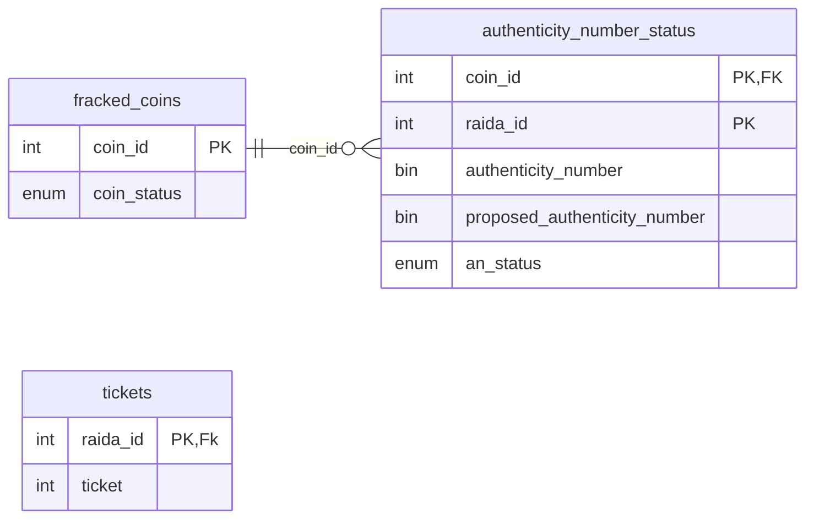
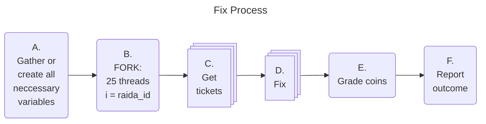

# Fix

Data Structure: 


Notes on Enumerators
```
* enum coin_status = ["BANK", "FRACKED", "TRASH", "COUNTERFEIT", "LIMBO", "SUSPECT"]
** enum an_status = ["AUTHENTIC", "BROKE_KEY", "CLOCK_TIMEOUT", "DNS", "ERROR", "FAILED", "0_UNTRIED"]

```
### This data can be stored in .csv files: 
fracked_coins table
```csv
dn_and_sn,status
1,Bank
2,Fracked
3,Trash
4,Counterfeit
5,Limbo
6,Suspect
```
coin_status table: (limbo_authenticity_number is used for the "Find" service used to fix coins in Limbo)
```csv
dn_and_sn,raida_id,status,ticket,authenticity_number,limbo_authenticity_number
1,101,u,1001,7F6F77F19C4C4719BEA04AAA65F26D50,00000000000000000000000000000000
1,102,e,1002,29C3D4180BA74829AC4EEC4F5CBCD7DA,00000000000000000000000000000000
2,101,f,1003,AA4EED25E8584739BE31CE1A2CE6EEE4,00000000000000000000000000000000
2,103,n,1004,FAB547BC96C74988A0263DAE3C566D94,00000000000000000000000000000000
3,102,p,1005,61085F165FC04FCBBD6CB3683ED3489A,00000000000000000000000000000000
4,104,k,1006,E6FFF9E8A05D4D719785A88196CCAE5B,00000000000000000000000000000000
```
tickets table:
```csv
raida_id, ticket
0,AA4EED25
1,E8584739
2,BE31CE1A
24,2CE6EEE4
```


## Sequence of events



```C
// Function call the start the Fix process
fix_coins( int echo_time_array[], ip_addr_t ip_addresses[25] ) { fixes frackec coins}

```

### Global Variables
char COIN_NUMBER  = [0x00,0x01] // Coin number ? is CloudCoin (high and low order bit);

### Gather or Create all neccessary variables

Step Code | Action 
---|---
A.01  | Read the encryption coin file into int encryption_sn and guid_t encryption_an_array[25]
A.02  | Passed in: string location_path, string wallet_name, should be passed in.
A.03  | Create an array for errors string error array
A.04  | Create a random array of challenges guid_t challeng_array[25]
A.05  | Create a random array of nounces nonce_t nonce_array[25]
A.06  | Load the IP addresses of the RAIDA ip_addr_t ip_addresses[25]
A.07  | Load the echo time file int echo_time_array[],
A.08  | load_fracked_coins(locaton_path, wallet_name) into the fraced_coin and coin_status structs updateable by threads.
A.09 | Create array tickets updateable by all threads.


### Fork 25 Threads
Step Code | Action 
---|---
B.01  | Create 25 threads, each gets its own raida_id, encryption_sn, encryption_an, nounce, challenge, echo_time 
B.02  | WHILE (ans_still_fracked > 0 ) Each thread will do the following steps:
B.03  | Call Get_ticket(raida_id, encryption_sn, encryption_an, nounce, challenge, echo_time) 
B.04  | Call Fix(raida_id, encryption_sn, encryption_an, nounce, challenge, echo_time, pointers to structs)

### Get Ticket
Step Code | Action 
---|---
C.01 | WHILE (ans_still_fracked > 0 ) Each thread will do the following steps:
C.02 | make_ticket_plan() Returns eight character string S = Get Ticket Sum" or T = "Get Ticket", T = TCP or U = UDP and amount 00000 - 999999 of coins using AI "Fix PlanModel"
C.03 | Set variables: ans_still_fracked=count( * ), transport="udp", service="get_ticket_sum", coins_per_loop=50, failed_sum="false", encryption_type=3.
C.04 | Create a new Request Header router_presentation byte array made up of random numbers with the exception of the raida_id and the coins type.
C.05 | Create a char request_routing_array[] = { 0x00, 0x00, 0x00, 0x00, 0x00, 0x00, 0x00, 0x00 };
C.06 | Create a char presentation_arry[] = { 0x00, 0x00, 0x00, 0x00, 0x00, 0x00, 0x00, 0x00 };
C.07 | Create a char encryption_arry[] = { 0x00, 0x00, 0x00, 0x00, 0x00, 0x00, 0x00, 0x00 };
C.08 | Create a char nounce_arry[] = { 0x00, 0x00, 0x00, 0x00, 0x00, 0x00, 0x00, 0x00 };
C.09 | rounting_array[0]  = 0x8 0x0 // 4 bit leghth of router bytes / 4 bit version numer is zero
C.10 | rounting_array[2]  = raida_id // usuallly 0-25
C.11 | rounting_array[4]  = 0x02 // Command Group (healing)
C.12 | rounting_array[5]  = 0x28 0r 0x29 // Comman 40 if Get Ticket, 41 if Get Ticket by Sum
C.13 | rounting_array[6]  = 0x00 // Coin ID high order bits
C.14 | rounting_array[7]  = 0x00     // Coin ID lowe order bits
C.15 | presentation_array[6]  = 0x00     // The packet index number in the message array
C.16 | presentation_array[7]  = 0x00     // The length of packets in the message array.
C.17 | encryption_array[0] = 0x01 // Encryption Type
C.18 | encryption_array[1] = 0x02 // Denomination of Encryption Key
C.19 | encryption_array[2] through [5] = 0x02 // Four byte serial number
C.20 | nounce_array = nounce
C.21 | echo_1 = nounce_array[6]
C.22 | echo_2 = nounce_array[7]
C.23 | ending_bytes[0] = 0x3E
C.24 | ending_bytes[1] = 0x3E
C.25 | body_array[ans_still_fracked]
C.26 | If service = "fix"
C.27 | For each row in the coin_status table 
C.28 | If service="get_ticket": body_array[i] = dn_and_sn[i] + authenticity_number[i] where raida_id = i 
C.29 | if service="get_ticket_sum": body_array[i] = dn_and_sn[i] where raida_id = i 
C.30 | if service="get_ticket_sum": sum += authenticity_number[i] 
C.31 | body = challenge + body_array 
C.32 | Pad body with bytes so that the number of bytes are divisiable by 16
C.33 | encrypted_body = encrypt_AES(body)
C.34 | encrypted_body += ending_bytes 
C.35 | request_header = rounting_array + presentation_arry + presentation_array + nounce_array + encrypted_body
C.36 | int time_out = set_timeout(transport, ans_still_fracked, echo_time)
C.37 | Send request_header using transport, timeout 
C.38 | wait for response
C.39 | But the response in a buffer
C.40 | response_status = buffer[2]
C.41 | length_of_body = buffer[9-11]
C.42 | execution_time_in_nano_seconds = buffer[12-15]
C.43 | response_challenge = buffer[16-31]
C.44 | if response_challenge != challenge record error (Fake RAIDA Server),  end thread.
C.45 | write statistics to transport, command_ground, command, request_header[length], execution_time, counter, echo_time, timedout?
C.46 | results_buffer[length_of_body]
C.47 | If status 241: all pass read bytes buffer[32-35] write to coin_status table
C.48 | if service ="fix" & status = 242: all fail write to coin_status table show all serial numbers under raida_id[i] as fail. 
C.49 | if service ="fix_support" & status = 242: Change service to "fix", Continue to While
C.50 | if service ="fix": If status 243: means mixed, read respons_array = bytes 32 to byte 32 + length_of_body. 
C.51 | Last four bytes of the are the ticket.
C.52 | Loop through dn_and_sn array and the response_array bytes. The bits represent each dn_and_sn. If the bit is 1, 'pass' otherwise 'fail'.
C.53 | encryption_arry[0] = 0x01 // Body Length
C.54 | if ans_still_fracked back to While
C.55 | Return Error Array

### set_timeout(transport, ans_still_fracked, echo_time){ function for calculating timeout }
T.01 | // Later this will be calculated by an AI model
T.02 | return echo_time * 3 + ans_still_fracked

### Fix 
Step Code | Action 
---|---
D.00 | make_ticket_plan(){ Returns eight character string S = Get Ticket Sum" or T = "Get Ticket", T = TCP or U = UDP and amount 00000 - 999999 }
D.01 | Set variables: ans_still_fracked=count( * ), transport="udp", service="fix", coins_per_loop=50, failed_sum="false", encryption_type=2.
D.02 | Create a new Request Header router_presentation byte-array made up of random numbers with the exception of the raida_id and the coins type.
D.03 | Create a char request_routing_array[] = { 0x00, 0x00, 0x00, 0x00, 0x00, 0x00, 0x00, 0x00 };
D.04 | Create a char presentation_arry[] = { 0x00, 0x00, 0x00, 0x00, 0x00, 0x00, 0x00, 0x00 };
D.05 | Create a char encryption_arry[] = { 0x00, 0x00, 0x00, 0x00, 0x00, 0x00, 0x00, 0x00 };
D.06 | Create a char nounce_arry[] = { 0x00, 0x00, 0x00, 0x00, 0x00, 0x00, 0x00, 0x00 };
D.07 | rounting_array[0]  = 0x8 0x0 // 4 bit leghth of router bytes / 4 bit version numer is zero
D.08 | rounting_array[2]  = raida_id // usuallly 0-25
D.09 | rounting_array[4]  = 0x02 // Command Group (healing)
D.10 | rounting_array[5]  = 0x50 // Comman 80 fix
D.11 | rounting_array[6]  = 0x00 // Coin ID high order bits
D.12 | rounting_array[7]  = 0x00     // Coin ID lowe order bits
D.13 | presentation_array[6]  = 0x00     // The packet index number in the message array
D.14 | presentation_array[7]  = 0x00     // The length of packets in the message array.
D.15 | encryption_array[0] = 0x01 // Encryption Type
D.16 | encryption_array[1] = 0x02 // Denomination of Encryption Key
D.17 | encryption_array[2] through [5] = 0x02 // Four byte serial number
D.18 | nounce_array = nounce
D.19 | echo_1 = nounce_array[6]
D.20 | echo_2 = nounce_array[7]
D.21 | ending_bytes[0] = 0x3E
D.22 | ending_bytes[1] = 0x3E
D.23 | body_array[ans_still_fracked]
D.24 | For each row in the coin_status table 
D.25 | If service="fix": body_array[i] = dn_and_sn[i] + authenticity_number[i] where raida_id = i 
D.26 | body = challenge + body_array 
D.27 | Pad body with bytes so that the number of bytes are divisiable by 16
D.28 | encrypted_body = encrypt_AES(body)
D.29 | encrypted_body += ending_bytes 
D.30 | request_header = rounting_array + presentation_arry + presentation_array + nounce_array + encrypted_body
D.31 | int time_out = set_timeout(transport, ans_still_fracked, echo_time)
D.32 | Send request_header using transport, timeout 
D.33 | wait for response
D.34 | But the response in a buffer
D.35 | response_status = buffer[2]
D.36 | length_of_body = buffer[9-11]
D.37 | execution_time_in_nano_seconds = buffer[12-15]
D.38 | response_challenge = buffer[16-31]
D.39 | if response_challenge != challenge record error (Fake RAIDA Server),  end thread.
D.40 | write statistics to transport, command_ground, command, request_header[length], execution_time, counter, echo_time, timedout?
D.41 | results_buffer[length_of_body]
D.42 | If status 241: all pass read bytes buffer[32-35] write to coin_status table
D.42 | if service ="fix" & status = 242: all fail write to coin_status table show all serial numbers under raida_id[i] as fail. 
D.42 | if service ="fix_support" & status = 242: Change service to "fix", Continue to While
D.42 | if service ="fix": If status 243: means mixed, read respons_array = bytes 32 to byte 32 + length_of_body. 
D.43 | - Last four bytes of the are the ticket.
D.44 | - Loop through dn_and_sn array and the response_array. The bits represent each dn_and_sn. If the bit is 1, 'pass'. otherwise 'fail' is put into the database. 
D.48 | encryption_arry[0] = 0x01 // Body Length
D.49 | Return Error Array

