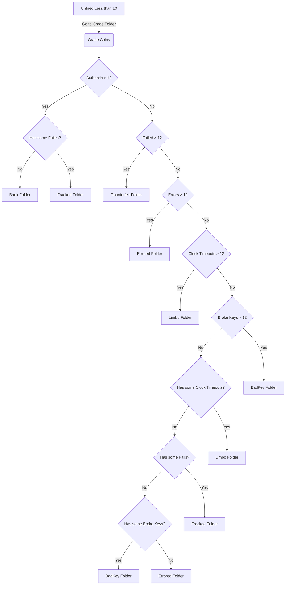

### **Function Specification: gradeCoin**

This document outlines the specifications for a function named gradeCoin. The function's primary purpose is to analyze binary "coin" files, determine their authenticity status based on an embedded data string, and sort them into appropriate folders.

---

### **1\. Function Summary**

The function will iterate through all files in a designated Grade folder. For each file, it will extract a 26-character hexadecimal "POWN string". Based on a count of specific characters within the first 25 characters of this string, the function will classify the coin's status and move the file to a corresponding folder (Bank, Fracked, Counterfeit, etc.). Finally, it will return a summary report of all processed coins.

---

### **2\. Function Signature**

function gradeCoin(parentDirectoryPath: string): array\<string\>

#### **Parameters:**

* **parentDirectoryPath (string):** The absolute or relative path to the parent directory containing the folder structure outlined below. The function should handle file path separators for the target operating system.

#### **Return Value:**

* **array\<string\>:** Returns an array of strings, where each string summarizes the result for one processed coin. If no coins are found in the Grade folder, it returns an empty array.  
* **Format of each string element:** "\<denomination\> \<serial\_number\> \<formatted\_pown\_string\> \<destination\_folder\>"  
  * **Example:** "100 51654 AAAAA-0AAAA-FAAAE-AAAAA-CAAAA Bank"

---

### **3\. Core Concepts**

#### **3.1 Folder Structure**

The function must operate within a specific directory structure located under the parentDirectoryPath.

* **Source Folder:**  
  * Grade/: Contains the coin files to be processed.  
* **Destination Folders:**  
  * Bank/: For fully authentic coins.  
  * Fracked/: For authentic coins with some counterfeit indications.  
  * Counterfeit/: For coins that are overwhelmingly counterfeit.  
  * Limbo/: For coins where a majority of authenticity checks timed out.  
  * Errored/: For coins where a majority of authenticity checks returned an error.  
  * BadKey/: For coins where a majority of checks failed due to key/encryption issues.

#### **3.2 POWN String**

The **POWN (Proof of Work Network) string** is the key data used for grading.

* **Source:** It is a 26-character hexadecimal string derived from a 13-byte array located at **byte indices 16 through 28 (inclusive)** within each coin file.  
* **Grading:** The **first 25 characters** of the POWN string are used for grading. Each character represents the status from one of 25 servers (RAIDA 0 to 24).  
* Status Codes: Each character corresponds to a specific outcome:  
  | Hex Character | Status | Description |  
  | :---: | :--- | :--- |  
  | A | Authentic | The RAIDA server confirmed the coin is authentic. |  
  | F | Failed | The RAIDA server detected the coin is counterfeit. |  
  | E | Error | The RAIDA server returned an error during the check. |  
  | C | Clock Timeout | The RAIDA server did not respond in the allotted time. |  
  | B | Broken Key | The authenticity check failed due to an encryption error. |  
  | 0 | Untried | The client did not contact this RAIDA server. |

#### **3.3 File Naming Convention**

Information about the coin must be parsed from its filename.

* **File Name Pattern:** denomination.CloudCoin.\#serial\_number.extension  
* **Denomination:** The part of the filename from the beginning up to the first space  
  * *Example:* In "100 CloudCoin \#51654 sometext.bin", the denomination is 100\.  
* **Serial Number:** The numeric digits immediately following the \# symbol.  
  * *Example:* In "100 CloudCoin \#51654 sometext.bin", the serial number is 51654\.

---


### **4\. Processing Logic**

The function must perform the following steps for each file in the parentDirectoryPath/Grade/ folder:

1. **Parse Filename:** Extract the denomination and serial\_number from the file's name.  
2. **Extract POWN String:** Read bytes 16-28 from the file and convert them to a 26-character hexadecimal string.  
3. **Count Statuses:** Count the occurrences of each status code (A, F, E, C, B) within the **first 25 characters** of the POWN string.  
4. **Apply Grading Rules:** Determine the destination folder using the following ordered rules. The **first rule that matches** dictates the outcome.  
   * **Rule 1: Authentic Check**  
     * If the count of 'A' is **greater than 12**:  
       * If the count of 'F' is **greater than 0**, move the file to the **Fracked/** folder.  
       * Otherwise, move the file to the **Bank/** folder.  
   * **Rule 2: Counterfeit Check**  
     * Else, if the count of 'F' is **greater than 12**, move the file to the **Counterfeit/** folder.  
   * **Rule 3: Error Check**  
     * Else, if the count of 'E' is **greater than 12**, move the file to the **Errored/** folder.  
   * **Rule 4: Timeout Check**  
     * Else, if the count of 'C' is **greater than 12**, move the file to the **Limbo/** folder.  
   * **Rule 5: Bad Key Check**  
     * Else, if the count of 'B' is **greater than 12**, move the file to the **BadKey/** folder.  
   * **Rule 6: Fallback for Mixed Results**  
     * Else (if none of the above conditions are met):  
       * If the count of 'C' is **greater than 0**, move to **Limbo/**.  
       * Else, if the count of 'F' is **greater than 0**, move to **Fracked/**.  
       * Else, if the count of 'B' is **greater than 0**, move to **BadKey/**.  
       * Otherwise, move the file to the **Errored/** folder.  
5. **Move File:** Move the current coin file from the Grade/ folder to the determined destination folder.  
6. **Record Result:**  
   * Format the full 25-character POWN string by inserting a \- after every 5th character (e.g., AAAAA-0AAAA-FAAAE-AAAAA-CAAAA).  
   * Create the result string in the specified format ("\<denomination\> \<serial\_number\> \<formatted\_pown\_string\> \<destination\_folder\>") and add it to the results array.  
7. **Loop:** Repeat for all files in the Grade/ folder.  
8. **Return:** After processing all files, return the array of result strings.

---

### **5\. Error Handling and Logging**

* **Robustness:** The function should be resilient to file system errors (e.g., permissions issues, non-existent directories).  
* **Error Logging:** If a file cannot be read or a directory cannot be accessed, the error should be logged to the console or a log file. The function should skip the problematic file and continue to the next one.  
  * *Example Log:* ERROR: Failed to read file /path/to/Grade/coin.dat. Reason: Permission denied.  
* **Success Logging:** For each file successfully moved, a log entry should be generated.  
  * *Example Log:* INFO: Graded coin 51654\. Moved to /path/to/Bank/.


# Grade
After coins have been authenticated, their files will have been put into the Grade folder. These binary coin files will have a byte array starting on index 16 and ending on index 28 inclusive (13 bytes) that are called the POWN string. This byte array can be turned into a string of 26 hexidecimal characters. The position of the hex character repressents the raidas 0 to 24. The last one is left blank. Each hex character has a meaning as follows: 0=Untried, A=Authentic, B= Broken Encryption Key, C= Clock Timeout, E=Error, F=Failed

0|A|B|C|E|F
---|---|---|---|---|---|
Untried | Authentic | Broke Key | Clock Timeout |  Error | Failed |
The client failed to echo this raida so it was not contacted | Coin Passed | Encryption Failed | No response from the raida in a timly manner | Raida Returned an error |Counterfeit

## Example POWN String
The following pown string shows the outcome of the authentication process. All the Raida found the coin to be authentic exept for Raida 9 that thought it was counterfeit. The client didn't bother sending a request to Raida 2 because the client was unable to echo it. Raida 12 returned an error and Raida 21 did not respond.  
```
AA UA AA AA AF AA EA AA AA AA AC AA A0
```


# **Function Specification: grade\_coins()**

This document specifies the grade\_coins( function. The primary goal is to identify and segregate CloudCoin based on their authenticity. 

## **Function Signature:**

function grade\_coins( path\_to\_parent: string,  ): string

* **Input Parameters:** This function takes the path to the parent folder as a parameter. This parameter is a string that will hold characters like forward slashes which may be escape characters.
  
* **Return Value:**  
  * Returns an coin_grade_array of strings. There is one element per coin in the array.
  * The format of the array of strings is the denomination, serial number, pown string and the folder that the coin was put in.
  * A sample string would be "100 51654 AAAAA-AAA0A-AAFAA-AEAAA-AAAAC Bank" 
  
## **Folder Structure (Context):**

Assume the following folder structure exists, with all listed folders residing under a common parent directory:

* Detect/: A folder where coins that have been processed originated.
* Grade/: A folder where ungraded coins exist.  
* Bank/: A destination folder where CloudCoin files may reside if they are authentic and have no bad passwords.  
* Fracked/: A destination folder where CloudCoin files may reside if the coin has some bad passwords but at least 13 good ones.  
* Limbo/: A destination folder where CloudCoin files may reside if there was 13 or more non-response from the raida servers after a request to authenticate was made.  
* Errored/: A destination folder where CloudCoin files may reside if the raida retrned 13 or more errors. 
* Encryption\_Failed/: A destination folder where CloudCoin files may reside failed encryption

## **Detailed Logic:**

1. **Read PownString:**  
   * The function must iterate through every file within the Grade/ folder.  
   * Read the file and extract the pown string. The pown string can be found at byte index 16 to 28 inclusive. 
   * Go through the flow in the mermaid diagram above so that pown string is used to figure out which of the folders that coin will be moved to.
   * Move the coin file into the folder it is to go in based on the diagram.
   * Extract the denomination string from the file name. The denomination starts at the first character of the file name and ends at the first space.  
   * Extract the serial number string from the file name. The serial number is the number that always follows the only pound sign in the name. It ends with the next space. So the string part "#4433 " means that the coin file's serial number is 4433.
   * Create the return string for the file and add it to the return string array. 
   
## **Logging Requirements:**

* **Successful Moves:**  
  * For every file successfully moved to the Duplicates/ folder (including those with modified names), a log entry must be created.  
  * The log entry should clearly indicate the operation, the original file path, and the new file path/name.  
  * Example: LOG: Moved to Duplicates: /parent/Suspect/cloudcoin\_123.bin \-\> /parent/Duplicates/cloudcoin\_123.bin  
  * Example with rename: LOG: Moved to Duplicates: /parent/Suspect/cloudcoin\_456.bin \-\> /parent/Duplicates/abcd\_cloudcoin\_456.bin  
* **Error Logging:**  
  * All errors encountered during file system operations (e.g., inability to read directories, file not found, permission denied, failure to move file) must be logged.  
  * Error logs should be detailed, including the error type, a descriptive message, and the affected file/folder path.  
  * Example: ERROR: Could not access folder: /parent/Suspect/. Reason: Permission denied.  
  * Example: ERROR: Failed to move file: /parent/Suspect/test.bin to /parent/Duplicates/test.bin. Reason: Destination disk full.

## **Error Handling Philosophy:**

* The function should be robust against common file system issues.  
* Any error that prevents the function from performing its core logic (e.g., inability to list files in Suspect or any destination folder, critical file move failures) should cause the function to log the error and return "failure".  
* Minor, non-critical issues (e.g., a single file being inaccessible but the overall process can continue) should be logged as errors but might not necessarily lead to a "failure" return, depending on the implementation's robustness. However, for simplicity, assume any logged error could contribute to a "failure" return if it prevents the full logic from being executed as intended for all files.

## **General Considerations:**

* Efficiency: While not explicitly requested, consider efficient file system operations where possible (e.g., avoid reading entire file contents for comparison; filename/serial number comparison is key).
